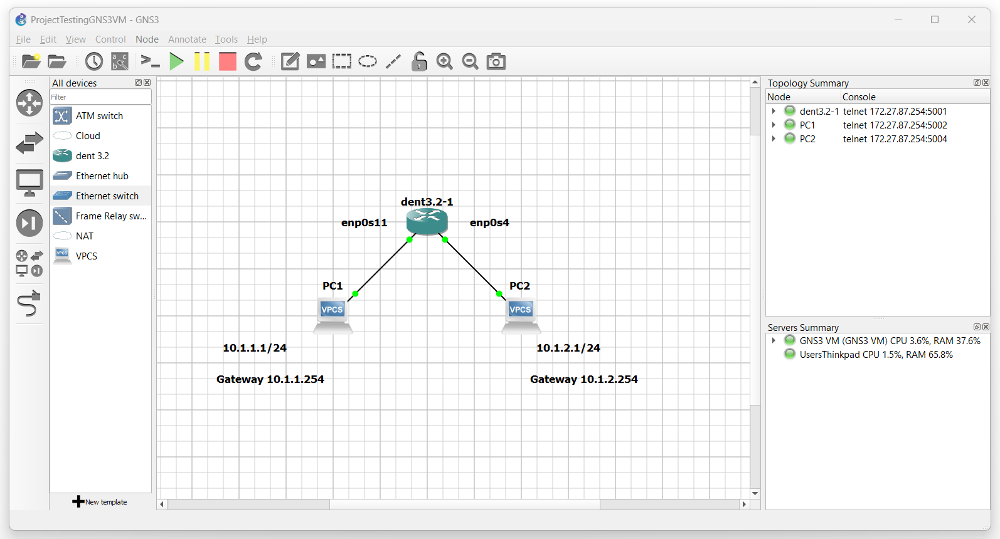

# Getting Started With Network Configuration

To familiarize yourself with the DENT NOS we designed a
simple tutorial for you. This tutorial will quickly cover interfaces
and how to configure a simple network.


***

## **Interfaces**
A network interface is the point of connection between a computer
and a network. As a system administrator you may want to know the
available network interfaces in your system to manage network
configurations.


### Links
The term Link is another name for a network interface. Once you start your DENT NOS
and login, you may display the available links associated with your machine using
the following command:

```
$ ip link show
...
1: lo: <LOOPBACK,UP,LOWER_UP> mtu 65536 qdisc noqueue state UNKNOWN mode DEFAULT group default qlen 1000
    link/loopback 00:00:00:00:00:00 brd 00:00:00:00:00:00
2: ma1: <NO-CARRIER,BROADCAST,MULTICAST,UP> mtu 1500 qdisc pfifo_fast state DOWN mode DEFAULT group default qlen 1000
    link/ether 0c:3f:f7:5c:00:00 brd ff:ff:ff:ff:ff:ff
3: enp0s4: <BROADCAST,MULTICAST> mtu 1500 qdisc noop state DOWN mode DEFAULT group default qlen 1000
    link/ether 0c:3f:f7:5c:00:01 brd ff:ff:ff:ff:ff:ff
4: enp0s5: <BROADCAST,MULTICAST> mtu 1500 qdisc noop state DOWN mode DEFAULT group default qlen 1000
    link/ether 0c:3f:f7:5c:00:02 brd ff:ff:ff:ff:ff:ff
  ...
```

Interfaces can be managed using iproute2 or any netlink supported utility.

*Note all the interfaces listed above are ``down``. To utilize a link it must be ``up``.*

You may bring a link ``up``using the following command
``sudo ip link set ${interface name} up``

*Note the output of ``ip link show`` will differ depending on whether
the port is in use.*

Ex.
```
$ ip link set dev enp0s4 up
[  443.984073] e1000: enp0s4 NIC Link is Up 1000 Mbps Full Duplex, Flow Control: RX
[  443.991676] 8021q: adding VLAN 0 to HW filter on device enp0s4
[  444.001685] IPv6: ADDRCONF(NETDEV_CHANGE): enp0s4: link becomes ready
$ ip link set dev enp0s5 up
[  451.350751] 8021q: adding VLAN 0 to HW filter on device enp0s5

```

In the output above notice that the interface ``enp0s4`` was inuse while ``enp0s5`` was not.

Rerunning ``ip link show`` will now depict ``enp0s4`` as ``up``
while ``enp0s5`` will remain unused:

```
$ ip link show
...
1: lo: <LOOPBACK,UP,LOWER_UP> mtu 65536 qdisc noqueue state UNKNOWN mode DEFAULT group default qlen 1000
    link/loopback 00:00:00:00:00:00 brd 00:00:00:00:00:00
2: ma1: <NO-CARRIER,BROADCAST,MULTICAST,UP> mtu 1500 qdisc pfifo_fast state DOWN mode DEFAULT group default qlen 1000
    link/ether 0c:3f:f7:5c:00:00 brd ff:ff:ff:ff:ff:ff
3: enp0s4: <BROADCAST,MULTICAST,UP,LOWER_UP> mtu 1500 qdisc pfifo_fast state UP mode DEFAULT group default qlen 1000
    link/ether 0c:3f:f7:5c:00:01 brd ff:ff:ff:ff:ff:ff
4: enp0s5: <NO-CARRIER,BROADCAST,MULTICAST,UP> mtu 1500 qdisc pfifo_fast state DOWN mode DEFAULT group default qlen 1000
    link/ether 0c:3f:f7:5c:00:02 brd ff:ff:ff:ff:ff:ff
...
```

To disable a link and bringing it back ``down`` use the following command
``sudo ip link set ${interface name} down``

Ex.
```
$ sudo ip link set enp0s4 down
```

### Loopback Interface

The loopback interface `` lo `` is a special type of virtual interface that allows the computer
to communicte with itself.


The two IP addresses associated with the loopback interface
are ``127.0.0.1/8`` for IPv4 and ``::1/128`` for IPV6.

***

## Network Configuraiton

While configuring your network you may need information on device IP addressing
to enable device communication. To show all addresses use the following command:

```
$ ip address show
...
1: lo: <LOOPBACK,UP,LOWER_UP> mtu 65536 qdisc noqueue state UNKNOWN group default qlen 1000
    link/loopback 00:00:00:00:00:00 brd 00:00:00:00:00:00
    inet 127.0.0.1/8 scope host lo
       valid_lft forever preferred_lft forever
    inet6 ::1/128 scope host
       valid_lft forever preferred_lft forever
2: ma1: <NO-CARRIER,BROADCAST,MULTICAST,UP> mtu 1500 qdisc pfifo_fast state DOWN group default qlen 1000
    link/ether 0c:3f:f7:5c:00:00 brd ff:ff:ff:ff:ff:ff
3: enp0s4: <BROADCAST,MULTICAST> mtu 1500 qdisc noop state DOWN group default qlen 1000
    link/ether 0c:3f:f7:5c:00:01 brd ff:ff:ff:ff:ff:ff
...
```

To connect machines add an IP address on an interface of your choice using the following
command:

``` sudo ip address add ${address}/${mask} dev ${interface name}```

For example run the following command in your DENT NOS:

```ip address add 192.0.2.1/24 dev enp0s4```

Rerunning ``ip address show`` will now show that ``enp0s4`` has an ip address linked to it:

```
$ ip address show
...
1: lo: <LOOPBACK,UP,LOWER_UP> mtu 65536 qdisc noqueue state UNKNOWN group default qlen 1000
    link/loopback 00:00:00:00:00:00 brd 00:00:00:00:00:00
    inet 127.0.0.1/8 scope host lo
       valid_lft forever preferred_lft forever
    inet6 ::1/128 scope host
       valid_lft forever preferred_lft forever
2: ma1: <NO-CARRIER,BROADCAST,MULTICAST,UP> mtu 1500 qdisc pfifo_fast state DOWN group default qlen 1000
    link/ether 0c:3f:f7:5c:00:00 brd ff:ff:ff:ff:ff:ff
3: enp0s4: <BROADCAST,MULTICAST> mtu 1500 qdisc noop state DOWN group default qlen 1000
    link/ether 0c:3f:f7:5c:00:01 brd ff:ff:ff:ff:ff:ff
    inet 192.0.2.1/24 scope global enp0s4
       valid_lft forever preferred_lft forever

...
```
***
## Simple Configuration Example

Imagine the configuration below. We will be using GNS3 to help illustrate
this example.



Assume PC1 has an IP address of 10.1.1.1/24 and an associated gateway
10.1.1.254/24 PC2 will have an IP address of 10.1.2.1/24 and an associated gateway
10.1.2.254/24 Both PCs are connected to a switch running the DENT NOS.

### Enable Interfaces
The ports which these devices are connected to the switch with will be
represented by the interfaces on the switch. When logged into the switch
use ``ip link show`` to view a list of all available interfaces.


Ex.
```
$ ip link show
...
1: lo: <LOOPBACK,UP,LOWER_UP> mtu 65536 qdisc noqueue state UNKNOWN mode DEFAULT group default qlen 1000
    link/loopback 00:00:00:00:00:00 brd 00:00:00:00:00:00
2: ma1: <NO-CARRIER,BROADCAST,MULTICAST,UP> mtu 1500 qdisc pfifo_fast state DOWN mode DEFAULT group default qlen 1000
    link/ether 0c:3f:f7:5c:00:00 brd ff:ff:ff:ff:ff:ff
3: enp0s4: <BROADCAST,MULTICAST> mtu 1500 qdisc pfifo_fast state DOWN mode DEFAULT group default qlen 1000
    link/ether 0c:3f:f7:5c:00:01 brd ff:ff:ff:ff:ff:ff
...
```

*Note by default all interfaces will be down. You must enable all interfaces that are
associated with a port that is in use.*

To enable an interface, use ``ip link set dev ${interface name} up``.

In the diagram above PC1 is connected to the port Ethernet7 which corresponds to the interface ``enp0s11`` of the switch.
PC2 is connected to the port Ethernet0 which corresponds to the interface ``enp0s4`` of the switch.

Run the following commands to bring these interfaces up

``$ ip link set dev enp0s11 up``
``$ ip link set dev enp0s4 up``

Once the interfaces are ``up`` you should see something similar to the following:

```
$ ip link show
...
1: lo: <LOOPBACK,UP,LOWER_UP> mtu 65536 qdisc noqueue state UNKNOWN mode DEFAULT group default qlen 1000
    link/loopback 00:00:00:00:00:00 brd 00:00:00:00:00:00
2: ma1: <NO-CARRIER,BROADCAST,MULTICAST,UP> mtu 1500 qdisc pfifo_fast state DOWN mode DEFAULT group default qlen 1000
    link/ether 0c:3f:f7:5c:00:00 brd ff:ff:ff:ff:ff:ff
3: enp0s4: <BROADCAST,MULTICAST,UP,LOWER_UP> mtu 1500 qdisc pfifo_fast state UP mode DEFAULT group default qlen 1000
    link/ether 0c:3f:f7:5c:00:01 brd ff:ff:ff:ff:ff:ff
...
10: enp0s11: <BROADCAST,MULTICAST,UP,LOWER_UP> mtu 1500 qdisc pfifo_fast state UP mode DEFAULT group default qlen 1000
    link/ether 0c:3f:f7:5c:00:08 brd ff:ff:ff:ff:ff:ff
...
```

### Add the Gateway Addresses to the Switch
Next add the gateway addresses to your switch on the appropriate interface.
To add the gateway addresses use the following command
``ip address add ${address}/${mask} dev ${interface name}``.

In the diagram above PC1 is connected to the port Ethernet7 which corresponds to
the interface ``enp0s11`` of the switch. PC1 will also use the gateway address
10.1.1.254/24. On the switch run the following command to add the gateway address
for PC1 to the switch:

```ip address add 10.1.1.254/24 dev enp0s11```


In the diagram above PC2 is connected to the port Ethernet0 which corresponds to
the interface ``enp0s4`` of the switch. PC2 will also use the gateway address
10.1.2.254/24. On the switch run the following command to add the gateway address
for PC2 to the switch:

```ip address add 10.1.2.254/24 dev enp0s4```


You should now be able to ping your PCs to your switch and your switch to your PCs.

*NOTE: Forward packeting must be enabled to ping between the PCs over the switch.*

If forward packeting is enabled on your router you should now also be able to ping between the PCs.


### How to enable Forward Packeting

To enable Packet forwarding check on the router to make sure the value
of the file ``ip_forward`` is "1". To view the contents of the file execute the
following command:

``cat /proc/sys/net/ipv4/ip_forward``

If the file content is "0", packet forwarding is disabled.
To enable packet forwarding the content of the file must be "1".

Use the following command to write overwrite the contents of the file to
the value of '1':

``sudo sh -c 'echo 1 > /proc/sys/net/ipv4/ip_forward' ``

Congratulations!
You should now be able to ping PC1 and PC2 through your router.