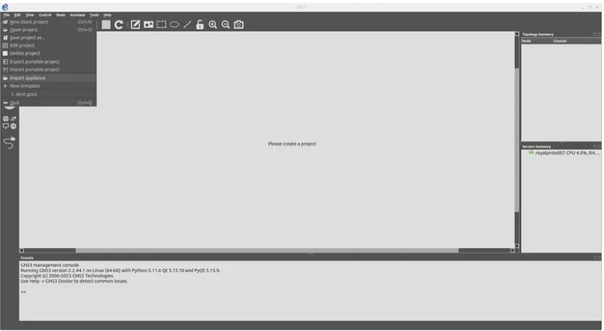

## Using your local machine to run the DENT NOS in GNS3

**DENT NOS, a Linux Foundation project, redefines network operating
systems by leveraging the Linux Kernel and Switchdev. Treating all
infrastructure equally, it simplifies abstractions.**

**This guide explores integrating DENT NOS with GNS3, streamlining the
simulation of disaggregated networks. Uncover the power of DENT NOS
in a virtualized environment with a quick installation walkthrough.
Let’s dive in!**

### Prerequisites
- [GNS3](https://docs.gns3.com/docs/) installed on your system.

### Installation Steps

### 1. Download DENT NOS Files
Visit the DENT NOS repository on OneDrive to download the required
files:  
[DENT NOS Files](https://onedrive.live.com/?authkey=%21AJV2rWTocq%5FG6KI&id=B4D5FD54A1A7D444%2144829&cid=B4D5FD54A1A7D444)

### 2. Uncompress Disk Image
Uncompress the downloaded disk image file.

### 3. Import Appliance to GNS3

1. Open GNS3 and go to `File -> Import Appliance. `
2. Select the GNS3 appliance file _(gns3a file)_ you downloaded
   from the OneDrive link.
3. Choose the server on which to run the appliance.

### 4. Choose QEMU Binary
1. Choose the QEMU binary that will be used to run the DENT NOS
   appliance.
2. The recommended option is `/bin/qemu-system-x86_64 (v8.0.4).`

### 5. Import DENT NOS Image
1. Click on the DENT NOS image file and import it.
2. Wait for the upload to finish; this may take some time.

### 6. Confirm Installation
1. You will be prompted with an installation confirmation.
2. Click “Yes” to confirm the installation.

    

### 7. DENT NOS Installation Complete
Congratulations!  
You have successfully installed DENT NOS on GNS3.

### 8. Start Using DENT NOS in GNS3
1. Drag the DENT NOS appliance into the main window of your GNS3 project.
2. Create your network topology, adding DENT NOS appliances as needed.
3. Right-click on each appliance and select “Start” to initiate the simulation.

### 9. Default Credentials
- DENT login: root
- Password: onl

### Conclusion
Congratulations! You’ve seamlessly integrated DENT NOS with GNS3, unlocking the potential for streamlined simulations of disaggregated networks.

As you explore the power of DENT NOS within this virtualized environment, experiment with diverse network configurations and scenarios to enhance your understanding.

**Happy networking!**

For more information on how to set up DENT in GNS3 with a local
machine feel free to contact the author Royal Simpson Pinto at
royalpinto007@gmail.com