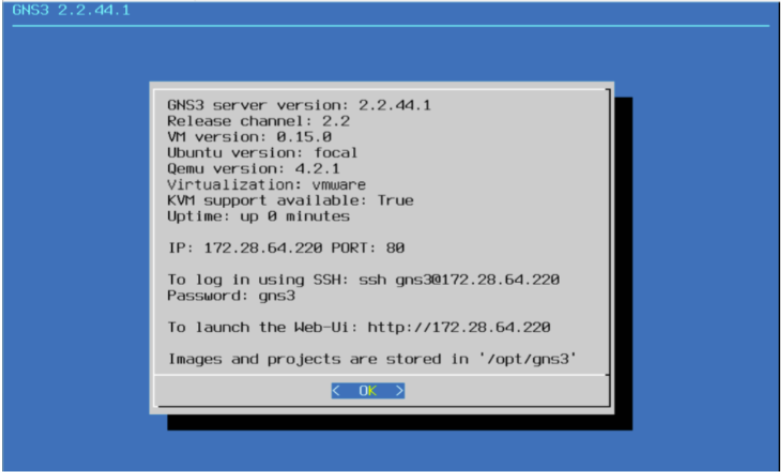

## Using a virtual machine to run the DENT NOS in GNS3

First, install the DENT GNS3 appliance file as well as the disk
image for the dent Virtual Machine. You can find the required files
here:** [DENT Image and gns3a file](https://1drv.ms/f/s!AkTUp6FU_dW0gt4dlXatZOhyr8boog?e=Ltqpa5.)

Install the appropirate GNS3 VM for your machine

If you are using VMware Workstation Pro, install the VMWare
Workstation and Fusion GNS3 VM and extract the .zip folder you
downloaded.

Open VMWare Workstation then click Open a Virtual Machine and
select the extracted GNS3 VMWare Workstation folder.

When ready, run the Virtual Machine. You should see a screen
similar to this below once the Virtual machine is running.

Now Open GNS3, go to Edit -> Preferences -> GNS3 VM and check
the “Enable the (GNS3) VM” box. Select the appropriate Virtual
Machine you are running GNS3 on as your Virtualization Engine
and click ok

You Should now See an Additional Server Listed under Server Summary

Go to File -> Import Appliance and select the appliance file.
In this scenario we will select one of the previously downloaded
files “DENT - 3.2”.

The QEMU binary that will be used to run this appliance is
recommended as /bin/qemu-system-x86_64(v4.2.1).

Next, we need to import the DENT image file by selecting again
one of the previously downloaded files “dent-vm.qcow2” and clicking
import.

**Wait for the upload to finish, it may take some time.**

Once the upload is finished, you may click next and yes to
install DENT

Once Installed you may now use the DENT appliance in GNS3.
The example below demonstrate 3 dent appliances connecting to
each other

After Starting the simulation you may right-click on any DENT
appliance and select _console_ to log-in.

**The default credentials are:**
- **Localhost login: root**
- **Password: onl**

### You have now successfully set up DENT in GNS3 with a virtual machine

For more information on how to set up DENT in GNS3 with a virtual
machine feel free to contact the author Korel Ucpinar at
Korelucpinar@gmail.com
