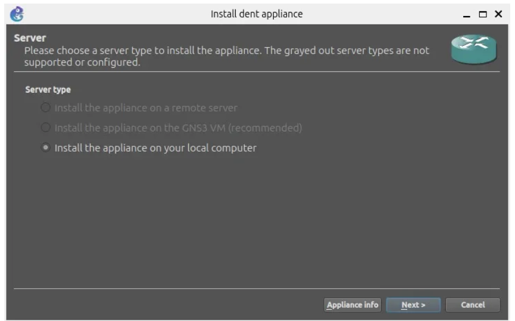

## Using your local machine

## Installation Steps

### Prerequisites

- [GNS3](https://docs.gns3.com/docs/) installed on your system.  

### 1. Download DENT NOS Files

&nbsp;&nbsp;&nbsp; Visit the DENT NOS repository on OneDrive to download the required files: [DENT NOS Files](https://onedrive.live.com/?authkey=%21AJV2rWTocq%5FG6KI&id=B4D5FD54A1A7D444%2144829&cid=B4D5FD54A1A7D444).

### 2. Uncompress Disk Image

&nbsp;&nbsp;&nbsp; Uncompress the downloaded disk image file.

### 3. Import Appliance to GNS3

&nbsp;&nbsp;&nbsp; a. Open GNS3 and go to `File -> Import Appliance`.  
&nbsp;&nbsp;&nbsp; b. Select the GNS3 appliance file _(gns3a file)_ you downloaded from the OneDrive link.  
&nbsp;&nbsp;&nbsp; c. Choose the server on which to run the appliance.

### 4. Choose QEMU Binary

&nbsp;&nbsp;&nbsp; a. Choose the QEMU binary that will be used to run the DENT NOS appliance.  
&nbsp;&nbsp;&nbsp; b. The recommended option is `/bin/qemu-system-x86_64 (v8.0.4)`.

### 5. Import DENT NOS Image

&nbsp;&nbsp;&nbsp; a. Click on the DENT NOS image file and import it.  
&nbsp;&nbsp;&nbsp; b. Wait for the upload to finish; this may take some time.

### 6. Confirm Installation

&nbsp;&nbsp;&nbsp; a. You will be prompted with an installation confirmation.  
  
&nbsp;&nbsp;&nbsp; b. Click “Yes” to confirm the installation.  

&nbsp;&nbsp;&nbsp; **Congratulations!**  
&nbsp;&nbsp;&nbsp; You have successfully installed DENT NOS on GNS3.

### Start Using DENT NOS in GNS3

&nbsp;&nbsp;&nbsp; a. Drag the DENT NOS appliance into the main window of your GNS3 project.  
&nbsp;&nbsp;&nbsp; b. Create your network topology, adding DENT NOS appliances as needed.  
&nbsp;&nbsp;&nbsp; c. Right-click on each appliance and select “Start” to initiate the simulation.

### Default Credentials

&nbsp;&nbsp;&nbsp; DENT login: root  
&nbsp;&nbsp;&nbsp; Password: onl  

For more information, you can visit [dent.dev](https://dent.dev).
