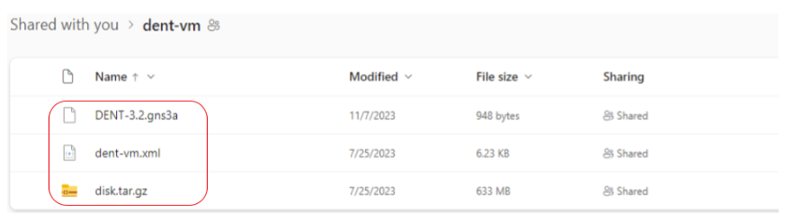
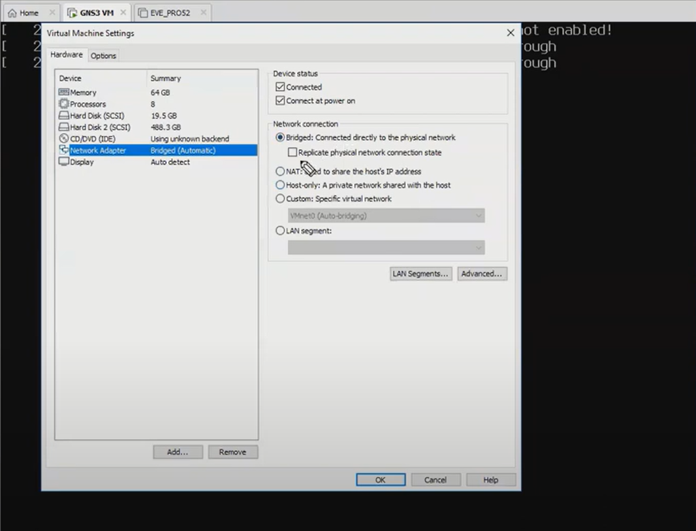
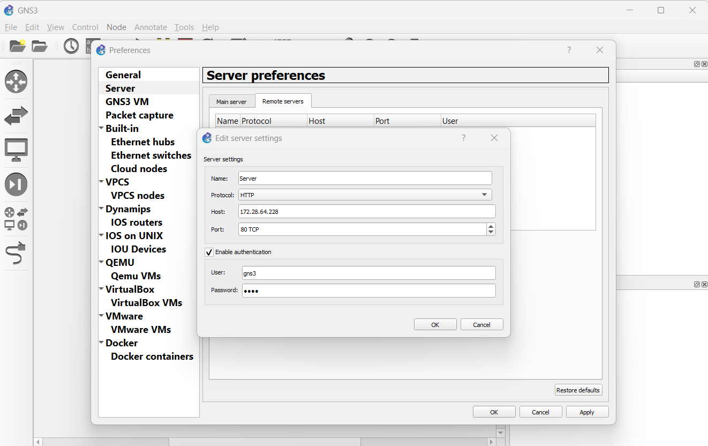
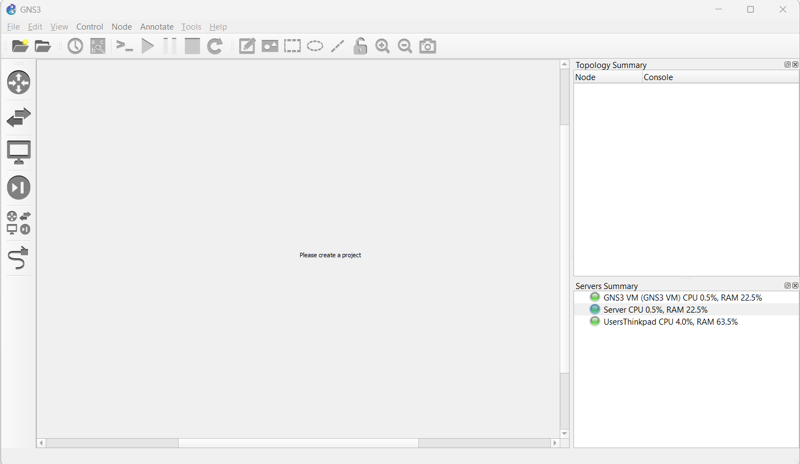
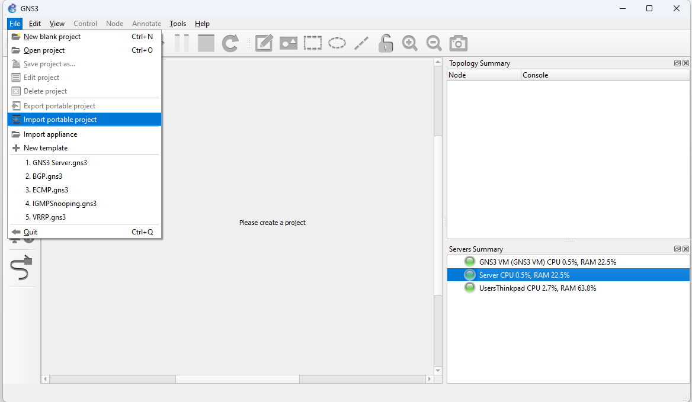
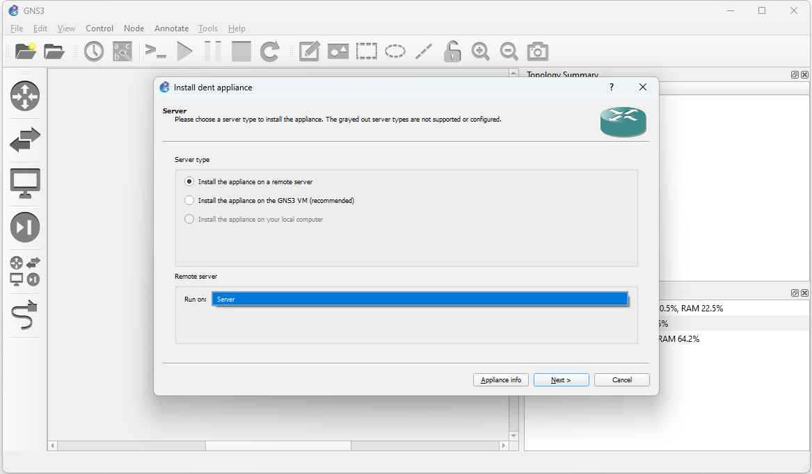
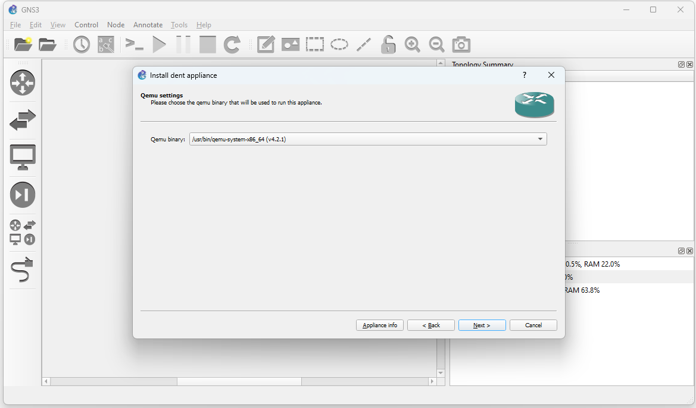
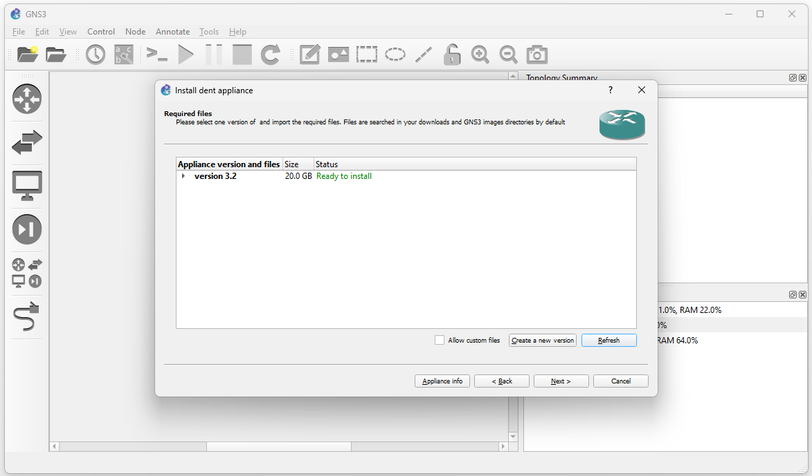
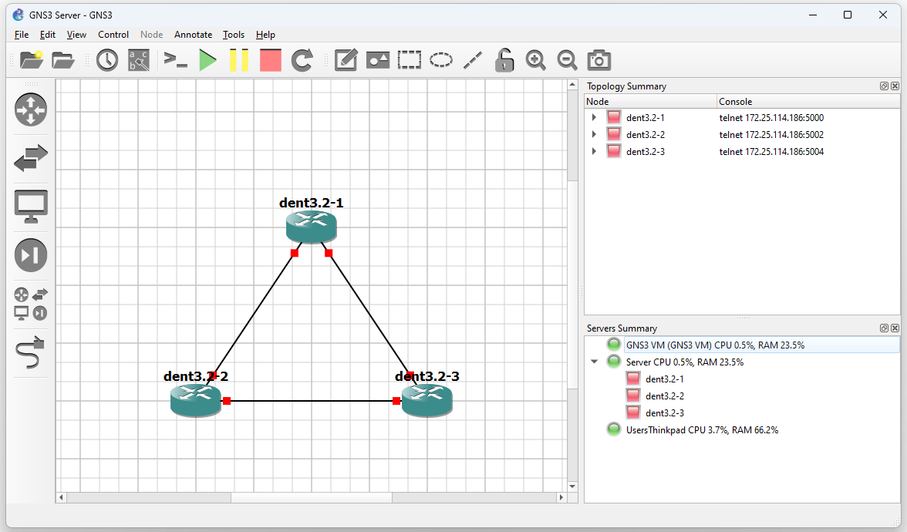
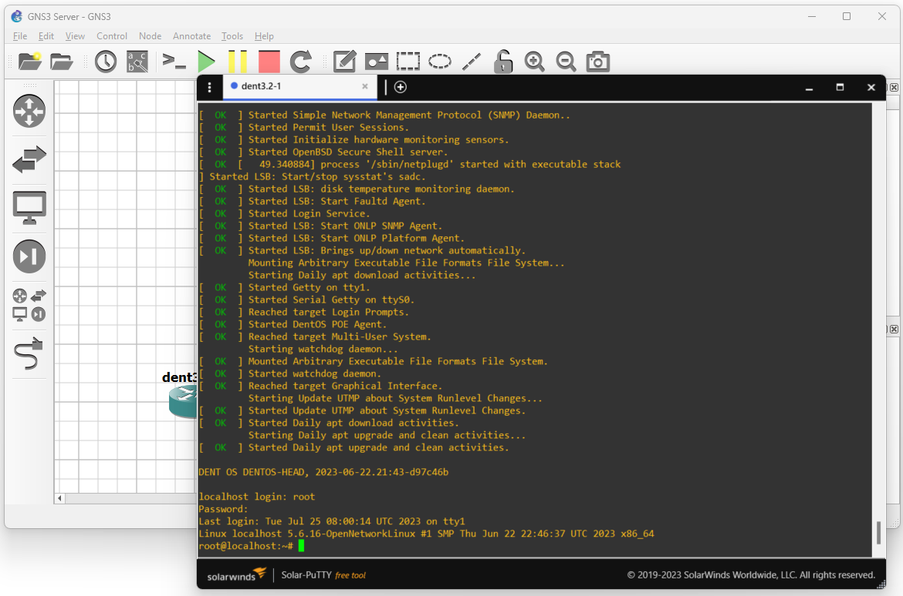

## Using a Remote Server

### Introduction

In this example, we will show how to run the GNS3 VM on a remote server.

Running the GNS3 VM on a remote server
is useful when you need more resources for more extensive network topologies.

### 1. Download DENT NOS Files

To run GNS3 on a remote server, first install the
DENT GNS3 appliance file and the disk
image for the dent Virtual Machine. You can find the required files
here: **[DENT Image and gns3a file](https://1drv.ms/f/s!AkTUp6FU_dW0gt4dlXatZOhyr8boog?e=Ltqpa5.)**



### 2. Download the GNS3 VM for the Server

On the Remote Server, install and load
the GNS3 VM associated with the Server, using VMware or another hypervisor.


Run the GNS3 VM and make sure the
network settings on the GNS3 VM are based on the Server's network.
Your local PC must be able to reach the server to be able to
use GNS3 with a Remote Server.
In VMware, this can be done by ensuring the GNS3 VM is Bridged.



### 3. Ensure PC is connected to Server

**NOTE: Use A VPN if Exposed to the Internet!**

It is highly recommended to use a VPN if your
remote server is exposed to
the internet. The GNS3 website has a few recommended free VPNs:
[VPNS](https://docs.gns3.com/docs/getting-started/installation/remote-server/#why-a-vpn).
Install one of the VPNs before booting GNS3 on your remote server
and attempting to access it.

Once GNS3 is finished booting on the remote server
it may look like the following:


To test you are able to reach the server a simple ping command will do:

```
C:\Users\Thinkpad>ping 172.28.64.228

Pinging 172.28.64.228 with 32 bytes of data:
Reply from 172.28.64.228: bytes=32 time<1ms TTL=64
Reply from 172.28.64.2286: bytes=32 time<1ms TTL=64
Reply from 172.28.64.228: bytes=32 time<1ms TTL=64
Reply from 172.28.64.228: bytes=32 time<1ms TTL=64

Ping statistics for 172.28.64.228:
Packets: Sent = 4, Received = 4, Lost = 0 (0% loss),
Approximate round trip times in milli-seconds:
Minimum = 15ms, Maximum = 24ms, Average = 20ms
```

### 4. Add new Server to GNS3

Now Open GNS3, go to Edit -> Preferences -> Server -> Remote Server
and select the 'Add' option. Proceed to pick a "Name" and include
the Remote Server's IP Address and the port listed.
You may also enable authentication by including a username
and password.



When ready, click 'OK' to see an Additional Server Listed under Server Summary.



### 5. Import new Appliance on Remote Server

Now, import the appliance as usual.
Go to File -> Import Appliance and select the appliance file.
In this scenario, we will choose one of the previously downloaded
files, “DENT - 3.2”.



Then select the remote server option from the Server Type and
select the newly specified Server.



Hit next. The QEMU binary that we will run in this appliance is
as /bin/qemu-system-x86_64(v4.2.1).



Import the DENT image file by selecting again
one of the previously downloaded files, “dent-vm.qcow2” and clicking
import.

**Wait for the upload to finish. It may take some time.**

Once the upload is finished, you may click next and yes to
install DENT



---

## Completion

Once Installed, you may now use the DENT appliance in GNS3 on
the remote Server.

The example below demonstrates three dent appliances connecting to
each other



After starting the simulation, you may right-click on any DENT
appliance and select _console_ to log-in.

**The default credentials are:**

- **Localhost login: root**
- **Password: onl**



### You have now successfully set up DENT in GNS3 with a remote server

For more information, visit [dent.dev](https://dent.dev).
