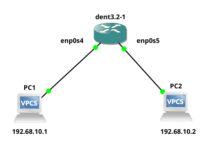

# Dynamic Host Configuration Protocol

Dynamic Host Configuration Protocol (DHCP) facilitates flexible options for IP address assignment within network configurations.

- It was introduced in the [Arthur Release (v1)](https://github.com/dentproject/dentOS/releases/tag/v1.0) of DENT.
- DHCP functionality enhances network management capabilities.

DENT can set up DHCP using both bridge interfaces and VLAN sub-interfaces.

### DHCP Client

To use DHCP Client, use the following command:

```
dhclient [INTERFACE_NAME]
```

**Notes:**

- Replace `[INTERFACE_NAME]` with the name of the interface where the DHCP client should be started.
- This command initiates the DHCP client on the specified interface to request and obtain an IP address dynamically from a DHCP server.

### DHCP Server

To install the DHCP Server on DENT, execute the following command:

```
sudo apt install isc-dhcp-server
```

**Note:** Ensure to run `apt-get update` beforehand if it hasn't been executed yet.

To check the status, use the following command:

```
systemctl status isc-dhcp-server.service
● isc-dhcp-server.service - LSB: DHCP server
   Loaded: loaded (/etc/init.d/isc-dhcp-server; generated; vendor preset: enable
   Active: failed (Result: exit-code); 10s ago
```

You may observe that DHCP isn't configured yet, and it displays a failed status. To rectify this, we need to adjust the DHCP server configuration.

To accomplish this, access the configuration file located at `/etc/dhcp/dhcpd.conf` and make the necessary changes. Use the following command:

```
nano /etc/dhcp/dhcpd.conf
```

Within the file, modify the contents as required. Below is a basic sample configuration:

```
subnet 192.168.1.0 netmask 255.255.255.0 {
    range 192.168.1.100 192.168.1.200;
    option routers 192.168.122.1;
    option domain-name-servers 192.168.122.1;
    default-lease-time 86400;
    max-lease-time 86400;
}
```

You also may need to edit `/etc/default/isc-dhcp-server` to specify the interfaces DHCP should listen to.

```
nano /etc/default/isc-dhcp-server
```

Within the file, specify the interfaces.

```
INTERFACESv4="br0"
```

After modifying the configuration, if you attempt to restart the DHCP server, you may encounter a failure. To restart, use the following command:

```
sudo systemctl restart isc-dhcp-server
Job for isc-dhcp-server.service failed because the control process exited with error code.
See "systemctl status isc-dhcp-server.service" and "journalctl -xe" for details.
```

This issue arises because the IP address assigned to the interface of DENT needs to be appropriate for DHCP server usage. For instance, if a bridge interface named br0 exists, it must have an IP address from which other devices can be assigned IPs within the DHCP server range.

To assign an IP address to br0, execute the following command:

```
ip address add 192.168.1.10/24 dev br0
```

Afterward, restart the DHCP server using `sudo systemctl restart isc-dhcp-server`. This time, it should operate without errors.

Additionally, verify the status to ensure it's active and running:

```
systemctl status isc-dhcp-server.service
● isc-dhcp-server.service - LSB: DHCP server
   Loaded: loaded (/etc/init.d/isc-dhcp-server; generated; vendor preset: enable
   Active: active (running)
```

Now, the DHCP server is ready to randomly assign IP addresses to different devices from the specified range.

### Example:

**Using DHCP with a Bridge:**

1. Begin by creating a bridge interface.

   ```
   ip link add name br0 type bridge
   ```

2. Set the desired ports (`enp0s4` and `enp0s5`) as members of the bridge.

   ```
   ip link set enp0s4 master br0
   ip link set enp0s5 master br0
   ```

3. Bring the interface 'br0' and the ports `enp0s4` and `enp0s5` up.

   ```
   ip link set br0 up
   ip link set enp0s4 up
   ip link set enp0s5 up
   ```

Please ensure that you add an IP address to the `br0` interface so that it follows the range of the DHCP server. Also, configure your DHCP server like it was done in the sample configuration.

**Using DHCP with a VLAN Sub-interface:**

1. Establish a bridge interface with VLAN filtering enabled.

   ```
   ip link add name br0 type bridge vlan_filtering 1
   ```

2. Bring the bridge interface `br0` up.

   ```
   ip link set dev br0 up
   ```

3. Set the desired ports (`enp0s4` and `enp0s5`) as members of the bridge.

   ```
   ip link set dev enp0s4 master br0
   ip link set dev enp0s5 master br0
   ```

4. Add the VLAN membership for the desired VLAN (e.g., VLAN ID 10) on the ports `enp0s4` and `enp0s5` and the bridge interface `br0`.

   ```
   bridge vlan add vid 10 dev enp0s4
   bridge vlan add vid 10 dev enp0s5
   bridge vlan add vid 10 dev br0 self
   ```

5. Generate VLAN sub-interfaces (`br0.10` and `br0.20` for example) associated with the respective VLAN IDs (e.g., VLAN ID 10 and VLAN ID 20).

   ```
   ip link add link br0 name br0.10 type vlan id 10
   ip link add link br0 name br0.20 type vlan id 20
   ```

These procedures facilitate the dynamic assignment of IP addresses to devices within the network using DHCP, either directly through VLAN sub-interfaces, with `enp0s4` and `enp0s5` as the ports. Also, configure your DHCP server like it was done in the sample configuration.

### Example Configuration:

Ensure that everything is configured using the steps provided above, as the example configurations apply similarly for both bridge and VLAN sub-interfaces.

**Before DHCP is configured:**


Since no IP address has been assigned, PC1 cannot ping PC2. The same applies for PC2 pinging PC1.

**After DHCP is configured:**

A dynamic IP address can be assigned on PC1 by running `ip dhcp` command and it gets assigned in the following way-

```
PC1> ip dhcp
DDORA IP 192.168.1.100/24 GW 192.168.122.1
```

To ensure that IP address has been assigned-

```
PC1> show ip

NAME        : PC1[1]
IP/MASK     : 192.168.1.100/24
GATEWAY     : 192.168.122.1
DNS         : 192.168.122.1
DHCP SERVER : 192.168.1.10
DHCP LEASE  : 86392, 86400/43200/75600
MAC         : 00:50:79:66:68:01
LPORT       : 20008
RHOST:PORT  : 127.0.0.1:20009
MTU         : 1500
```

It can be done similarly on PC2.

```
PC2> ip dhcp
DDORA IP 192.168.1.101/24 GW 192.168.122.1
```

To ensure that IP address has been assigned-

```
PC2> show ip

NAME        : PC2[1]
IP/MASK     : 192.168.1.101/24
GATEWAY     : 192.168.122.1
DNS         : 192.168.122.1
DHCP SERVER : 192.168.1.10
DHCP LEASE  : 86365, 86400/43200/75600
MAC         : 00:50:79:66:68:00
LPORT       : 20006
RHOST:PORT  : 127.0.0.1:20007
MTU         : 1500
```



PC1 pings PC2:

```
PC1> ping 192.168.1.101
84 bytes from 192.168.1.101 icmp_seq=1 ttl=64 time=2.795 ms
84 bytes from 192.168.1.101 icmp_seq=2 ttl=64 time=1.554 ms
84 bytes from 192.168.1.101 icmp_seq=3 ttl=64 time=1.562 ms
84 bytes from 192.168.1.101 icmp_seq=4 ttl=64 time=1.575 ms
84 bytes from 192.168.1.101 icmp_seq=5 ttl=64 time=1.484 ms
```

**Note**: The same can be checked for PC2 pinging PC1.

<div style="border-top: 1px solid gray;"></div>
