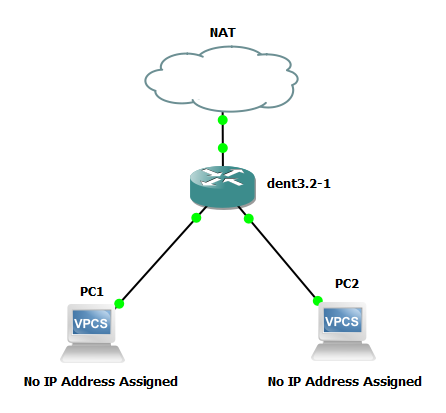
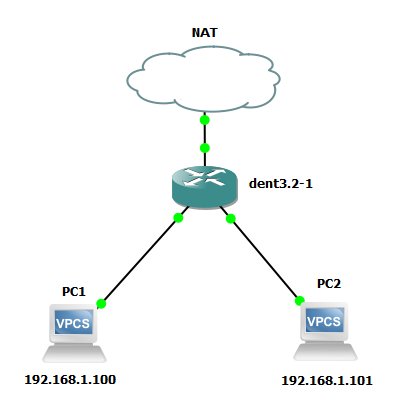

# Dynamic Host Configuration Protocol

DENT facilitates Dynamic Host Configuration Protocol (DHCP), offering flexible options for IP address assignment within network configurations.

- It was introduced in the [Arthur Release (v1)](https://github.com/dentproject/dentOS/releases/tag/v1.0) of DENT.
- DHCP functionality enhances network management capabilities.

DENT can set up DHCP using both bridge interfaces and VLAN sub-interfaces.

To use DHCP, use the following command:

```
dhclient [INTERFACE_NAME]
```

**Notes:**

- Replace `[INTERFACE_NAME]` with the name of the interface where the DHCP client should be started.
- This command initiates the DHCP client on the specified interface to request and obtain an IP address dynamically from a DHCP server.

### Example:

**Using DHCP with a Bridge:**

1. Begin by creating a bridge interface.

   ```
   ip link add name br0 type bridge
   ```

2. Set the desired ports (`enp0s4` and `enp0s5`) as members of the bridge.

   ```
   ip link set enp0s4 master br0
   ip link set enp0s5 master br0
   ```

3. Bring the ports `enp0s4` and `enp0s5` up.

   ```
   ip link set en0s4 up
   ip link set en0s5 up
   ```

4. Initiate the DHCP client on the bridge interface (`br0`).
   ```
   dhclient br0
   ```

**Using DHCP with a VLAN Sub-interface:**

1. Establish a bridge interface with VLAN filtering enabled.

   ```
   ip link add name br0 type bridge vlan_filtering 1
   ```

2. Bring the bridge interface `br0` up.

   ```
   ip link set dev br0 up
   ```

3. Set the desired ports (`enp0s4` and `enp0s5`) as members of the bridge.

   ```
   ip link set dev enp0s4 master br0
   ip link set dev enp0s5 master br0
   ```

4. Add the VLAN membership for the desired VLAN (e.g., VLAN ID 10) on the ports `enp0s4` and `enp0s5` and the bridge interface `br0`.

   ```
   bridge vlan add vid 10 dev enp0s4
   bridge vlan add vid 10 dev enp0s5
   bridge vlan add vid 10 dev br0 self
   ```

5. Generate VLAN sub-interfaces (`br0.10` and `br0.20` for example) associated with the respective VLAN IDs (e.g., VLAN ID 10 and VLAN ID 20).

   ```
   ip link add link br0 name br0.10 type vlan id 10
   ip link add link br0 name br0.20 type vlan id 20
   ```

6. Initiate the DHCP client on the VLAN sub-interfaces (`br0.10` and `br0.20`).
   ```
   dhclient br0.10
   dhclient br0.20
   ```

These procedures facilitate the dynamic assignment of IP addresses to devices within the network using DHCP, either directly through a bridge interface or via VLAN sub-interfaces, with `enp0s4` and `enp0s5` as the ports.

### Example Configuration:

Ensure that everything is configured using the steps provided above, as the example configurations apply similarly for both bridge and VLAN sub-interfaces.

**Before DHCP is configured:**



Since no IP address has been assigned, PC1 cannot ping PC2. The same applies for PC2 pinging PC1.

**After DHCP is configured:**

A dynamic IP address is assigned.



PC1 pings PC2:

```
PC1> ping 192.68.10.2
84 bytes from 192.68.10.2 icmp_seq=1 ttl=64 time=0.506 ms
84 bytes from 192.68.10.2 icmp_seq=2 ttl=64 time=0.713 ms
84 bytes from 192.68.10.2 icmp_seq=3 ttl=64 time=0.728 ms
84 bytes from 192.68.10.2 icmp_seq=4 ttl=64 time=0.878 ms
```

**Note**: The same can be checked for PC2 pinging PC1.

<div style="border-top: 1px solid gray;"></div>
