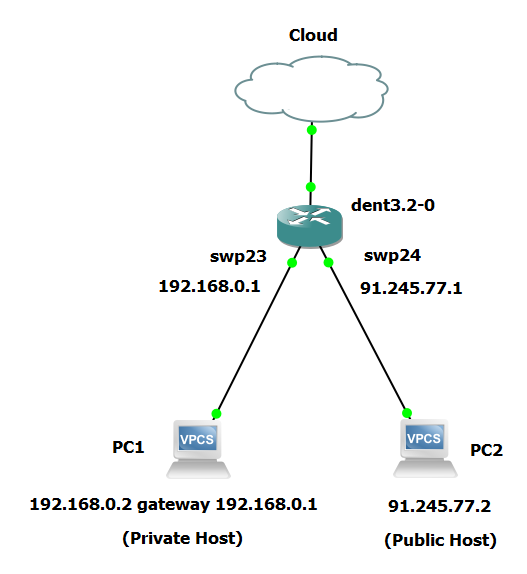

# Port Translation

Port Translation is a special case of Network Address Translation (NAT) where the source IP addresses for all packets going in one direction are translated to a common address and/or port. This method is often used to redirect traffic from one port to another, enabling multiple devices on a local network to share a single public IP address while maintaining unique port assignments for each session.

### Example Configuration:

To configure Port Translation, use `iptables` to set up rules for port forwarding and translation. For detailed information on iptables, refer to the [iptables(8)](https://linux.die.net/man/8/iptables). Below is an example configuration:

Configure the private host (Assume it to be PC1):

```
ip 192.168.0.2/24 192.168.0.1
```

Configure the public host (Assume it to be PC2):

```
ip 91.245.77.2/24
```

Configure IP on the interfaces and set up a default gateway:

```
ip addr add dev swp23 192.168.0.1/24
ip addr add dev swp24 91.245.77.1/24
```

```
ip route add default via 91.245.77.1
```

Ensure that the interfaces are up. You can bring up the interfaces using the following commands:

```
ip link set dev swp23 up
ip link set dev swp24 up
```



Configure iptables Rules for Port Translation:

```
# Flush existing iptables rules
iptables -F
iptables -t nat -F
```

```
# Add PREROUTING rule for destination NAT (DNAT)
iptables -t nat -A PREROUTING -p tcp -d 91.245.77.1 --dport 80 -j DNAT --to-destination 192.168.0.2:8080
```

```
# Add POSTROUTING rule for source NAT (SNAT)
iptables -t nat -A POSTROUTING -p tcp -s 192.168.0.2 --sport 8080 -j SNAT --to-source 91.245.77.1:80
```

To list all NAT table rules, use the following command:

```
iptables -t nat -L -n -v
```

Output:

```
Chain PREROUTING (policy ACCEPT 0 packets, 0 bytes)
 pkts bytes target     prot opt in     out     source               destination
    0     0 DNAT       tcp  --  *      *       0.0.0.0/0            91.245.77.1          tcp dpt:80 to:192.168.0.2:8080

Chain INPUT (policy ACCEPT 0 packets, 0 bytes)
 pkts bytes target     prot opt in     out     source               destination

Chain OUTPUT (policy ACCEPT 0 packets, 0 bytes)
 pkts bytes target     prot opt in     out     source               destination

Chain POSTROUTING (policy ACCEPT 0 packets, 0 bytes)
 pkts bytes target     prot opt in     out     source               destination
    0     0 SNAT       tcp  --  *      *       192.168.0.2          0.0.0.0/0            tcp spt:8080 to:91.245.77.1:80
```

**Notes**

- **PREROUTING Chain:** Alters the destination IP address and port of incoming packets before they are routed. This is useful for forwarding incoming requests to a different internal server or port.
- **POSTROUTING Chain:** Alters the source IP address and port of outgoing packets after routing. This ensures that the response packets go back through the NAT device and then to the correct external client.
- **DNAT (Destination NAT):** Changes the destination address of packets.
- **SNAT (Source NAT):** Changes the source address of packets.

## Private to Private Flow

To avoid translating packets within the private subnet, add a rule to bypass NAT for such traffic:

```
# Bypass NAT for private-to-private traffic
iptables -t nat -A POSTROUTING -s 192.168.0.0/24 -d 192.168.0.0/24 -j ACCEPT
```

To list all NAT table rules, use the following command:

```
iptables -t nat -L -n -v
```

```
Chain PREROUTING (policy ACCEPT 0 packets, 0 bytes)
 pkts bytes target     prot opt in     out     source               destination
    0     0 DNAT       tcp  --  *      *       0.0.0.0/0            91.245.77.1          tcp dpt:80 to:192.168.0.2:8080

Chain INPUT (policy ACCEPT 0 packets, 0 bytes)
 pkts bytes target     prot opt in     out     source               destination

Chain OUTPUT (policy ACCEPT 0 packets, 0 bytes)
 pkts bytes target     prot opt in     out     source               destination

Chain POSTROUTING (policy ACCEPT 0 packets, 0 bytes)
 pkts bytes target     prot opt in     out     source               destination
    0     0 SNAT       tcp  --  *      *       192.168.0.2          0.0.0.0/0            tcp spt:8080 to:91.245.77.1:80
    0     0 ACCEPT     all  --  *      *       192.168.0.0/24       192.168.0.0/24
```

Consider the following setup:

- Private Host (192.168.0.2) wants to be accessible from a Public IP (91.245.77.1) on port 80.
- The actual service on the Private Host is running on port 8080.

With the above iptables configuration:

- Incoming traffic on 91.245.77.1:80 is forwarded to 192.168.0.2:8080.
- Outgoing traffic from 192.168.0.2:8080 appears as originating from 91.245.77.1:80.

**Verify Connectivity**:

From PC1 to DENT:

```
PC1> ping 192.168.0.1
PING 192.168.0.1 (192.168.0.1) 56(84) bytes of data.
64 bytes from 192.168.0.1: icmp_seq=1 ttl=64 time=0.064 ms
64 bytes from 192.168.0.1: icmp_seq=2 ttl=64 time=0.056 ms
64 bytes from 192.168.0.1: icmp_seq=3 ttl=64 time=0.043 ms
64 bytes from 192.168.0.1: icmp_seq=4 ttl=64 time=0.048 ms
```

From PC2 to DENT:

```
PC2> ping 91.245.77.1
PING 91.245.77.1 (91.245.77.1) 56(84) bytes of data.
64 bytes from 91.245.77.1: icmp_seq=1 ttl=64 time=0.094 ms
64 bytes from 91.245.77.1: icmp_seq=2 ttl=64 time=0.092 ms
64 bytes from 91.245.77.1: icmp_seq=3 ttl=64 time=0.087 ms
64 bytes from 91.245.77.1: icmp_seq=4 ttl=64 time=0.084 ms
```

From PC1 to PC2:

```
PC1> ping 91.245.77.2
PING 91.245.77.2 (91.245.77.2) 56(84) bytes of data.
64 bytes from 91.245.77.2: icmp_seq=1 ttl=64 time=0.123 ms
64 bytes from 91.245.77.2: icmp_seq=2 ttl=64 time=0.121 ms
64 bytes from 91.245.77.2: icmp_seq=3 ttl=64 time=0.122 ms
64 bytes from 91.245.77.2: icmp_seq=4 ttl=64 time=0.120 ms
```

This setup provides a clear and effective way to manage Port Translation using iptables, ensuring that traffic is correctly redirected and translated as needed.

**Notes**

- Port Translation involves translating source port numbers of packets.
- Configuration may vary depending on specific network requirements and tooling.
