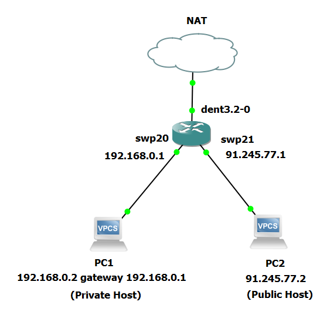

# Stateful Network Address Translation (NAT)

Stateful Network Address Translation (NAT), also known as dynamic NAT, facilitates the mapping of multiple private IP addresses to public addresses.

- It was introduced in the [Beeblebrox Release (v2)](https://github.com/dentproject/dentOS/releases/tag/v2.0) of DENT.

Configuration of stateful NAT involves employing the `tc iproute2` tool alongside the `tc-ct` action. For dynamic NAT entry offloading, integrate the `tc-ct` action with the flower filter rule and ingress qdisc.

### Example Configuration:

This example sets up networking for connected hosts, assigning IP addresses and configuring interfaces. It establishes a default gateway and enables connection tracking and NAT for traffic management. Considerations for resource usage and rule priorities are included.

Configure the private host (Assume it to be PC1):

```
ip 192.168.0.2/24 192.168.0.1
```

Configure the public host (Assume it to be PC2):

```
ip 91.245.77.2/24
```

Configure IP on the interfaces and set up a default gateway:

```
ip addr add dev swp20 192.168.0.1/24
ip addr add dev swp21 91.245.77.1/24
```

```
ip route add default via 91.245.77.1
```

Ensure that the interfaces are up. You can bring up the interfaces using the following commands:

```
ip link set dev swp20 up
ip link set dev swp21 up
```



This setup ensures PC1 (the private host) is on the private network, and PC2 (the public host) is on the public network, with the DENT VM managing the connection tracking and Stateful NAT between these networks.

Enable connection tracking on `swp20`:

```
tc qdisc add dev swp20 clsact
```

```
tc filter add dev swp20 ingress proto ip pref 2 flower ct_state -trk action ct
```

```
filter protocol ip pref 2 flower chain 0
filter protocol ip pref 2 flower chain 0 handle 0x1
  eth_type ipv4
  ct_state -trk
  in_hw in_hw_count 1
        action order 1: ct zone 0 pipe
         index 3 ref 1 bind 1
        used_hw_stats delayed
```

Configure NAT connection tracking on `swp21`:

```
tc qdisc add dev swp21 clsact
```

NAT connection tracking on `swp21` for egress traffic:

```
tc filter add dev swp21 egress prio 10 proto ip flower action ct commit nat src addr 91.245.77.1 pipe action pass
```

```
filter protocol ip pref 10 flower chain 0
filter protocol ip pref 10 flower chain 0 handle 0x1
  eth_type ipv4
  not_in_hw
        action order 1: ct commit zone 0 nat src addr 91.245.77.1 pipe
         index 4 ref 1 bind 1

        action order 2: gact action pass
         random type none pass val 0
         index 3 ref 1 bind 1
```

NAT connection tracking on `swp21` for ingress traffic:

```
tc filter add dev swp21 ingress prio 5 proto ip flower action ct nat pipe action pass
```

```
filter protocol ip pref 5 flower chain 0
filter protocol ip pref 5 flower chain 0 handle 0x1
  eth_type ipv4
  in_hw in_hw_count 1
        action order 1: ct zone 0 nat pipe
         index 5 ref 1 bind 1
        used_hw_stats delayed

        action order 2: gact action pass
         random type none pass val 0
         index 4 ref 1 bind 1
        used_hw_stats delayed
```

**Verify Connectivity**:

From PC1 to DENT:

```
PC1> ping 192.168.0.1
PING 192.168.0.1 (192.168.0.1) 56(84) bytes of data.
64 bytes from 192.168.0.1: icmp_seq=1 ttl=64 time=0.049 ms
64 bytes from 192.168.0.1: icmp_seq=2 ttl=64 time=0.043 ms
64 bytes from 192.168.0.1: icmp_seq=3 ttl=64 time=0.036 ms
64 bytes from 192.168.0.1: icmp_seq=4 ttl=64 time=0.040 ms
```

From PC2 to DENT:

```
PC1> ping 91.245.77.1
PING 91.245.77.1 (91.245.77.1) 56(84) bytes of data.
64 bytes from 91.245.77.1: icmp_seq=1 ttl=64 time=0.057 ms
64 bytes from 91.245.77.1: icmp_seq=2 ttl=64 time=0.048 ms
64 bytes from 91.245.77.1: icmp_seq=3 ttl=64 time=0.039 ms
64 bytes from 91.245.77.1: icmp_seq=4 ttl=64 time=0.042 ms
```

From PC1 to PC2:

```
PC1> ping 91.245.77.2
PING 91.245.77.2 (91.245.77.2) 56(84) bytes of data.
64 bytes from 91.245.77.2: icmp_seq=1 ttl=64 time=0.043 ms
64 bytes from 91.245.77.2: icmp_seq=2 ttl=64 time=0.040 ms
64 bytes from 91.245.77.2: icmp_seq=3 ttl=64 time=0.034 ms
64 bytes from 91.245.77.2: icmp_seq=4 ttl=64 time=0.036 ms
```

Since all three pings are successful, it indicates that the network is configured correctly and connectivity is established.

**Notes:**

- Since the NAT configuration uses regular ACL rules, it takes resources from regular ACL memory.
- Egress CT flower filter match on a public port should be the same as CT flower filter on a private port. If a CT rule exists on multiple private port, those flower matches should be reflected on egress public port.

## Private to Private Flow

To skip NAT for packets designated as a private subnet or hosts:

```
tc filter add dev swp21 protocol ip ingress flower skip_sw ip_proto tcp dst_ip 192.168.0.1/24 action pass
```

```
filter protocol ip pref 49152 flower chain 0
filter protocol ip pref 49152 flower chain 0 handle 0x1
  eth_type ipv4
  ip_proto tcp
  dst_ip 192.168.0.1/24
  skip_sw
  in_hw in_hw_count 1
        action order 1: gact action pass
         random type none pass val 0
         index 5 ref 1 bind 1
        used_hw_stats delayed
```

**Note:** The last added rule has a higher priority, so the priority can be skipped in the rule.
