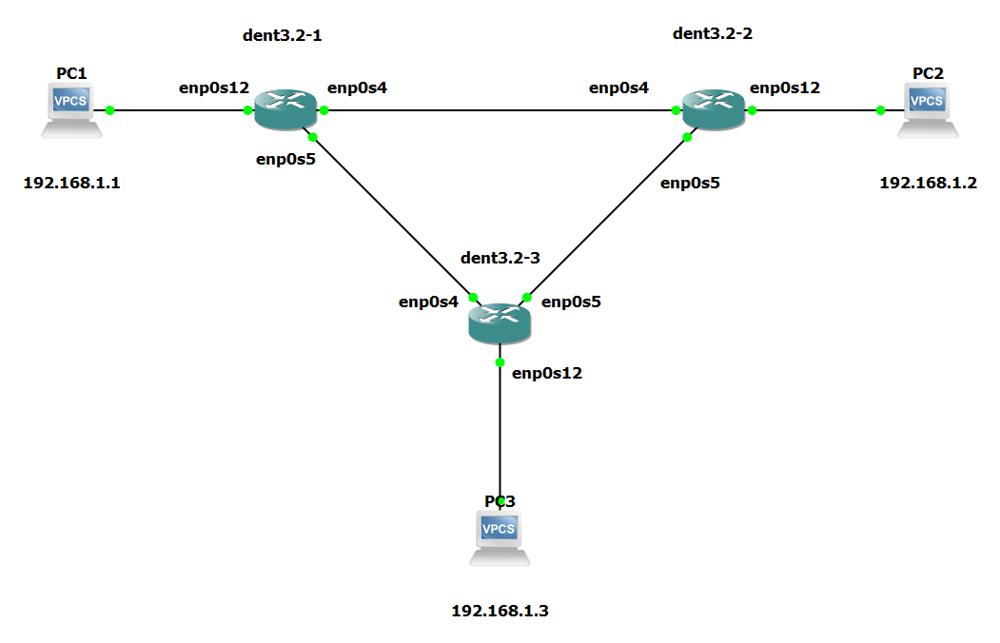

# STP (Spanning Tree Protocol)

## Introduction

In this guide, we will quickly explain what the
Spanning Tree Protocol is
and give an example implementing it.

The Spanning Tree Protocol or STP is a network protocol that operates
on the Layer 2 level of devices.

The ports on a switch with STP enabled
will always be in one of the following five port states.

1. Blocking

2. Listening

3. Learning

4. Forwarding

5. Disabled

The ports in a switch with STP will often begin
in the blocking state
and later change to the listening, learning,
and eventually forwarding state when appropriate.

**This conversion may take time as devices "learn"
where other devices are.**

STP is simple to implement using bridges and is
important to address looping and
wasting bandwidth. STP works by blocking
redundant links from forwarding packets.

To learn the basics of bridges, visit the following:
[Bridging Layer 2](../VLANConfigurationSubCategories/BridgingL2.html)

## Enabling Spanning Tree Protocol

**By default, STP is disabled on all bridges.**

To enable STP on an existing bridge, run the following command:

```
$ ip link set dev ${Bridge Name} type bridge stp_state 1
```

To enable STP on bridge creation, use:

```
$ ip link set dev ${Bridge Name} type bridge stp_state 1
```

To disable STP on a bridge, set stp_state to “0”.

To show the current information about the state of the
bridge use the following:

```
$ ip -d link show dev ${Bridge Name}
```

The brctl utility can also be used to view information
about the current configuration.

If the brctl utility is not already installed, use:
`$ apt-get update` to update the package lists.
Install the brctl utility with: `$ apt-get install bridge-utils`

Use the following to confirm STP is enabled:

```
$ brctl show ${Bridge Name}
```

In addition to this, view other relevant information regarding the
STP configuration of the current bridge with:

```
$ brctl showstp ${Bridge Name}
```

## Configurables

The following are some of the controllable parameters
regarding STP configurations

- Bridge Priority
- Path Priority and Cost
- Forwarding Delay
- Hello Time
- Max Age

### Bridge Priority

The Bridge Priority is used to determine
the probability that the bridge will be elected as the root device.
A lower bridge priority indicates that a switch has a higher
likelihood of becoming the root device

Ex.

```
$ ip link set ${Birdge Name} type bridge priority ${Priority Number}
```

### Path Priority and Cost

The Path Priority and Cost will influence the route packets take.
A lower cost is preferred.

Ex.

```
$ ip link set ${Interface Name} type bridge_slave cost ${Cost Number}
```

### Forwarding Delay

The Forwarding Delay is the time spent in hundredths of a second
in the LISTENING state and the LEARNING state before changing states.

Ex.

```
$ ip link set ${Bridge Name} type bridge forward_delay ${Delay Time}
```

### Hello Time

The Hello time is the set of time in hundredths of a second
between each hello packet sent by the bridge.

Ex.

```
$ ip link set ${Bridge Name} type bridge hello_time ${Hello Time}
```

### Max Age

The Max Age is the timeout requirement for the hello packet.
It reflects the time in hundredths of a second until another bridge in the
spanning tree is assumed to be dead. It is based on the time of
reception since the last received hello message.

Ex.

```
$ ip link set ${Bridge Name} type bridge max_age ${Age Time}
```

---

## Example Configuration

Consider the following topology:



Let's say we wanted to configure PC1, PC2, and PC3 to be able to communicate
over these links and maintain the same LAN. One way we could do this is
to create bridges on every switch and enslave all the
connected interfaces.

**However, creating a bridge on every device without STP enabled would
begin to flood the system, as shown below.**

### Flawed Example:

The following was run on every switch in the given topology:

```
$ ip link add name br0 type bridge

$ ip link set enp0s4 master br0

$ ip link set enp0s5 master br0

$ ip link set enp0s12 master br0
```

The interfaces were also brought up with:

```
$ ip link set enp0s4 up

$ ip link set enp0s5 up

$ ip link set enp0s12 up

$ ip link set br0 up
```

The result of this configuration was
a flood of requests in the system. The following
is a log from one of the switch devices:

```
root@localhost:~# [  291.521985] br0: received packet on enp0s4 with own address as source address (addr:0c:6e:09:a1:00:01, vlan:0)
[  291.530112] br0: received packet on enp0s4 with own address as source address (addr:0c:6e:09:a1:00:01, vlan:0)
[  291.537694] br0: received packet on enp0s5 with own address as source address (addr:0c:6e:09:a1:00:01, vlan:0)
[  291.554573] br0: received packet on enp0s4 with own address as source address (addr:0c:6e:09:a1:00:01, vlan:0)
[  296.510152] net_ratelimit: 6194 callbacks suppressed
```

In this configuration, attempting to add a bridge to every device
without STP enabled resulted in a loop where devices
where receiving their own source MAC addresses.

**To avoid this, enable STP by including `stp_state 1`
upon bridge creation.**

### Corrected Example:

The following was run on every switch in the given topology:

```
$ ip link add name br0 type bridge stp_state 1

$ ip link set enp0s4 master br0

$ ip link set enp0s5 master br0

$ ip link set enp0s12 master br0
```

The interfaces were also brought up with:

```
$ ip link set enp0s4 up

$ ip link set enp0s5 up

$ ip link set enp0s12 up

$ ip link set br0 up
```

By enabling the bridges to include STP, the system flooding was
prevented. PC1 PC2 and PC3 can now
successfully ping one another without
the switches receiving continued feedback
regarding their own source MAC addresses.

```
PC1 : 192.168.1.1 255.255.255.0

PC1> ping 192.168.1.2

84 bytes from 192.168.1.2 icmp_seq=1 ttl=64 time=2.345 ms
84 bytes from 192.168.1.2 icmp_seq=2 ttl=64 time=1.093 ms
84 bytes from 192.168.1.2 icmp_seq=3 ttl=64 time=1.442 ms
^C

PC1> ping 192.168.1.3

84 bytes from 192.168.1.3 icmp_seq=1 ttl=64 time=0.506 ms
84 bytes from 192.168.1.3 icmp_seq=2 ttl=64 time=0.713 ms
84 bytes from 192.168.1.3 icmp_seq=3 ttl=64 time=0.728 ms
84 bytes from 192.168.1.3 icmp_seq=4 ttl=64 time=0.878 ms
^C
PC3>
```

**NOTE: The outputs above were tested on a Virtual Machine**
