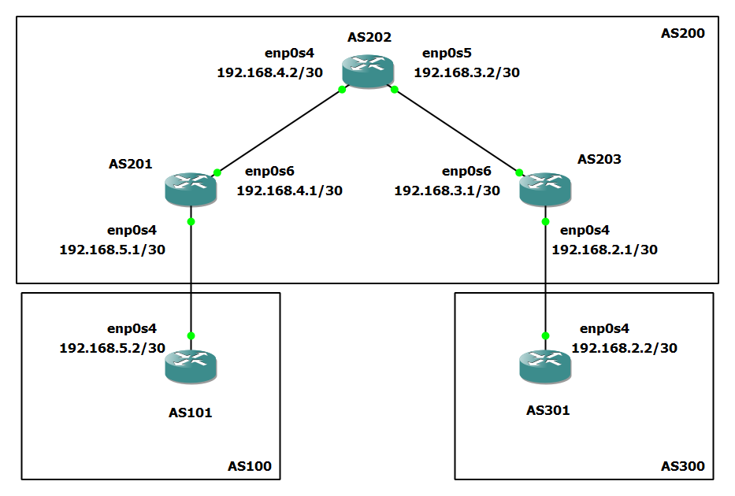

# BGP (Border Gateway Protocol)

## Introduction

In this guide, we will quickly explain what the
Border Gateway Protocol is
and give an example implementing it.

The Border Gateway Protocol, or BGP, is a standardized means of exchanging routing
and reachability information between each autonomous system (AS) on the Internet.
BGP differs from IGPs (Interior Gateway Protocols) like OSPF, EIGRP
and IS-IS due to its scalability.
IGPs are often used within an autonomous system, while
BGP is used across them.

Two forms of BGP include
**eBGP** (External Border Gateway Protocol) and **iBGP** (Internal Border Gateway Protocol)

- **eBGP** is used to advertise routing information from autonomous system to autonomous system.
- **iBGP**, on the other hand, propagates those external routes within an autonomous system.

The table below summarizes some additional differences between iBGP and eBGP:

| Description                                                          |                                                                                    iBGP                                                                                    |                                                                                                          eBGP                                                                                                           |
| -------------------------------------------------------------------- | :------------------------------------------------------------------------------------------------------------------------------------------------------------------------: | :---------------------------------------------------------------------------------------------------------------------------------------------------------------------------------------------------------------------: |
| Route Advertisement                                                  | If a route is learned via iBGP, it is considered within its own AS. Routes Received from a peer cannot be advertised to another peer but can be advertised to an eBGP peer |                               If a route is learned via eBGP, it is understood as not belonging to the local AS. Routes received from a peer cna be broadcast to both eBGP nad iBGP peers                               |
| Topology                                                             |                 Each iBGP speaker within AS must have all other iBGP peers in the same AS as neighbors. This configuration is called a Full Mesh Topology                  |                                                                                          A Full Mesh Topology is not required                                                                                           |
| Loop Prevention                                                      |                  Uses BGP split horizon. This rule states that a BGP router does not advertise the routes learned from an iBGP peer to other iBGP peers.                   | The AS_Path attribute contains a list of numbers through which a route has traversed. If a router sees its AS number in the AS_PATH attribute of an incoming BGP packet, it will drop the advertisement to avoid loops. |
| Default TTL between Peers                                            |                                                                                 TTL = 255                                                                                  |                                                                                                         TTL = 1                                                                                                         |
| Default Administrative Distance (Used in determining route priority) |                                                                                    200                                                                                     |                                                                                                           20                                                                                                            |

In this document, we will be using the open-source software
FRR (Free Range Routing) to configure an example for BGP.

For more information regarding configuring BGP outside of this document, visit the FRR Documentation:
[BGP with FRR](https://docs.frrouting.org/en/latest/bgp.html#bgp)

## Installation of FRR

To install FRR (Free Range Routing) with BGP support on DENT Devices, follow the steps below:

### Installation using APT:

```
curl -s https://deb.frrouting.org/frr/keys.gpg | sudo tee /usr/share/keyrings/frrouting.gpg > /dev/null
FRRVER="frr-stable"
echo deb '[signed-by=/usr/share/keyrings/frrouting.gpg]' https://deb.frrouting.org/frr \
     $(lsb_release -s -c) $FRRVER | sudo tee -a /etc/apt/sources.list.d/frr.list
sudo apt update && sudo apt install frr frr-pythontools
```

**Note:** Ensure that `apt-transport-https` and `curl` are installed before proceeding with the installation.

### Installation using Snapcraft (Alternative Method):

```
sudo apt update
sudo apt install snapd
sudo snap install core

sudo snap install frr
```

### Start and Enable FRR Service

```
sudo systemctl start frr
sudo systemctl enable frr
```

Output-

```
Synchronizing state of frr.service with SysV service script with /lib/systemd/systemd-sysv-install.
Executing: /lib/systemd/systemd-sysv-install enable frr
```

## Enable BGP

Once FRR is installed, edit
the FRR daemon configuration file to enable BGP on any device:

```
vim /etc/frr/daemons
```

Ensure the following configuration:

```
zebra=yes
bgpd=yes
ospfd=no
ospf6d=no
ripd=no
ripngd=no
```

### Interacting with FRR

To access FRR's interactive shell, use the following:

```
$ sudo vtysh
```

The Output will resemble the following:

```
Hello, this is FRRouting (version 8.5).
Copyright 1996-2005 Kunihiro Ishiguro, et al.
```

The following commands can now be used with `vtysh` to view the current configuration and neighbor relationships:

- `show bgp summary`: Displays a summary of the current BGP status and configuration details.
- `show bgp neighbor`: Lists the current BGP neighbors and their statuses.
- `show ip route`: Shows the current routing table and all the IP routes known to the device.

For more information on these and other available commands, please refer to [BGP FRR](https://docs.frrouting.org/en/latest/bgp.html#bgp).

## Concept Overview

### Autonomous System Number (ASN)

Devices must be configured with an ASN number for BGP routing.

An autonomous system is defined by an ASN (Autonomous System Number).
In FRR, ASNs have a value ranging from 1 to 65535.
Numbers 64512 through 65535 are defined as private ASNs and must
not be advertised on the global Internet.

ASNs are used by BGP to make routing decisions and are important for
establishing eBGP and iBGP configurations. When devices have the same ASN and are BGP neighbors, an iBGP session is established.
When devices have different ASNs and are BGP neighbors, an eBGP session is established.

To specify the ASN of a device, developers should use the following statement:

```
router bgp ${Device ASN}
```

Ex.

```
router bgp 100
```

Establishes a new router with BGP and ASN 100.

### Neighbors

Devices, when being configured
for BGP must also know who to peer with in order to exchange routing information.

Routers in the same AS configured for BGP are known as iBGP peers and
must be neighbors with every other router configured for BGP in the same AS.
This is known as a full mesh topology. Routers that are in two different autonomous systems are eBGP peers and do not need to know every other eBGP
router.

To specify the neighbors of a device, use the following statement:

```
neighbor ${Neighboring Router ID} remote-as ${ASN of Neighbor}
```

Ex.

```
   neighbor 192.168.5.1 remote-as 200
```

Specify the BGP neighbor of the given router applied on as 192.168.5.1 in ASN 200.

### Routes

By default, all BGP routing information is not sent to neighboring devices.
Instead, users must specify the routes devices to share with their neighbors.

A few ways to do this are with the following commands:

```
network A.B.C.D/M
```

or

```
redistribute connected
```

Ex.

```
  network 192.168.5.0/30
```

Broadcasts to neighbors the route to the 192.168.5.0/30 network.

### Policy

Additionally, BGP devices will only add routes to their routing table as specified by a policy.

One way to configure policies is by using a prefix-list and a route-map:

#### **Prefix-list**

A prefix-list is used for filtering IP prefixes in routing updates.
To create a prefix-list filter, users will use the statement:

```
ip prefix-list ${Name of Prefix List} seq ${Sequence Num} ${permit | deny} ${IP Address}
```

To create a filter for a range, you must specify this with the inclusion of `le` or `ge`
for less than or equal to or greater than or equal to:

```
ip prefix-list ${Name of Prefix List} seq ${Sequence Num} ${permit | deny} ${IP Addr} ${IP Range} ${le | ge}
```

Ex.

```
ip prefix-list R1-FILTER-LIST seq 5 permit 192.0.0.0/8 le 30
```

This creates an IP prefix-list named R1-FILTER. It permits routes with prefixes in the range 192.0.0.0/8
less than or equal to /30.

or

Ex.

```
ip prefix-list R1-FILTER seq 5 permit any
```

This creates an IP prefix-list named R1-Filter that adds all routes received.

#### **Route-Map**

A route-map allows you to manipulate routing decisions.
To create a route-map user will use the statement:

```
route-map ${Route-Map Name} ${permite | dent} ${Sequence Num}
```

To match a prefix list to a route map, use

```
match ip address prefix-list ${Prefix List Name}
```

Ex.

```
route-map R1-FILTER permit 10
 match ip address prefix-list R1-FILTER-LIST
exit
```

This defines a route map named R1-FILTER with sequence number 10.
This route-map matches IP addresses with the prefix-list R1-FILTER-LIST.

To add the incoming traffic of a neighbor or outgoing traffic of a neighbor through a specified
route-map use the following:

```
neightbor A.B.C.D/M route-map ${Route-map Name} ${in | out}
```

Ex.

```
neighbor 192.168.5.1 route-map R1-FILTER in

neighbor 192.168.5.1 route-map R1-FILTER out
```

The above filters incoming and outgoing packets with
the defined route-map called R1-FILTER.

### Example Configuraiton File

Below is an example configuration file and a line by line explanation of each
command:

```
!
router bgp 100
 neighbor 192.168.5.1 remote-as 200
 !
 address-family ipv4 unicast
  network 192.168.5.0/30
  neighbor 192.168.5.1 route-map R1-FILTER in
  neighbor 192.168.5.1 route-map R1-FILTER out
 exit-address-family
exit
!
ip prefix-list R1-FILTER seq 5 permit 192.0.0.0/8 le 30
!
route-map R1-FILTER permit 10
 match ip address prefix-list R1-FILTER
exit
!
end
```

| Command                                                   |                                                                                                       Description                                                                                                       |
| --------------------------------------------------------- | :---------------------------------------------------------------------------------------------------------------------------------------------------------------------------------------------------------------------: |
| `router bgp 100`                                          |                                                              This initiates a BGP process with the Autonomous System Number (ASN) 100 on the given router.                                                              |
| ` neighbor 192.168.5.1 remote-as 200`                     | This sets up a BGP neighbor relationship with the router at IP address 192.168.5.1, which is in a different ASN (200). An eBGP connection will be established since the device ASN is different from the neighbor's ASN |
| `address-family ipv4 unicast`                             |                                                                     This specifies that the following commands will apply to IPv4 unicast routing.                                                                      |
| `network 192.168.5.0/30`                                  |                                                              This command advertises the network 192.168.5.0 with a subnet mask of 255.255.255.252 (/30).                                                               |
| `neighbor 192.168.5.1 route-map R1-FILTER in`             |                                                                 Applies the route-map named R1-FILTER to incoming routes for the neighbor 192.168.5.1.                                                                  |
| `neighbor 192.168.5.1 route-map R1-FILTER in`             |                                                                 Applies the route-map named R1-FILTER to outgoing routes for the neighbor 192.168.5.1.                                                                  |
| `exit-address-family`                                     |                                                                                This command exits the address family configuration mode                                                                                 |
| `ip prefix-list R1-FILTER seq 5 permit 192.0.0.0/8 le 30` |                                                 This creates a prefix list that permits networks within the 192.0.0.0/8 range with a subnet mask length of 30 or less.                                                  |
| `route-map R1-FILTER permit 10`                           |                                                                                        This defines a route-map named R1-FILTER                                                                                         |
| ` match ip address prefix-list R1-FILTER`                 |                                                                      The new route-map permits routes matching the previously defined prefix list.                                                                      |
| ` end`                                                    |                                                                                        This command exits the configuration mode                                                                                        |

The `!` characters are used as separators for readability and have no functional impact on the configuration.

### BGP Peer Session Establishment

When a BGP routing process is configured with a peer, your device will go
through the following state changes:

#### States

1. **Idle**—This is your device's initial state. In this state, no network reachability information is sent. Your device will also attempt to establish a TCP connection with a peer.

2. **Connect** - In this state, the device attempts to complete a three-way TCP handshake. If successful, the state will change to **OpenSent**, otherwise it will move to **Active**.

3. **Active** - During this state, BGP has NOT been established. Your device will continue to make attempts at the TCP three-way handshake until the ConnectRetry timer expires.

4. **OpenSent**—Once this state is achieved, BGP has initiated a connection and is waiting for an Open message from the peer. Upon receiving the Open message, BGP will send keepalive messages and move to the Open Confirmation State. If there are errors, your device will return to the **Active** state.

5. **OpenConfirm** - BGP will wait for a keepalive message from its peers. Once received, your device will transition to the **Established State**

6. **Established**—This is the final state in which BGP neighbors begin exchanging routing information. If the BGP process receives an error notification during this state, it will be changed back to the **Idle** state.

### Routing Priority

The route selection process used by FRR has the following
decision criterion starting at the top and going down for selecting routes:

1. Weight check - Prefer higher local weight routes to lower routes.

2. Local preference check - Prefer higher local preference routes to lower.
   If `bgp bestpath aigp` is enabled, and both paths that are compared have AIGP attributes, BGP uses AIGP tie-breaking unless both paths have the AIGP metric attribute. This means the AIGP attribute is not evaluated during the best path selection process between two paths when one path does not have the AIGP attribute.

3. Local route check -
   Prefer local routes (statics, aggregates, redistributed) to received routes from peers.

4. AS path length check -
   Prefer shortest hop-count AS_PATHs.

5. Origin check -
   Prefer IGP origin routes to EGP and, finally, Incomplete routes.

6. MED check -
   Where routes with a MED were received from the same AS, prefer the route with the lowest MED. Multi-Exit Discriminator.

7. External check -
   Prefer the route received from an external eBGP peer over routes received from other types of peers.

8. IGP cost check -
   Prefer the route with the lowest IGP cost.

9. Multi-path check -
   If multi-pathing is enabled, check whether the route is not yet distinguished in preference and may be considered equal. If bgp `bestpath as-path multipath-relax` is set, all such routes are considered equal, otherwise routes received via iBGP with identical AS_PATHs or routes received from eBGP neighbours in the same AS are considered equal.

10. Already-selected external check -
    If both routes were received from eBGP peers, then the route that was already selected should be preferred. Note that this check is not applied if bgp `bestpath compare-routerid` is configured.

11. Router-ID check -
    Prefer the route with the lowest router-ID. If the route has an ORIGINATOR_ID attribute, through iBGP reflection, then that router ID is used, otherwise use the router-ID of the peer the route was received from.

12. Cluster-List length check -
    Use the route with the shortest cluster-list length. The cluster-list reflects the iBGP reflection path the route has taken.

13. Peer address -
    Prefer the route received from the peer with the higher transport layer address as a tie-breaker.

## Example Configuration

Consider the following topology:



The diagram above shows three asynchronus systems AS100, AS200, and AS300.
AS100 contains Device AS101. AS200 contains Device AS201, AS202, and AS203. A300 contains Device AS301.
Using BGP these devices will exchange routing and reachability information.

### Assign IP Addresses:

On Device AS101:

```
ip address add 192.168.5.2/30 dev enp0s4
ip link set enp0s4 up
```

On Device AS201:

```
ip address add 192.168.5.1/30 dev enp0s4
ip link set enp0s4 up
ip address add 192.168.4.1/30 dev enp0s6
ip link set enp0s6 up
```

On Device AS202:

```
ip address add 192.168.4.2/30 dev enp0s4
ip link set enp0s4 up
ip address add 192.168.3.2/30 dev enp0s5
ip link set enp0s5 up
```

On Device AS203:

```
ip address add 192.168.3.1/30 dev enp0s6
ip link set enp0s6 up
ip address add 192.168.2.1/30 dev enp0s4
ip link set enp0s4 up
```

On Device AS301:

```
ip address add 192.168.2.2/30 dev enp0s4
ip link set enp0s4 up
```

_Devices should also have a route between themselves and devices directly connected.
We can confirm this using `ip route show`._

AS101:

```
root@localhost:~# ip route show
192.168.5.0/30 dev enp0s4 proto kernel scope link src 192.168.5.2
root@localhost:~#
```

_If a route was not added, add a static route between each router
and the device connected ot them._

Finally, ensure IPv4 forwarding is enabled on all devices (`sysctl -w net.ipv4.ip_forward=1`) with the following:

`sudo sh -c 'echo 1 > /proc/sys/net/ipv4/ip_forward'`

## Configuring BGP

First, let's configure Devices AS101 and AS301 for eBGP.

Edit the FRR configuration file on both devices with the following command:

```
sudo vim /etc/frr/frr.conf
```

On Device AS101, add the following configuration to the `frr.conf` file:

```
router bgp 100
 neighbor 192.168.5.1 remote-as 200
 !
 address-family ipv4 unicast
  network 192.168.5.0/30
  neighbor 192.168.5.1 route-map R1-FILTER in
  neighbor 192.168.5.1 route-map R1-FILTER out
 exit-address-family
exit
!
ip prefix-list R1-FILTER seq 5 permit 192.0.0.0/8 le 30
!
route-map R1-FILTER permit 10
 match ip address prefix-list R1-FILTER
exit
!
end
```

On Device AS301, add the following configuration to the `frr.conf` file:

```
router bgp 300
 neighbor 192.168.2.1 remote-as 200
 !
 address-family ipv4 unicast
  network 192.168.2.0/30
  neighbor 192.168.2.1 route-map R1-FILTER in
  neighbor 192.168.2.1 route-map R1-FILTER out
 exit-address-family
exit
!
ip prefix-list R1-FILTER seq 5 permit 192.0.0.0/8 le 30
!
route-map R1-FILTER permit 10
 match ip address prefix-list R1-FILTER
exit
!
end
```

Next, we will configure Devices AS201, AS202 and AS203 for BGP.

On Device AS201, add the following configuration to the `frr.conf` file:

```
router bgp 200
 neighbor 192.168.3.1 remote-as 200
 neighbor 192.168.4.2 remote-as 200
 neighbor 192.168.5.2 remote-as 100
 !
 address-family ipv4 unicast
  network 192.168.4.0/30
  network 192.168.5.0/30
  neighbor 192.168.5.2 route-map R1-FILTER in
  neighbor 192.168.5.2 route-map R1-FILTER out
 exit-address-family
exit
!
ip prefix-list R1-FILTER seq 5 permit 192.0.0.0/8 le 30
!
route-map R1-FILTER permit 10
 match ip address prefix-list R1-FILTER
exit
!
end
```

On Device AS203, add the following configuration to the `frr.conf` file:

```
router bgp 200
 neighbor 192.168.2.2 remote-as 300
 neighbor 192.168.3.2 remote-as 200
 neighbor 192.168.4.1 remote-as 200
 !
 address-family ipv4 unicast
  network 192.168.2.0/30
  network 192.168.3.0/30
  neighbor 192.168.2.2 route-map R1-FILTER in
  neighbor 192.168.2.2 route-map R1-FILTER out
 exit-address-family
exit
!
ip prefix-list R1-FILTER seq 5 permit 192.0.0.0/8 le 30
!
route-map R1-FILTER permit 10
 match ip address prefix-list R1-FILTER
exit
!
end
```

On Device AS202, add the following configuration to the `frr.conf` file:

```
router bgp 200
 neighbor 192.168.3.1 remote-as 200
 neighbor 192.168.4.1 remote-as 200
exit
!
end
```

Restart the FRR service on each device after configurations with the following command to ensure BGP
is properly started:

```
systemctl restart frr
```

### Adding Routes Between iBGP peers

Typically, you would use an IGP when routing internally in an AS. This is what allows iBGP peers
to know how to start the three-way TCP handshake with each neighbor.

Without iBGP routers knowing how to reach each neighbor, routing information is not shared between them:

Take a look at the sample output below from router AS203:

```
localhost# show bgp sum

IPv4 Unicast Summary (VRF default):
BGP router identifier 192.168.3.1, local AS number 200 vrf-id 0
BGP table version 2
RIB entries 3, using 576 bytes of memory
Peers 3, using 2174 KiB of memory

Neighbor        V         AS   MsgRcvd   MsgSent   TblVer  InQ OutQ  Up/Down State/PfxRcd   PfxSnt Desc
192.168.2.2     4        300        15        14        0    0    0 00:06:47            1        2 N/A
192.168.3.2     4        200        13        16        0    0    0 00:06:31            0        2 N/A
192.168.4.1     4        200         0         0        0    0    0    never       Active        0 N/A

Total number of neighbors 3
```

If we look at the neighbor 192.168.4.1, we can see a BGP session has not been established
the reason is that AS203 has no route to reach 192.168.4.1.

If we add a static route or via an IGP between the two devices, we should be able to establish
a BGP session. Devices will then be able to share their routing information.

On Device AS201, run the following command:

```
ip route add 192.168.3.1 via 192.168.4.2
```

On Device AS203, run the following command:

```
ip route add 192.168.4.1 via 192.168.3.2
```

Now that all iBGP peers are connected, we can see that routing information is being sent:

```
localhost# show bgp sum

IPv4 Unicast Summary (VRF default):
BGP router identifier 192.168.3.1, local AS number 200 vrf-id 0
BGP table version 4
RIB entries 7, using 1344 bytes of memory
Peers 3, using 2174 KiB of memory

Neighbor        V         AS   MsgRcvd   MsgSent   TblVer  InQ OutQ  Up/Down State/PfxRcd   PfxSnt Desc
192.168.2.2     4        300        33        35        0    0    0 00:06:21            1        4 N/A
192.168.3.2     4        200        17        18        0    0    0 00:14:51            0        2 N/A
192.168.4.1     4        200        18        18        0    0    0 00:14:51            2        2 N/A

Total number of neighbors 3
```

Congratulations, you have now successfully configured BGP on your devices!

To test that BGP is configured, we will ping AS301 from AS101.

Device AS101:

```
root@localhost:~# ping 192.168.2.2
PING 192.168.2.2 (192.168.2.2) 56(84) bytes of data.
64 bytes from 192.168.2.2: icmp_seq=1 ttl=61 time=6.35 ms
64 bytes from 192.168.2.2: icmp_seq=2 ttl=61 time=20.8 ms
64 bytes from 192.168.2.2: icmp_seq=3 ttl=61 time=23.5 ms
64 bytes from 192.168.2.2: icmp_seq=4 ttl=61 time=4.24 ms
^C
--- 192.168.2.2 ping statistics ---
4 packets transmitted, 4 received, 0% packet loss, time 3004ms
rtt min/avg/max/mdev = 4.241/13.743/23.566/8.536 ms
root@localhost:~#
```

**NOTE: The output above was tested on a virtual machine**
