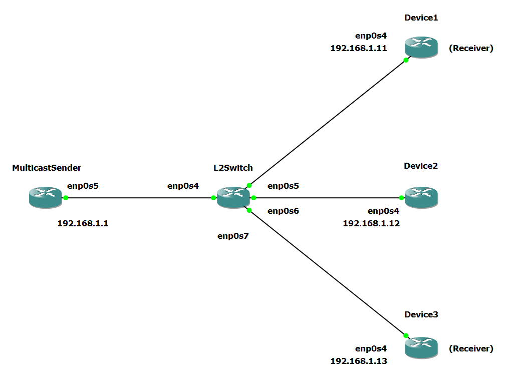

# IGMP Snooping

## Introduction

In this guide, we will quickly explain what
IGMP Snooping is and give an example implementing it.

IGMP snooping is a network switch feature that
enhances the efficiency of the multicast traffic delivery. Since
IGMP Snooping occurs at Layer 2 it will use the bridge driver
for coordinating multicast transmissions.
Bridges, by default, may flood traffic to all enslaved ports.

IGMP Snooping makes it so that
Multicast transmissions will only go down ports where there are devices
a part of a given multicast group.

## Multicast Database (MDB)

The Multicast Database (MDB) contains
all known L2 multicast group addresses (mac address) on a link.
The MDB is how the Bridge driver keeps track of all registered multicast
groups and, as such, is essential for IGMP Snooping.

## Creating a static MDB Group

First, create a bridge with

```
$ ip link add name br0 type bridge
```

To create a static MDB group (or add a port to an already existing group) on a bridge,
enter the following command:

```
$ bridge mdb add dev ${DEV} port ${PORT} grp ${GROUP} ${<permanent|temp>} ${vid}
```

Detailed Descriptions:

| Configure |                                    Description                                     |
| --------- | :--------------------------------------------------------------------------------: |
| DEV       |                The interface where this group address is associated                |
| PORT      |        The port whose link is known to have members of the multicast group         |
| GROUP     | The multicast group address whose members reside on the link connected to the port |
| permanent |                      Indicate that the MDB entry is permanent                      |
| temp      |                Indicates that the MDB entry is temporary (default)                 |
| vid       |                        The VLAN ID for the multicast group                         |

Ex.

Using a MAC address:

```
$ bridge mdb add dev br0 port veth1 grp 01:00:00:00:00:04 permanent vid 1
```

Using an IPV4 address:

```
$ bridge mdb add dev br0 port veth1 grp 239.255.255.255 permanent vid 1
```

## Deleting a single MDB Group

To delete a group or a single port from a group, enter the following command:

```
$ bridge mdb delete dev ${DEV} port ${PORT} grp ${GROUP} ${<permanent|temp>}
```

Ex.

```
$ bridge mdb delete dev br0 port veth1 grp 239.255.255.255 permanent vid 1
```

**NOTE: Deleting a bridge will automatically clear all MDB groups associated with the Bridge**

## Viewing an MDB Table

To view an MDB table, enter the following command:

```
$ bridge mdb show dev ${Bridge Name}
```

Additional filters can also be included to alter the output of this command:

- To show the 'time to live' of any shown MDB group (time till expiration), use `-d`

- To only show multicast router ports, use `-s`

Ex.

```
root@localhost:~# bridge mdb show dev br0
dev br0 port enp0s7 grp ff02::1:ff2f:1 temp
dev br0 port enp0s5 grp ff02::1:ff6c:1 temp
dev br0 port enp0s6 grp ff02::1:ff8c:1 temp
dev br0 port enp0s4 grp ff02::1:ffb8:2 temp
dev br0 port br0 grp ff02::1:ff54:1 temp
dev br0 port br0 grp ff02::6a temp
```

## Enabling IGMP Snooping

In order to use IGMP Snooping, `mcast_snooping` must be enabled on the bridge.
`mcast_snooping` enables the management of multicast traffic.
It is responsible for the multicast traffic being forwarded intelligently to only those
ports where the interested hosts are connected.

By default, multicast snooping is disabled and `mcast_snooping` will be `0`.

To enable IGMP snooping on a bridge, set `mcast_snooping` to `1`:

Ex.

```
$ ip link set dev ${Bridge Name} type bridge mcast_snooping 1
```

## Multicast Querying

In addition to enabling `mcast_snooping`,
multicast querying is also needed for IGMP Snooping.
When the `mcast_querier` flag is enabled, a bridge can act as the source
for sending out multicast query messages and managing multicast group memberships within a network segment.

By default, multicast queries by a bridge are disabled and `mcast_querier` will be `0`.

To enable multicast querying on a bridge, set `mcast_querier` to `1`.

Ex.

```
$ ip link set dev ${Bridge Name} type bridge `mcast_querier` 1
```

## Additional Configurations

### Multicast Routers

Another tool for network administrators is the `mcast_router` attribute.

There are three settings for the `multicast_router` attribute:

- `0` The bridge device will not forward any multicast traffic to its ports.
- `1` The bridge device will act as a multicast router, forwarding multicast traffic according to the multicast forwarding database.
- `2` The bridge device will forward all multicast traffic to all of its ports, regardless of the multicast forwarding database.

By default, `mcast_router` will be `1`.

Setting this flag to `2` is useful in cases where the multicast router is
not present, or when there is a need
for forwarding both known and unknown IP multicast to a
another router.

Ex.

```
$ ip link set dev ${Bridge Name} type bridge `mcast_router` 2
```

### Multicast Flooding

Multicast flooding can also be changed using the `mcast_flood` attribute.
This attribute controls whether multicast traffic,
for which there is no MDB entry, will be flooded
toward a given port.

There are two settings for the `mcsat_flood` attribute:

- `on` Flood multicast traffic on ports where there is no MDB entry
- `off` Multicast traffic is NOT sent down ports where there is no MDB entry

By default, `mcast_flood` will be `on`.

Ex.

```
$ bridge link set dev ${Port Name} mcast_flood off
```

### IGMP Version

The IGMP version can also be changed using the `mcast_igmp_version` attribute.

There are two settings for the `mcast_igmp_version` attribute:

- `2` Sets the IGMP version to IGMPv2
- `3` Sets the IGMP version to IGMPv3

By default, `mcast_igmp_version` will be `2`.

Ex.

```
$ ip link set dev br0 type bridge mcast_igmp_version 3
```

## Example Configuration

Consider the following topology:



In this example, the MulticastSender will send packets to a multicast group IP address that
Device1 and Device3 are a part of. The multicast group IP address will be 224.0.55.55, and the
L2Switch will implement IGMP Snooping by querying and appropriately
forwarding the packets to only Device1 and Device3.

We will use the `iperf` utility to generate the multicast traffic.

If the `iperf` utility is not already installed on the multicast sender
and receiving devices:

Do not forget to use `$ apt-get update` to
fetch the latest version of your package lists.
Follow this with the command `$ apt-get upgrade` to first
review the changes in the latest versions
and then replace the old packages by installing the new ones.

Install the iperf utility with: `$ apt-get install iperf`

### Configure the MulticastSender

On the MulticastSender, attach an IP address to the enp0s4 interface with the following:

```
$ ip address add 192.168.1.1 dev enp0s5
```

Do not forget to bring the interface up with

```
$ ip link set enp0s5 up
```

Finally, add the default route to know where to send
multicast generated packets:

```
$ ip route add default dev enp0s5
```

### Configure the End Devices

Bring the interfaces of all the end devices up with:

```
$ ip link set enp0s4 up
```

To have only Device1 and Device3
join a group multicast address
use the following command on them:

```
$ ip address add 224.0.55.55 dev enp0s4
```

**NOTE: End Devices can be added dynamically to an
MDB table by including the keyword `autojoin` upon the addition of the
IP address. In this example it is not needed as we will
add the entry to the MDB table statically, but it is another
useful feature for network administrators.**

Ex.

```
$ ip address add 224.0.55.55 dev enp0s4 autojoin
```

### Configure IGMP Snooping on the L2Switch

First, create a bridge on the L2 Switch running DENT to connect all interfaces on the LAN.
Use the following to do so...

L2Switch:

```
$ ip link add name br0 type bridge

$ ip link set dev enp0s4 master br0

$ ip link set dev enp0s5 master br0

$ ip link set dev enp0s6 master br0

$ ip link set dev enp0s7 master br0
```

After the bridge is created, bring all interfaces up with the following:

```
$ ip link set dev enp0s4 up

$ ip link set dev enp0s5 up

$ ip link set dev enp0s6 up

$ ip link set dev enp0s7 up

$ ip link set dev br0 up
```

The MulticastSender can now reach all Devices.
However, since IGMP Snooping is not configured,
multicast traffic will be flooded on all ports,
and all Devices will receive the multicast traffic.

To limit the ports that receive multicast traffic to only those
a part of the group enable `mcast_snooping` and `mcast_querrying`
on the switch with the following:

```
$ ip link set dev br0 type bridge mcast_snooping 1
```

```
$ ip link set dev br0 type bridge mcast_querier 1
```

Now, update the MDB table by adding the interfaces
that are a part of the multicast group. In our example, the
receiver devices are Device1 on interface enp0s5
and Device3 on interface enp0s7.

Add these two entries to the MDB table with the following:

```
$ bridge mdb add dev br0 port enp0s5 grp 224.0.55.55 permanent
```

```
$ bridge mdb add dev br0 port enp0s7 grp 224.0.55.55 permanent
```

Multicast traffic will now only be sent to Device1 and Device3.

To test the configuration was successful,
we will use the `iperf` utility to
generate multicast traffic from the MulticastSender:

MulticastSender:

```
root@localhost:~# iperf -c 224.0.55.55 -u -T 32 -t 3 -i 1
------------------------------------------------------------
Client connecting to 224.0.55.55, UDP port 5001
Sending 1470 byte datagrams, IPG target: 11215.21 us (kalman adjust)
Setting multicast TTL to 32
UDP buffer size:  208 KByte (default)
------------------------------------------------------------
[  3] local 192.168.1.1 port 49710 connected with 224.0.55.55 port 5001
[ ID] Interval       Transfer     Bandwidth
[  3]  0.0- 1.0 sec   131 KBytes  1.07 Mbits/sec
[  3]  1.0- 2.0 sec   128 KBytes  1.05 Mbits/sec
[  3]  2.0- 3.0 sec   128 KBytes  1.05 Mbits/sec
[  3]  0.0- 3.0 sec   386 KBytes  1.05 Mbits/sec
[  3] Sent 269 datagrams
root@localhost:~#
```

The excerpt below shows the log of each device after running tcpdump
to log the traffic on each interface:

Device1:

```
root@localhost:~# tcpdump
[16969.941780] device enp0s4 entered promiscuous mode
tcpdump: verbose output suppressed, use -v or -vv for full protocol decode
listening on enp0s4, link-type EN10MB (Ethernet), capture size 262144 bytes
13:30:55.877791 IP 192.168.1.1.37631 > 224.0.55.55.5001: UDP, length 1470
13:30:55.890941 IP 192.168.1.1.37631 > 224.0.55.55.5001: UDP, length 1470
...
13:33:48.716221 IP 192.168.1.1.35653 > 224.0.55.55.5001: UDP, length 1470
```

Device2:

```
root@localhost:~# tcpdump
[17022.680227] device enp0s4 entered promiscuous mode
tcpdump: verbose output suppressed, use -v or -vv for full protocol decode
listening on enp0s4, link-type EN10MB (Ethernet), capture size 262144 bytes
```

Device3:

```
root@localhost:~# tcpdump
[17077.051525] device enp0s4 entered promiscuous mode
tcpdump: verbose output suppressed, use -v or -vv for full protocol decode
listening on enp0s4, link-type EN10MB (Ethernet), capture size 262144 bytes
13:32:54.377608 IP 192.168.1.1.57427 > 224.0.55.55.5001: UDP, length 1470
13:32:54.386654 IP 192.168.1.1.57427 > 224.0.55.55.5001: UDP, length 1470
...
13:32:55.411938 IP 192.168.1.1.57427 > 224.0.55.55.5001: UDP, length 1470
```

Based on the above, we can see that the multicast traffic was only
forwarded to Device1 and Device3 successfully.

**NOTE: The above was tested on a virtual machine**
