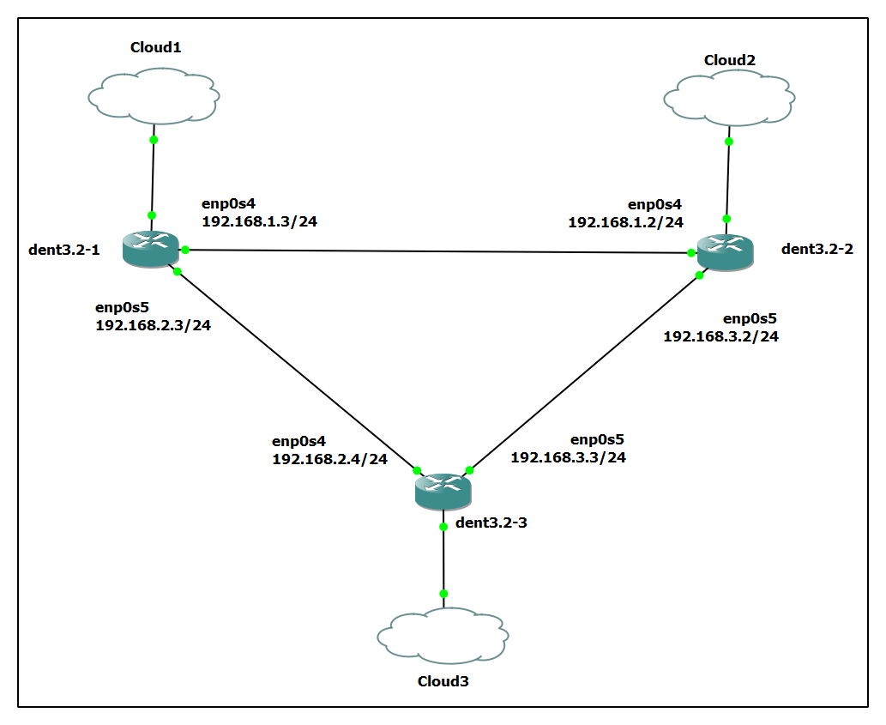

# Open Shortest Path First Version 2 (OSPFv2)

OSPFv2 is a widely used interior gateway protocol (IGP) for routing Internet Protocol (IP) packets within a single routing domain, which can be an autonomous system. It uses a link-state routing algorithm and provides efficient and scalable routing in large and complex network topologies. For more information, please refer- [OSPFv2](https://datatracker.ietf.org/doc/html/rfc2328).

This document provides detailed instructions for installing and configuring OSPFv2 on DENT devices using FRR (Free Range Routing).

## Installation of FRR

To install FRR (Free Range Routing) with OSPF support on DENT Devices, follow the steps below:

### Installation using APT:

```
curl -s https://deb.frrouting.org/frr/keys.gpg | sudo tee /usr/share/keyrings/frrouting.gpg > /dev/null

FRRVER="frr-stable"
echo deb '[signed-by=/usr/share/keyrings/frrouting.gpg]' https://deb.frrouting.org/frr \
     $(lsb_release -s -c) $FRRVER | sudo tee -a /etc/apt/sources.list.d/frr.list

sudo apt update && sudo apt install frr frr-pythontools
```

Note: Ensure that `apt-transport-https` and `curl` are installed before proceeding with the installation.

### Installation using Snapcraft (Alternative Method):

```
sudo apt update
sudo apt install snapd
sudo snap install core

sudo snap install frr
```

### Start and Enable FRR Service:

```
sudo systemctl start frr
sudo systemctl enable frr
```

Output-

```
Synchronizing state of frr.service with SysV service script with /lib/systemd/systemd-sysv-install.
Executing: /lib/systemd/systemd-sysv-install enable frr
```

## Example Configuration

### Enable OSPFd:

Edit the FRR daemon configuration file on all the devices-

```
sudo nano /etc/frr/daemons
```

Ensure the following configuration-

```
zebra=yes
bgpd=no
ospfd=yes
ospf6d=no
ripd=no
ripngd=no
```

<p align="center">
  
</p>

### Assign IP Addresses:

On Device 1 (dent3.2-1)-

```
ip addr add 192.168.1.3/24 dev enp0s4
ip link set dev enp0s4 up

ip addr add 192.168.2.3/24 dev enp0s5
ip link set dev enp0s5 up
```

On Device 2 (dent3.2-2)-

```
ip addr add 192.168.1.2/24 dev enp0s4
ip link set dev enp0s4 up

ip addr add 192.168.3.2/24 dev enp0s5
ip link set dev enp0s5 up
```

On Device 3 (dent3.2-3)-

```
ip addr add 192.168.2.4/24 dev enp0s4
ip link set dev enp0s4 up

ip addr add 192.168.3.3/24 dev enp0s5
ip link set dev enp0s5 up
```

Ensure IPv4 forwarding is enabled on each device (`sysctl -w net.ipv4.ip_forward=1`).

### Configure OSPF:

Edit the FRR configuration file on all the devices-

```
sudo nano /etc/frr/frr.conf
```

Add the following configuration to the file:

On Device 1 (dent3.2-1)-

```
router ospf
 network 192.168.1.0/24 area 0
 network 192.168.2.0/24 area 0
```

On Device 2 (dent3.2-2)-

```
router ospf
 network 192.168.1.0/24 area 0
 network 192.168.3.0/24 area 0
```

On Device 3 (dent3.2-3)-

```
router ospf
 network 192.168.2.0/24 area 0
 network 192.168.3.0/24 area 0
```

**Note:** The configuration may vary depending on user requirements.

### Restart FRR:

```
sudo systemctl restart frr
```

### Interacting with OSPF:

To access the interactive OSPF shell:

```
sudo vtysh
```

Output-

```
Hello, this is FRRouting (version 8.5).
Copyright 1996-2005 Kunihiro Ishiguro, et al.
```

After accessing the `vtysh` shell, you can execute OSPF-specific commands such as `show ip ospf`, `show ip ospf neighbor`, and `show ip route` to inspect OSPF configurations and neighbor relationships.

- `show ip ospf`: Displays the current status and configuration details of the OSPF routing process.
- `show ip ospf neighbor`: Lists the OSPF neighbor relationships and their statuses.
- `show ip route`: Shows the current routing table and all the IP routes known to the device.

For more information on these and other available commands, please refer to [OSPFv2 FRR](https://docs.frrouting.org/en/latest/ospfd.html).

**Device 1 (dent3.2-1) Output:**

```
localhost# show ip ospf

 OSPF Routing Process, Router ID: 192.168.122.127
 Supports only single TOS (TOS0) routes
 This implementation conforms to RFC2328
 RFC1583Compatibility flag is disabled
 OpaqueCapability flag is disabled
 Initial SPF scheduling delay 0 millisec(s)
 Minimum hold time between consecutive SPFs 50 millisec(s)
 Maximum hold time between consecutive SPFs 5000 millisec(s)
 Hold time multiplier is currently 1
 SPF algorithm last executed 13.456s ago
 Last SPF duration 128 usecs
 SPF timer is inactive
 LSA minimum interval 5000 msecs
 LSA minimum arrival 1000 msecs
 Write Multiplier set to 20
 Refresh timer 10 secs
 Maximum multiple paths(ECMP) supported 256
 Administrative distance 110
 Number of external LSA 0. Checksum Sum 0x00000000
 Number of opaque AS LSA 0. Checksum Sum 0x00000000
 Number of areas attached to this router: 1
 Area ID: 0.0.0.0 (Backbone)
   Number of interfaces in this area: Total: 2, Active: 2
   Number of fully adjacent neighbors in this area: 2
   Area has no authentication
   SPF algorithm executed 19 times
   Number of LSA 7
   Number of router LSA 3. Checksum Sum 0x00024c09
   Number of network LSA 4. Checksum Sum 0x00029261
   Number of summary LSA 0. Checksum Sum 0x00000000
   Number of ASBR summary LSA 0. Checksum Sum 0x00000000
   Number of NSSA LSA 0. Checksum Sum 0x00000000
   Number of opaque link LSA 0. Checksum Sum 0x00000000
   Number of opaque area LSA 0. Checksum Sum 0x00000000
```

```
localhost# show ip route

Codes: K - kernel route, C - connected, S - static, R - RIP,
       O - OSPF, I - IS-IS, B - BGP, E - EIGRP, N - NHRP,
       T - Table, v - VNC, V - VNC-Direct, A - Babel, F - PBR,
       f - OpenFabric,
       > - selected route, * - FIB route, q - queued, r - rejected, b - backup
       t - trapped, o - offload failure

K>* 0.0.0.0/0 [0/0] via 192.168.122.1, ma1, 00:30:47
O   192.168.1.0/24 [110/100] is directly connected, enp0s4, weight 1, 00:01:02
C>* 192.168.1.0/24 is directly connected, enp0s4, 00:01:02
O   192.168.2.0/24 [110/100] is directly connected, enp0s5, weight 1, 00:30:47
C>* 192.168.2.0/24 is directly connected, enp0s5, 00:30:47
O>* 192.168.3.0/24 [110/200] via 192.168.1.2, enp0s4, weight 1, 00:01:01
  *                          via 192.168.2.4, enp0s5, weight 1, 00:01:01
C>* 192.168.122.0/24 is directly connected, ma1, 00:30:47
```

```
localhost# show ip ospf neighbor

Neighbor ID     Pri State           Up Time         Dead Time Address         Interface                        RXmtL RqstL DBsmL
192.168.122.185   1 Full/Backup     29m26s            31.967s 192.168.2.4     enp0s5:192.168.2.3                   0     0     0
192.168.122.5     1 Full/DR         1m32s             35.844s 192.168.1.2     enp0s4:192.168.1.3                   0     0     0
```

**Device 2 (dent3.2-2) Output:**

```
localhost# show ip ospf

 OSPF Routing Process, Router ID: 192.168.122.5
 Supports only single TOS (TOS0) routes
 This implementation conforms to RFC2328
 RFC1583Compatibility flag is disabled
 OpaqueCapability flag is disabled
 Initial SPF scheduling delay 0 millisec(s)
 Minimum hold time between consecutive SPFs 50 millisec(s)
 Maximum hold time between consecutive SPFs 5000 millisec(s)
 Hold time multiplier is currently 1
 SPF algorithm last executed 1m48s ago
 Last SPF duration 30 usecs
 SPF timer is inactive
 LSA minimum interval 5000 msecs
 LSA minimum arrival 1000 msecs
 Write Multiplier set to 20
 Refresh timer 10 secs
 Maximum multiple paths(ECMP) supported 256
 Administrative distance 110
 Number of external LSA 0. Checksum Sum 0x00000000
 Number of opaque AS LSA 0. Checksum Sum 0x00000000
 Number of areas attached to this router: 1
 Area ID: 0.0.0.0 (Backbone)
   Number of interfaces in this area: Total: 2, Active: 2
   Number of fully adjacent neighbors in this area: 2
   Area has no authentication
   SPF algorithm executed 23 times
   Number of LSA 6
   Number of router LSA 3. Checksum Sum 0x00024a0a
   Number of network LSA 3. Checksum Sum 0x0001dfd6
   Number of summary LSA 0. Checksum Sum 0x00000000
   Number of ASBR summary LSA 0. Checksum Sum 0x00000000
   Number of NSSA LSA 0. Checksum Sum 0x00000000
   Number of opaque link LSA 0. Checksum Sum 0x00000000
   Number of opaque area LSA 0. Checksum Sum 0x00000000
```

```
localhost# show ip route

Codes: K - kernel route, C - connected, S - static, R - RIP,
       O - OSPF, I - IS-IS, B - BGP, E - EIGRP, N - NHRP,
       T - Table, v - VNC, V - VNC-Direct, A - Babel, F - PBR,
       f - OpenFabric,
       > - selected route, * - FIB route, q - queued, r - rejected, b - backup
       t - trapped, o - offload failure

K>* 0.0.0.0/0 [0/0] via 192.168.122.1, ma1, 00:32:07
O   192.168.1.0/24 [110/100] is directly connected, enp0s4, weight 1, 00:02:26
C>* 192.168.1.0/24 is directly connected, enp0s4, 00:32:07
O>* 192.168.2.0/24 [110/200] via 192.168.1.3, enp0s4, weight 1, 00:02:19
  *                          via 192.168.3.3, enp0s5, weight 1, 00:02:19
O   192.168.3.0/24 [110/100] is directly connected, enp0s5, weight 1, 00:32:07
C>* 192.168.3.0/24 is directly connected, enp0s5, 00:32:07
C>* 192.168.122.0/24 is directly connected, ma1, 00:32:07
```

```
localhost# show ip ospf neighbor

Neighbor ID     Pri State           Up Time         Dead Time Address         Interface                        RXmtL RqstL DBsmL
192.168.122.127   1 Full/Backup     2m39s             39.958s 192.168.1.3     enp0s4:192.168.1.2                   0     0     0
192.168.122.185   1 Full/Backup     30m30s            35.155s 192.168.3.3     enp0s5:192.168.3.2                   0     0     0
```

**Device 3 (dent3.2-3) Output:**

```
localhost# show ip ospf

 OSPF Routing Process, Router ID: 192.168.122.185
 Supports only single TOS (TOS0) routes
 This implementation conforms to RFC2328
 RFC1583Compatibility flag is disabled
 OpaqueCapability flag is disabled
 Initial SPF scheduling delay 0 millisec(s)
 Minimum hold time between consecutive SPFs 50 millisec(s)
 Maximum hold time between consecutive SPFs 5000 millisec(s)
 Hold time multiplier is currently 1
 SPF algorithm last executed 2m25s ago
 Last SPF duration 40 usecs
 SPF timer is inactive
 LSA minimum interval 5000 msecs
 LSA minimum arrival 1000 msecs
 Write Multiplier set to 20
 Refresh timer 10 secs
 Maximum multiple paths(ECMP) supported 256
 Administrative distance 110
 Number of external LSA 0. Checksum Sum 0x00000000
 Number of opaque AS LSA 0. Checksum Sum 0x00000000
 Number of areas attached to this router: 1
 Area ID: 0.0.0.0 (Backbone)
   Number of interfaces in this area: Total: 2, Active: 2
   Number of fully adjacent neighbors in this area: 2
   Area has no authentication
   SPF algorithm executed 19 times
   Number of LSA 6
   Number of router LSA 3. Checksum Sum 0x00024a0a
   Number of network LSA 3. Checksum Sum 0x0001dfd6
   Number of summary LSA 0. Checksum Sum 0x00000000
   Number of ASBR summary LSA 0. Checksum Sum 0x00000000
   Number of NSSA LSA 0. Checksum Sum 0x00000000
   Number of opaque link LSA 0. Checksum Sum 0x00000000
   Number of opaque area LSA 0. Checksum Sum 0x00000000
```

```
localhost# show ip route

Codes: K - kernel route, C - connected, S - static, R - RIP,
       O - OSPF, I - IS-IS, B - BGP, E - EIGRP, N - NHRP,
       T - Table, v - VNC, V - VNC-Direct, A - Babel, F - PBR,
       f - OpenFabric,
       > - selected route, * - FIB route, q - queued, r - rejected, b - backup
       t - trapped, o - offload failure

K>* 0.0.0.0/0 [0/0] via 192.168.122.1, ma1, 00:30:59
O>* 192.168.1.0/24 [110/200] via 192.168.2.3, enp0s4, weight 1, 00:02:58
  *                          via 192.168.3.2, enp0s5, weight 1, 00:02:58
O   192.168.2.0/24 [110/100] is directly connected, enp0s4, weight 1, 00:30:57
C>* 192.168.2.0/24 is directly connected, enp0s4, 00:30:59
O   192.168.3.0/24 [110/100] is directly connected, enp0s5, weight 1, 00:30:59
C>* 192.168.3.0/24 is directly connected, enp0s5, 00:30:59
C>* 192.168.122.0/24 is directly connected, ma1, 00:30:59
```

```
localhost# show ip ospf neighbor

Neighbor ID     Pri State           Up Time         Dead Time Address         Interface                        RXmtL RqstL DBsmL
192.168.122.127   1 Full/DR         31m00s            37.929s 192.168.2.3     enp0s4:192.168.2.4                   0     0     0
192.168.122.5     1 Full/DR         30m57s            31.124s 192.168.3.2     enp0s5:192.168.3.3                   0     0     0
```

### Verifying OSPF Shortest Path and Route Failover

<br />
**Verify Shortest Path Forwarding:**

Use the show ip route command on `dent3.2-1` to verify the routing table-

```
localhost# sudo vtysh -c "show ip route"

Codes: K - kernel route, C - connected, S - static, R - RIP,
       O - OSPF, I - IS-IS, B - BGP, E - EIGRP, N - NHRP,
       T - Table, v - VNC, V - VNC-Direct, A - Babel, F - PBR,
       f - OpenFabric,
       > - selected route, * - FIB route, q - queued, r - rejected, b - backup
       t - trapped, o - offload failure

K>* 0.0.0.0/0 [0/0] via 192.168.122.1, ma1, 00:04:52
O   192.168.1.0/24 [110/100] is directly connected, enp0s4, weight 1, 00:04:52
C>* 192.168.1.0/24 is directly connected, enp0s4, 00:04:52
O   192.168.2.0/24 [110/100] is directly connected, enp0s5, weight 1, 00:04:52
C>* 192.168.2.0/24 is directly connected, enp0s5, 00:04:52
O>* 192.168.3.0/24 [110/200] via 192.168.1.2, enp0s4, weight 1, 00:02:58
  *                          via 192.168.2.4, enp0s5, weight 1, 00:02:58
C>* 192.168.122.0/24 is directly connected, ma1, 00:04:52
```

Perform a traceroute from `dent3.2-1` to `dent3.2-2` and observe the path taken-

On dent3.2-1:

```
localhost# traceroute 192.168.1.2

traceroute to 192.168.1.2 (192.168.1.2), 30 hops max, 60 byte packets
 1  192.168.1.2 (192.168.1.2)  6.104 ms  3.226 ms  2.166 ms
```

Perform a ping test to ensure connectivity and observe the round-trip time (RTT)-

```
localhost# ping 192.168.1.2

PING 192.168.1.2 (192.168.1.2) 56(84) bytes of data.
64 bytes from 192.168.1.2: icmp_seq=1 ttl=64 time=2.84 ms
64 bytes from 192.168.1.2: icmp_seq=2 ttl=64 time=6.08 ms
64 bytes from 192.168.1.2: icmp_seq=3 ttl=64 time=5.06 ms
64 bytes from 192.168.1.2: icmp_seq=4 ttl=64 time=10.6 ms
64 bytes from 192.168.1.2: icmp_seq=5 ttl=64 time=9.97 ms
```

The RTT values are consistent with a direct connection.

**Ensuring enp0s4 is the Shortest Path:**

Check the cost associated with each interface involved in OSPF routing-

```
localhost# sudo vtysh -c "show ip ospf interface enp0s4"

enp0s4 is up
  IP address 192.168.1.3/24
  OSPF cost 10
```

```
localhost# sudo vtysh -c "show ip ospf interface enp0s5"

enp0s5 is up
  IP address 192.168.2.3/24
  OSPF cost 20
```

By performing the above checks, you ensure that `enp0s4` is indeed the shortest path based on its lower OSPF cost. The initial `show ip route` and `traceroute` outputs confirmed that packets were taking this path, validating its status as the shortest route.

**Demonstrate Route Failover:**

Manually shut down the primary interface on one of the devices to simulate a link failure-

On dent3.2-1:

```
ip link set dev enp0s4 down
```

Use the show ip route command again to check the updated routing table and verify that OSPF has rerouted traffic through the alternative path-

```
localhost# sudo vtysh -c "show ip route"

Codes: K - kernel route, C - connected, S - static, R - RIP,
       O - OSPF, I - IS-IS, B - BGP, E - EIGRP, N - NHRP,
       T - Table, v - VNC, V - VNC-Direct, A - Babel, F - PBR,
       f - OpenFabric,
       > - selected route, * - FIB route, q - queued, r - rejected, b - backup
       t - trapped, o - offload failure

K>* 0.0.0.0/0 [0/0] via 192.168.122.1, ma1, 00:06:01
O   192.168.2.0/24 [110/100] is directly connected, enp0s5, weight 1, 00:06:01
C>* 192.168.2.0/24 is directly connected, enp0s5, 00:06:01
O>* 192.168.3.0/24 [110/200] via 192.168.2.4, enp0s5, weight 1, 00:00:08
C>* 192.168.122.0/24 is directly connected, ma1, 00:06:01
```

Perform a traceroute again from `dent3.2-1` to `dent3.2-2` to observe the new path taken by the packets-

```
localhost# traceroute 192.168.1.2

traceroute to 192.168.1.2 (192.168.1.2), 30 hops max, 60 byte packets
 1  192.168.122.1 (192.168.122.1)  1.863 ms  0.417 ms  0.330 ms
 2  192.168.81.2 (192.168.81.2)  0.652 ms  0.497 ms  0.650 ms
 3  * * *
 ...
29  * * 192.168.1.2 (192.168.1.2)  4.163 ms
```

Perform a ping test again to ensure connectivity and observe the RTT-

```
localhost# ping 192.168.1.2

PING 192.168.1.2 (192.168.1.2) 56(84) bytes of data.
64 bytes from 192.168.1.2: icmp_seq=1 ttl=63 time=6.05 ms
64 bytes from 192.168.1.2: icmp_seq=2 ttl=63 time=5.90 ms
64 bytes from 192.168.1.2: icmp_seq=3 ttl=63 time=3.32 ms
64 bytes from 192.168.1.2: icmp_seq=4 ttl=63 time=23.1 ms
64 bytes from 192.168.1.2: icmp_seq=5 ttl=63 time=11.3 ms
```

The increased RTT values confirm that packets are taking a longer path due to the primary interface being down.

You've now successfully demonstrated the two key behaviors of OSPF:

- **Shortest Path Forwarding**: Initially, OSPF forwards packets through the shortest path (`enp0s4`).
- **Route Failover**: When the shortest path is unavailable (by shutting down `enp0s4`), OSPF reroutes traffic through an alternative path (`enp0s5`).

By following these steps, you will have successfully installed and configured OSPFv2 on your DENT devices using FRR. This setup ensures efficient and scalable routing within your network. Adjust configurations as needed based on specific requirements. For further customization, refer to [OSPFv2 FRR](https://docs.frrouting.org/en/latest/ospfd.html) documentation.
