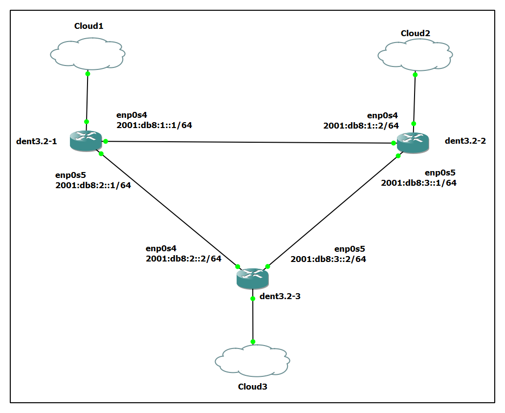

# Open Shortest Path First Version 3 (OSPFv3)

OSPFv3 is an interior gateway protocol (IGP) used for routing IPv6 packets within a single routing domain. It's an enhanced version of OSPFv2 specifically designed to support IPv6 networks. For more information, please refer- [OSPFv3](https://datatracker.ietf.org/doc/html/rfc5340).

This document provides detailed instructions for installing and configuring OSPFv3 on DENT devices using FRR (Free Range Routing).

## Installation of FRR

To install FRR (Free Range Routing) with OSPF support on DENT Devices, follow the steps below:

### Installation using APT:

```
curl -s https://deb.frrouting.org/frr/keys.gpg | sudo tee /usr/share/keyrings/frrouting.gpg > /dev/null

FRRVER="frr-stable"
echo deb '[signed-by=/usr/share/keyrings/frrouting.gpg]' https://deb.frrouting.org/frr \
     $(lsb_release -s -c) $FRRVER | sudo tee -a /etc/apt/sources.list.d/frr.list

sudo apt update && sudo apt install frr frr-pythontools
```

Note: Ensure that `apt-transport-https` and `curl` are installed before proceeding with the installation.

### Installation using Snapcraft (Alternative Method):

```
sudo apt update
sudo apt install snapd
sudo snap install core

sudo snap install frr
```

### Start and Enable FRR Service:

```
sudo systemctl start frr
sudo systemctl enable frr
```

Output-

```
Synchronizing state of frr.service with SysV service script with /lib/systemd/systemd-sysv-install.
Executing: /lib/systemd/systemd-sysv-install enable frr
```

## Example Configuration

### Enable OSPF6d:

Edit the FRR daemon configuration file on both the devices:

```
sudo nano /etc/frr/daemons
```

Ensure the following configuration:

```
zebra=yes
bgpd=no
ospfd=no
ospf6d=yes
ripd=no
ripngd=no
```

<p align="center">
  
</p>

### Assign IP Addresses:

On Device 1 (dent3.2-1):

```
ip -6 addr add 2001:db8:1::1/64 dev enp0s4
ip link set enp0s4 up

ip -6 addr add 2001:db8:2::1/64 dev enp0s5
ip link set enp0s5 up
```

On Device 2 (dent3.2-2):

```
ip -6 addr add 2001:db8:1::2/64 dev enp0s4
ip link set enp0s4 up

ip -6 addr add 2001:db8:3::1/64 dev enp0s5
ip link set enp0s5 up
```

On Device 3 (dent3.2-3):

```
ip -6 addr add 2001:db8:2::2/64 dev enp0s4
ip link set enp0s4 up

ip -6 addr add 2001:db8:3::2/64 dev enp0s5
ip link set enp0s5 up
```

Ensure IPv6 forwarding is enabled on each device (`sysctl -w net.ipv6.conf.all.forwarding=1`).

### Configure OSPF6:

Edit the FRR configuration file on both the devices:

```
sudo nano /etc/frr/frr.conf
```

Add the following configuration to the file:

On Device 1-

```
router ospf6

 ospf6 router-id 1.1.1.1
 interface enp0s4 area 0.0.0.0
 interface enp0s5 area 0.0.0.0
```

On Device 2-

```
router ospf6

 ospf6 router-id 2.2.2.2
 interface enp0s4 area 0.0.0.0
 interface enp0s5 area 0.0.0.0
```

On Device 3-

```
router ospf6

 ospf6 router-id 3.3.3.3
 interface enp0s4 area 0.0.0.0
 interface enp0s5 area 0.0.0.0
```

**Note:** The configuration may vary depending on user requirements.

### Restart FRR:

```
sudo systemctl restart frr
```

### Interacting with OSPF:

To access the interactive OSPF shell:

```
sudo vtysh
```

Output-

```
Hello, this is FRRouting (version 8.5).
Copyright 1996-2005 Kunihiro Ishiguro, et al.
```

After accessing the `vtysh` shell, you can execute OSPF-specific commands such as `show ip ospf6`, `show ipv6 route ospf`, and `show ipv6 ospf6 neighbor` to inspect OSPF configurations and neighbor relationships.

- `show ip ospf6`: Displays OSPFv3 routing information, including OSPFv3 process details, areas, and neighbors.
- `show ipv6 route ospf`: Shows IPv6 routes learned via OSPFv3, including network prefixes and next-hop information.
- `show ipv6 ospf6 neighbor`: Provides information about OSPFv3 neighbors, including their IPv6 addresses, states, and interface details.

For more information on these and other available commands, please refer to [OSPFv3 FRR](https://docs.frrouting.org/en/latest/ospf6d.html).

**Device 1 (dent3.2-1) Output:**

```
localhost# show ip ospf6

 OSPFv3 Routing Process (0) with Router-ID 1.1.1.1
 Running 00:00:53
 LSA minimum arrival 1000 msecs
 Maximum-paths 256
 Administrative distance 110
 Initial SPF scheduling delay 0 millisec(s)
 Minimum hold time between consecutive SPFs 50 millsecond(s)
 Maximum hold time between consecutive SPFs 5000 millsecond(s)
 Hold time multiplier is currently 2
 SPF algorithm last executed 00:00:01 ago, reason N+
 Last SPF duration 0 sec 300 usec
 SPF timer is inactive
 Number of AS scoped LSAs is 0
 Number of areas in this router is 1
 Authentication Sequence number info
  Higher sequence no 1, Lower sequence no 0

 Area 0.0.0.0
     Number of Area scoped LSAs is 12
     Interface attached to this area: enp0s4 enp0s5
     SPF last executed 1.936271s ago
```

```
localhost# show ipv6 route ospf

Codes: K - kernel route, C - connected, S - static, R - RIPng,
       O - OSPFv3, I - IS-IS, B - BGP, N - NHRP, T - Table,
       v - VNC, V - VNC-Direct, A - Babel, F - PBR,
       f - OpenFabric,
       > - selected route, * - FIB route, q - queued, r - rejected, b - backup
       t - trapped, o - offload failure

O   2001:db8:1::/64 [110/100] is directly connected, enp0s4, weight 1, 00:00:32
O   2001:db8:2::/64 [110/100] is directly connected, enp0s5, weight 1, 00:00:30
O>* 2001:db8:3::/64 [110/200] via fe80::e64:49ff:fed6:1, enp0s5, weight 1, 00:00:20
  *                           via fe80::e73:15ff:fedf:1, enp0s4, weight 1, 00:00:20
```

```
localhost# show ipv6 ospf6 neighbor

Neighbor ID     Pri    DeadTime    State/IfState         Duration I/F[State]
2.2.2.2           1    00:00:31     Full/DR              00:00:47 enp0s4[BDR]
3.3.3.3           1    00:00:33     Full/DR              00:00:45 enp0s5[BDR]
```

**Device 2 (dent3.2-2) Output:**

```
localhost# show ip ospf6

 OSPFv3 Routing Process (0) with Router-ID 2.2.2.2
 Running 00:00:56
 LSA minimum arrival 1000 msecs
 Maximum-paths 256
 Administrative distance 110
 Initial SPF scheduling delay 0 millisec(s)
 Minimum hold time between consecutive SPFs 50 millsecond(s)
 Maximum hold time between consecutive SPFs 5000 millsecond(s)
 Hold time multiplier is currently 1
 SPF algorithm last executed 00:00:02 ago, reason R+, R-
 Last SPF duration 0 sec 1148 usec
 SPF timer is inactive
 Number of AS scoped LSAs is 0
 Number of areas in this router is 1
 Authentication Sequence number info
  Higher sequence no 1, Lower sequence no 0

 Area 0.0.0.0
     Number of Area scoped LSAs is 12
     Interface attached to this area: enp0s4 enp0s5
     SPF last executed 2.462380s ago
```

```
localhost# show ipv6 route ospf

Codes: K - kernel route, C - connected, S - static, R - RIPng,
       O - OSPFv3, I - IS-IS, B - BGP, N - NHRP, T - Table,
       v - VNC, V - VNC-Direct, A - Babel, F - PBR,
       f - OpenFabric,
       > - selected route, * - FIB route, q - queued, r - rejected, b - backup
       t - trapped, o - offload failure

O   2001:db8:1::/64 [110/100] is directly connected, enp0s4, weight 1, 00:00:36
O>* 2001:db8:2::/64 [110/200] via fe80::e01:98ff:fe5e:1, enp0s4, weight 1, 00:00:24
  *                           via fe80::e64:49ff:fed6:2, enp0s5, weight 1, 00:00:24
O   2001:db8:3::/64 [110/100] is directly connected, enp0s5, weight 1, 00:00:29
```

```
localhost# show ipv6 ospf6 neighbor

Neighbor ID     Pri    DeadTime    State/IfState         Duration I/F[State]
1.1.1.1           1    00:00:34     Full/BDR             00:00:51 enp0s4[DR]
3.3.3.3           1    00:00:39     Full/DR              00:00:49 enp0s5[BDR]
```

**Device 3 (dent3.2-3) Output:**

```
localhost# show ip ospf6

 OSPFv3 Routing Process (0) with Router-ID 3.3.3.3
 Running 00:00:57
 LSA minimum arrival 1000 msecs
 Maximum-paths 256
 Administrative distance 110
 Initial SPF scheduling delay 0 millisec(s)
 Minimum hold time between consecutive SPFs 50 millsecond(s)
 Maximum hold time between consecutive SPFs 5000 millsecond(s)
 Hold time multiplier is currently 2
 SPF algorithm last executed 00:00:11 ago, reason R+, R-, N+
 Last SPF duration 0 sec 346 usec
 SPF timer is inactive
 Number of AS scoped LSAs is 0
 Number of areas in this router is 1
 Authentication Sequence number info
  Higher sequence no 1, Lower sequence no 0

 Area 0.0.0.0
     Number of Area scoped LSAs is 12
     Interface attached to this area: enp0s4 enp0s5
     SPF last executed 11.782986s ago
```

```
localhost# show ipv6 route ospf

Codes: K - kernel route, C - connected, S - static, R - RIPng,
       O - OSPFv3, I - IS-IS, B - BGP, N - NHRP, T - Table,
       v - VNC, V - VNC-Direct, A - Babel, F - PBR,
       f - OpenFabric,
       > - selected route, * - FIB route, q - queued, r - rejected, b - backup
       t - trapped, o - offload failure

O>* 2001:db8:1::/64 [110/200] via fe80::e01:98ff:fe5e:2, enp0s4, weight 1, 00:00:32
  *                           via fe80::e73:15ff:fedf:2, enp0s5, weight 1, 00:00:32
O   2001:db8:2::/64 [110/100] is directly connected, enp0s4, weight 1, 00:00:37
O   2001:db8:3::/64 [110/100] is directly connected, enp0s5, weight 1, 00:00:32
```

```
localhost# show ipv6 ospf6 neighbor

Neighbor ID     Pri    DeadTime    State/IfState         Duration I/F[State]
1.1.1.1           1    00:00:31     Full/BDR             00:00:52 enp0s4[DR]
2.2.2.2           1    00:00:34     Full/BDR             00:00:47 enp0s5[DR]
```

### Verifying OSPF Shortest Path and Route Failover

<br />
**Verify Shortest Path Forwarding:**

Use the `show ipv6 route ospf` command on `dent3.2-1` to verify the routing table-

```
localhost# sudo vtysh -c "show ipv6 route ospf"

Codes: K - kernel route, C - connected, S - static, R - RIPng,
       O - OSPFv3, I - IS-IS, B - BGP, N - NHRP, T - Table,
       v - VNC, V - VNC-Direct, A - Babel, F - PBR,
       f - OpenFabric,
       > - selected route, * - FIB route, q - queued, r - rejected, b - backup
       t - trapped, o - offload failure

O   2001:db8:1::/64 [110/100] is directly connected, enp0s4, weight 1, 00:10:35
O   2001:db8:2::/64 [110/100] is directly connected, enp0s5, weight 1, 00:09:35
O>* 2001:db8:3::/64 [110/200] via fe80::e64:49ff:fed6:1, enp0s5, weight 1, 00:10:23
  *                           via fe80::e73:15ff:fedf:1, enp0s4, weight 1, 00:10:23
```

Perform a traceroute6 from `dent3.2-1` to `dent3.2-2` and observe the path taken-

On dent3.2-1:

```
localhost# traceroute6 2001:db8:1::2

traceroute to 2001:db8:1::2 (2001:db8:1::2), 30 hops max, 80 byte packets
 1  2001:db8:1::2 (2001:db8:1::2)  6.121 ms  2.275 ms  1.788 ms
```

Perform a ping test to ensure connectivity and observe the round-trip time (RTT)-

```
localhost# ping6 2001:db8:1::2

PING 2001:db8:1::2(2001:db8:1::2) 56 data bytes
64 bytes from 2001:db8:1::2: icmp_seq=1 ttl=64 time=5.42 ms
64 bytes from 2001:db8:1::2: icmp_seq=2 ttl=64 time=11.5 ms
64 bytes from 2001:db8:1::2: icmp_seq=3 ttl=64 time=11.5 ms
64 bytes from 2001:db8:1::2: icmp_seq=4 ttl=64 time=2.42 ms
64 bytes from 2001:db8:1::2: icmp_seq=5 ttl=64 time=1.52 ms
```

The RTT values are consistent with a direct connection.

**Ensuring enp0s4 is the Shortest Path:**

Check the cost associated with each interface involved in OSPF routing-

```
localhost# sudo vtysh -c "show ipv6 ospf6 interface enp0s4"

enp0s4 is up, type BROADCAST
  Area ID 0.0.0.0, Cost 100
```

```
localhost# sudo vtysh -c "show ipv6 ospf6 interface enp0s5"

enp0s5 is up, type BROADCAST
  Area ID 0.0.0.0, Cost 150
```

By performing the above checks, you ensure that `enp0s4` is indeed the shortest path based on its lower OSPF cost. The initial `show ipv6 route ospf` and `traceroute6` outputs confirmed that packets were taking this path, validating its status as the shortest route.

**Demonstrate Route Failover:**

Manually shut down the primary interface on one of the devices to simulate a link failure-

On dent3.2-1:

```
ip link set dev enp0s4 down
```

Use the `show ipv6 route ospf` command again to check the updated routing table and verify that OSPF has rerouted traffic through the alternative path-

```
localhost# sudo vtysh -c "show ipv6 route ospf"

Codes: K - kernel route, C - connected, S - static, R - RIPng,
       O - OSPFv3, I - IS-IS, B - BGP, N - NHRP, T - Table,
       v - VNC, V - VNC-Direct, A - Babel, F - PBR,
       f - OpenFabric,
       > - selected route, * - FIB route, q - queued, r - rejected, b - backup
       t - trapped, o - offload failure

O>* 2001:db8:1::/64 [110/300] via fe80::e64:49ff:fed6:1, enp0s5, weight 1, 00:00:11
O   2001:db8:2::/64 [110/100] is directly connected, enp0s5, weight 1, 00:16:27
O>* 2001:db8:3::/64 [110/200] via fe80::e64:49ff:fed6:1, enp0s5, weight 1, 00:00:11
```

Perform a traceroute6 again from `dent3.2-1` to `dent3.2-2` to observe the new path taken by the packets-

```
localhost# traceroute6 2001:db8:1::2

traceroute to 2001:db8:1::2 (2001:db8:1::2), 30 hops max, 80 byte packets
 1  2001:db8:2::2 (2001:db8:2::2)  3.612 ms  1.720 ms  1.284 ms
 2  2001:db8:1::2 (2001:db8:1::2)  2.724 ms  2.593 ms  2.303 ms
```

Perform a ping test again to ensure connectivity and observe the RTT-

```
localhost# ping6 2001:db8:1::2

PING 2001:db8:1::2(2001:db8:1::2) 56 data bytes
64 bytes from 2001:db8:1::2: icmp_seq=1 ttl=63 time=6.22 ms
64 bytes from 2001:db8:1::2: icmp_seq=2 ttl=63 time=3.77 ms
64 bytes from 2001:db8:1::2: icmp_seq=3 ttl=63 time=5.57 ms
64 bytes from 2001:db8:1::2: icmp_seq=4 ttl=63 time=4.14 ms
64 bytes from 2001:db8:1::2: icmp_seq=5 ttl=63 time=4.14 ms
64 bytes from 2001:db8:1::2: icmp_seq=6 ttl=63 time=16.4 ms
```

The increased RTT values confirm that packets are taking a longer path due to the primary interface being down.

You've now successfully demonstrated the two key behaviors of OSPF6:

- **Shortest Path Forwarding**: Initially, OSPF6 forwards packets through the shortest path (`enp0s4`).
- **Route Failover**: When the shortest path is unavailable (by shutting down `enp0s4`), OSPF6 reroutes traffic through an alternative path (`enp0s5`).

By following these steps, you will have successfully installed and configured OSPFv3 on your DENT devices using FRR. This setup ensures efficient and scalable routing within your network. Adjust configurations as needed based on specific requirements. For further customization, refer to [OSPFv3 FRR](https://docs.frrouting.org/en/latest/ospf6d.html) documentation.
