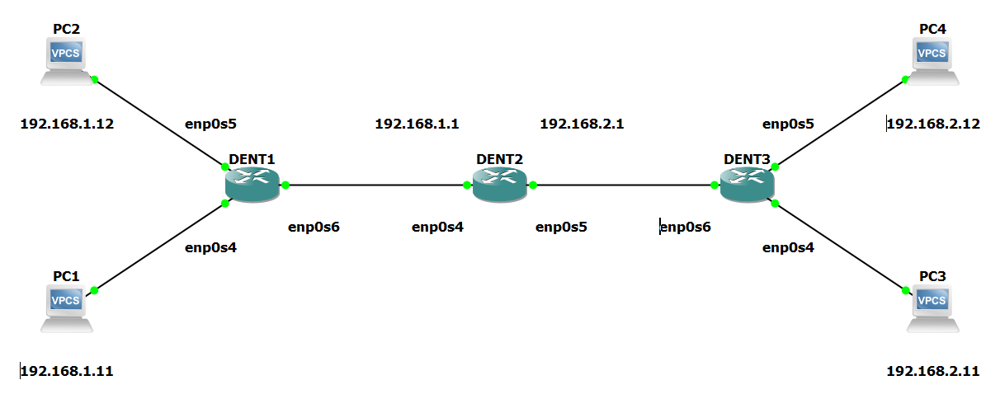

# Static Routing And Forwarding

## Introduction

In this guide, we will explain how to add static routes and
have devices communicate between Layer 2 and Layer 3 DENT devices.

Layer 2 communication between devices can be done using Bridges in Linux Systems.
For more information on bridges, visit the following:
[Bridging Layer 2](../VLANConfigurationSubCategories/BridgingL2.html)

Layer 3 communication between devices over different subnets may require the configuration of
gateway IP addresses, static routes, and packet forwarding.

## Adding IP Addresses to Interfaces

To add IP addresses to a DENT device, use the following command:

`$ ip address add ${address}/${mask} dev ${interface name}`

Ex.

`$ ip address add 192.168.1.1 dev enp0s4`

## Static Routing

### Add Routes

To add static routes on a DENT device, use the `ip route add` command.

```
$ ip route add ${Desired Subnet or IP Address} ${Connected Route or Nexthop Route}
```

The following are a few types of example routes one can add:

### Adding a Connected Route

A connected route is a route to a network that is directly
attached to one of the router’s interfaces.

A connected route can be configured with `dev ${Name of Interface}`

Ex.

```
$ ip route add 192.168.1.0/24 dev enp0s4
```

### Adding a Nexthop Route

A nexthop route is a route that specifies the next IP address
to use when forwarding packets to a particular destination.

A nexthop route can be configured with `via {Address of the Nexthop}`

Ex.

```
$ ip route add 192.168.1.0/24 via 192.168.1.1
```

The above ensures that any packets meant
for an IP address with the subnet, 192.168.1.x is forwarded to enp0s4 or
via the nexthop address using 192.168.1.1

### Adding an ECMP Route

ECMP is a routing strategy where packet forwarding to a single destination can occur over multiple best paths with equal routing priority.

An ECMP route chains multiple nexthop routes together for the same destination address:

```
$ ip route add ${Desired Subnet or IP Address} nexthop ${First Nexthop Route} nexthop ${Secondary Nexthop Route}...
```

Ex.

```
$ ip route add 192.168.1.0/24 nexthop via 192.168.1.1 nexthop via 192.168.1.2
```

For more information, visit the ECMP Page.

### Adding a Blackhole Route

A blackhole route is a network route where incoming or outgoing traffic is
silently “dropped,” without informing the source
that the data did not reach its intended recipient.

A blackhole route can be configured with the `blackhole` keyword:

```
$ ip route add blackhole ${Desired Subnet or IP Address}
```

Ex.

```
$ ip route add blackhole 3.3.3.3
```

### Delete Routes

To statically delete routes on Linux devices, use the `ip route del` command:

```
$ ip route del ${Desired Subnet or IP Address}
```

Ex.

```
$ ip route del 192.168.1.1
```

To delete all routes in the main table, use the following:

```
$ ip route flush table main
```

### Viewing Routes

To display the contents of the routing table, use:

```
$ ip route show ${Includes Optional Flags}
```

Additional filters can also be included to limit the output of this command:

- To list routes going via an interface, use `$ dev {Interface Name}`

- To only list routes going via the nexthop route, use `$ via {Address of the Nexthop}`

Ex.

```
root@dentlab:~# ip route show
1.1.1.0/24 dev sw1p1 scope link linkdown rt_trap
blackhole 3.3.3.3 rt_offload
4.4.4.4 via 1.1.1.2 dev sw1p1 trap linkdown rt_offload
10.2.1.0/24 via 11.1.1.2 dev sw1p31 offload rt_offload
12.12.12.5 linkdown rt_offload
        nexthop via 1.1.1.3 dev sw1p1 weight 1 trap linkdown
        nexthop via 1.1.1.4 dev sw1p1 weight 1 trap linkdown
```

In the above information about **static route flags**
are also shown with `rt_trap`, `rt_offload`, `offload`, and `trap`

### Static Route Flags

Static route flags can provide information on the behavior
of routing entries in the hardware (HW).
There are two types of flags:

**Flag 1. LPM**

LPM flags notify about entry in
HW LPM and are denoted by the prefix `rt_`.
This flag is supported for all types of routes.

**Flag 2. nexthop**

Nexthop flags notify about a nexthop
entry in HW. These are denoted without
`rt_`.
These flags are supported only for nexthop routes.

The following tables show the result of LPM and nexthop flag combinations.
_(LPM is placed vertically and nexthop is placed horizontally)_

If no LPM flag is specified the nexthop flag does not influence the result:

| LPM\nexthop       | Not specified       |       `trap`        |    `offload   `     |
| ----------------- | :------------------ | :-----------------: | :-----------------: |
| **Not specified** | Route is overlapped | Route is overlapped | Route is overlapped |

On a nexthop route, the following are LPM and nexthop flag combinations:

| LPM\nexthop         |                   `trap`                   |                 `offload`                  |
| ------------------- | :----------------------------------------: | :----------------------------------------: |
| `rt_offload_failed` | Unkown beahvior. LPM in HW is inconsistent | Unkown beahvior. LPM in HW is inconsistent |
| `rt_offload`        |              Packets trapped               |         Packets fully routed by HW         |

On a nexthop route via a non-switch interface, a connected route,
and a local route, the following are LPM and nexthop flag combinations:

| LPM\nexthop         |                Not Specified                |
| ------------------- | :-----------------------------------------: |
| `rt_trap`           |               Packets trapped               |
| `rt_offload_failed` | Unknown behavior. LPM in HW is inconsistent |

On a blackhole route, the following are LPM and nexthop flag combinations:

| LPM\nexthop         |                Not Specified                |
| ------------------- | :-----------------------------------------: |
| `rt_offload`        |            Packets dropped by HW            |
| `rt_offload_failed` | Unknown behavior. LPM in HW is inconsistent |

## Forwarding

To enable Packet forwarding the value of the file `ip_forward` in `/proc/sys/net/ipv4/ip_forward`
must be "1". To view the contents of the file, execute the following command:

`$ cat /proc/sys/net/ipv4/ip_forward`

If the file content is "0", packet forwarding is disabled.
Use the following command to overwrite the contents of the file to
the value of "1":

`$ sudo sh -c 'echo 1 > /proc/sys/net/ipv4/ip_forward'`

## Example Configuration

Consider the following topology:


Let's say we wanted to configure static routes for PC1, PC2, PC3, and PC4 to be able to communicate.
PC1 and PC2 are on the same subnet, so we will use a Layer 2 bridge on DENT1 to facilitate their communication.
Similarly, PC3 and PC4 are on the same subnet and will use a bridge on DENT3.
Communication between PC1 or PC2 with PC3 and PC4 will need a Layer 3 device for routing as they are on different subnets.
We will configure this on DENT2.

First, let's create the two bridges on DENT1 and DENT3.

On both devices, run the following:

```
$ ip link add name br0 type bridge
```

Next, enslave the interfaces to the newly created bridge:

```
$ ip link set enp0s4 master br0

$ ip link set enp0s5 master br0

$ ip link set enp0s6 master br0
```

Remember to bring the associated interfaces up on both devices!

```
$ ip link set br0 up

$ ip link set enp0s4 up

$ ip link set enp0s5 up

$ ip link set enp0s6 up
```

PC1 should now be able to communicate with PC2!
Similarly, PC3 should now be able to communicate with PC4!

Next, we will configure DENT2 with the gateway IP addresses, static routes,
and packet forwarding:

First, ensure the associated interfaces are up on DENT2 with the following:

```
$ ip link set enp0s4 up

$ ip link set enp0s5 up
```

Add the gateway IP addresses to the DENT2:

```
$ ip address add 192.168.1.1 dev enp0s4

$ ip address add 192.168.2.1 dev enp0s5
```

To add the static routes, use the following:

```
$ ip route add 192.168.1.0/24 dev enp0s4

$ ip route add 192.168.2.0/24 dev enp0s5
```

Enable packet forwarding by running the following as well:

`$ sudo sh -c 'echo 1 > /proc/sys/net/ipv4/ip_forward' `

**NOTE: If the PCs are not already configured:**

_On each PC, specify the device IP address and the
gateway address on the router in the same subnet._

Congratulations PC1 can now ping PC2, PC3, and PC4!

```
PC1> ping 192.168.2.1

84 bytes from 192.168.2.1 icmp_seq=1 ttl=64 time=1.543 ms
84 bytes from 192.168.2.1 icmp_seq=2 ttl=64 time=2.233 ms
84 bytes from 192.168.2.1 icmp_seq=3 ttl=64 time=1.969 ms
84 bytes from 192.168.2.1 icmp_seq=4 ttl=64 time=2.245 ms
84 bytes from 192.168.2.1 icmp_seq=5 ttl=64 time=1.556 ms

PC1>
```

**NOTE: The outputs above were tested on a Virtual Machine**
