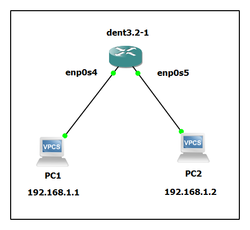

# Port Mirroring

Port mirroring is a powerful feature that allows you to copy packets traversing a physical switch port and send them to another port for analysis. This is crucial for monitoring and troubleshooting network traffic without disrupting normal operations.

### Configuring Port Mirroring

In DENT, port mirroring is configured using the `tc` command with the `matchall` filter and the `mirred egress mirror` action. Refer to [tc-mirred(8)](https://man7.org/linux/man-pages/man8/tc-mirred.8.html) and [tc-matchall(8)](https://man7.org/linux/man-pages/man8/tc-matchall.8.html) for detailed information on these commands.

To configure port mirroring from one port to another, use the following commands:

```
tc qdisc add dev <PORT> clsact
tc filter add dev <PORT> (ingress|egress) matchall skip_sw action mirred egress mirror dev <TO-PORT>
```

- `<PORT>`: The port from which traffic will be mirrored.
- `<TO-PORT>`: The port that will receive the mirrored traffic.

In this context, `ingress` refers to the incoming direction of the original traffic, while `egress` is the direction for the mirrored traffic queue. The `skip_sw` flag ensures that the mirroring occurs only in hardware, bypassing the kernel.

### Mirroring ingress and egress traffic

**Ingress Traffic Mirroring** <br/>
To mirror incoming traffic from `swp21` to the analyzer port `swp22`:

```
# Mirror ingress traffic from swp21 to analyzer port swp22
tc filter add dev swp21 ingress matchall skip_sw action mirred egress mirror dev swp22
```

**Output:**

```
filter parent ffff: protocol all pref 49152 matchall chain 0
filter parent ffff: protocol all pref 49152 matchall chain 0 handle 0x1
  action order 1: mirred (Egress Mirror to device swp22) stolen
  index 1 ref 1 bind 1
```

**Egress Traffic Mirroring** <br/>
To mirror outgoing traffic from `swp23` to the analyzer port `swp24`:

```
# Mirror egress traffic from swp23 to analyzer port swp24
tc filter add dev swp23 egress matchall skip_sw action mirred egress mirror dev swp24
```

**Output:**

```
filter parent ffff: protocol all pref 49152 matchall chain 0
filter parent ffff: protocol all pref 49152 matchall chain 0 handle 0x1
  action order 1: mirred (Egress Mirror to device swp24) stolen
  index 1 ref 1 bind 1
```

### Mirroring Traffic from Multiple Ports

To mirror traffic from multiple ports, you can use the `ingress_block` and `egress_block` configurations:

**Mirroring ingress traffic from multiple ports:**

```
tc qdisc add dev swp25 ingress_block 1 clsact
tc qdisc add dev swp26 ingress_block 1 clsact

tc filter add block 1 ingress matchall skip_sw action mirred egress mirror dev swp27
```

**Output:**

```
qdisc clsact 8001: dev swp25 root refcnt 2
qdisc clsact 8001: dev swp26 root refcnt 2
filter parent ffff: protocol all pref 49152 matchall chain 0
filter parent ffff: protocol all pref 49152 matchall chain 0 handle 0x1
  action order 1: mirred (Egress Mirror to device swp27) stolen
  index 1 ref 1 bind 1
```

**Mirroring egress traffic from multiple ports:**

```
tc qdisc add dev swp28 egress_block 2 clsact
tc qdisc add dev swp29 egress_block 2 clsact

tc filter add block 2 egress matchall skip_sw action mirred egress mirror dev swp30
```

**Output:**

```
qdisc clsact 8001: dev swp28 root refcnt 2
qdisc clsact 8001: dev swp29 root refcnt 2
filter parent ffff: protocol all pref 49152 matchall chain 0
filter parent ffff: protocol all pref 49152 matchall chain 0 handle 0x1
  action order 1: mirred (Egress Mirror to device swp30) stolen
  index 1 ref 1 bind 1
```

### Example Configuration

To verify the configuration, perform a simple ping test from VPC1 to VPC2 and check if the mirrored traffic appears on the analyzer port.



**Set up port mirroring from `enp0s4` to `enp0s5`:**

```
tc qdisc add dev enp0s4 clsact
tc filter add dev enp0s4 ingress matchall skip_sw action mirred egress mirror dev enp0s5
```

**Verify the configuration:**

```
tc filter show dev enp0s4 ingress
```

**Output:**

```
filter parent ffff: protocol all pref 49152 matchall chain 0
filter parent ffff: protocol all pref 49152 matchall chain 0 handle 0x1
  action order 1: mirred (Egress Mirror to device enp0s5) stolen
  index 1 ref 1 bind 1
```

Ping from VPC1 connected to `enp0s4` to VPC2 with the IP address `192.168.1.2`:

```
ping 192.168.1.2
```

**Output:**

```
PING 192.168.1.2 (192.168.1.2) 56(84) bytes of data.
64 bytes from 192.168.1.2: icmp_seq=1 ttl=64 time=0.123 ms
64 bytes from 192.168.1.2: icmp_seq=2 ttl=64 time=0.112 ms
64 bytes from 192.168.1.2: icmp_seq=3 ttl=64 time=0.110 ms
```

**Check the mirrored traffic on the analyzer port `enp0s5`:**

Use a packet analyzer tool like `tcpdump` on `enp0s5` to verify the mirrored traffic:

```
tcpdump -i enp0s5
```

**Output:**

```
tcpdump: verbose output suppressed, use -v or -vv for full protocol decode
listening on enp0s5, link-type EN10MB (Ethernet), capture size 262144 bytes
10:00:00.000000 IP 192.168.1.1 > 192.168.1.2: ICMP echo request, id 1, seq 1, length 64
10:00:00.000123 IP 192.168.1.2 > 192.168.1.1: ICMP echo reply, id 1, seq 1, length 64
10:00:01.000000 IP 192.168.1.1 > 192.168.1.2: ICMP echo request, id 1, seq 2, length 64
```

This verifies that the port mirroring is configured correctly and the mirrored traffic is being captured on the analyzer port `enp0s5`.

### Special Considerations

- Mirrored packets bypass eVLAN/VLAN and Spanning Tree filtering on the analyzer port. This allows mirroring from a port in one VLAN/Bridge to a port in a different VLAN/Bridge.
- The `skip_sw` flag ensures that mirroring occurs in the hardware, providing better performance and lower latency.

### Limitations

- The number of rules is limited by the supported port mirror combinations.
- A source port cannot be bound to multiple analyzer ports.
- Filter rules must have a higher priority than the lowest priority flower rules. The `matchall` filter takes precedence over flower ACL rules.
- The number of filters does not affect the maximum ACL rule count.
- A source port can also function as an analyzer port.
- Drop counter statistics are not supported.
