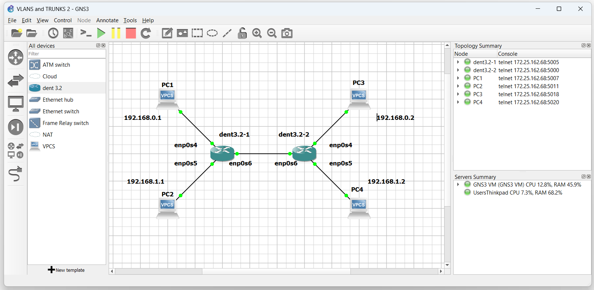

# Trunks

## Introduction

VLAN trunking is the practice of aggregating multiple network
links into a single link.

Trunking, with VLAN Aware bridging, is relatively simple
as it builds on the same fundamentals.

## Example Configuration

Consider the topology:



Let's say we wanted to configure PC1 and PC3 to be on VLAN 10
while PC2 and PC4 would be on VLAN 20. By building a trunk, we
can communicate over the two switches with one link.

First, ensure each switch has a bridge for the interfaces in use.
In this example, `enp0s4`, `enp0s5`, and `enp0s6` are in use
on both switches.

On Switch 1 and Switch 2, run the following:

```
$ ip link add name br0 type bridge

$ ip link set dev enp0s4 master br0

$ ip link set dev enp0s5 master br0

$ ip link set dev enp0s6 master br0
```

Communication over the switches is now possible between PCs on the
same subnet.

Next, add the desired VLAN tags to each PC interface.
Then, add both tags to the two interfaces connecting the switches.
In this example, the link is connected to `enp0s6` for both switches.

On Switch 1 and Switch 2, run the following:

```
$ bridge vlan add dev enp0s4 vid 10 pvid untagged master

$ bridge vlan add dev enp0s5 vid 20 pvid untagged master

$ bridge vlan add dev enp0s6 vid 10 pvid untagged master

$ bridge vlan add dev enp0s6 vid 20 pvid untagged master

```

All four PCS can now communicate over the trunk with the respective
PCs who share their VLAN.

**NOTE: The outputs below were tested on a Virtual Machine**

```
PC1 : 192.168.0.1 255.255.255.0

PC1> ping 192.168.0.2

84 bytes from 192.168.0.2 icmp_seq=1 ttl=64 time=2.345 ms
84 bytes from 192.168.0.2 icmp_seq=2 ttl=64 time=1.093 ms
84 bytes from 192.168.0.2 icmp_seq=3 ttl=64 time=1.442 ms
^C
PC1>
```

```
PC2 : 192.168.1.1 255.255.255.0

PC2> ping 192.168.1.2

84 bytes from 192.168.1.2 icmp_seq=1 ttl=64 time=2.345 ms
84 bytes from 192.168.1.2 icmp_seq=2 ttl=64 time=1.093 ms
84 bytes from 192.168.1.2 icmp_seq=3 ttl=64 time=1.442 ms
^C
PC2>
```
