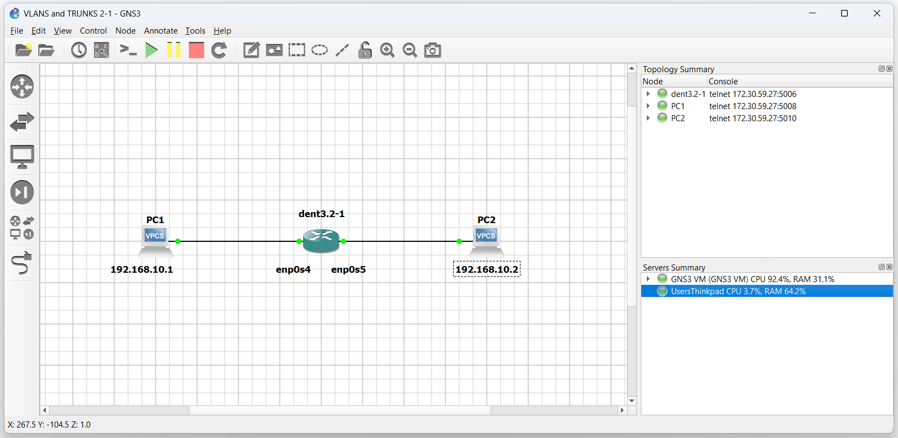

# Bridging Layer 2

## Introduction

In this guide, we will explain what bridging is
and give a quick example of how to use bridges.

In Linux systems, a bridge is a virtual switch-like device used to
connect different network interfaces and virtual network devices.

## Bridges

To create a bridge, use the following command:

```
$ ip link add name ${Bridge Name} type bridge
```

NOTE: Bridges may be configured with VLAN support.
For more information, visit VLANs (Configuring 802.1q Interfaces)

### Connecting Interfaces to a Bridge

Once you have created a new bridge, connect interfaces to it
with the following command:

```
$ ip link set dev ${Interface Name} master ${Bridge Name}
```

Connecting multiple different interfaces to the same bridge will allow devices on the
same subnet to ping each other.



With the configuration above, open the console on the switch and log in.

Run the following:

```
$ ip link add name br0 type bridge

$ ip link set dev enp0s4 master br0

$ ip link set dev enp0s5 master br0
```

Now ensure all interfaces are up with the `ip link` command.

```
$ ip link set br0 up

$ ip link set enp0s4 up

$ ip link set enp0s5 up
```

In the example above, the devices connected on enp0s4 and enp0s5
will now be able to communicate with one another using this bridge
as they are on the same subnet.

**NOTE: The output below was tested on a Virtual Machine**

PC1 ping on PC2:

```
PC1 : 192.168.0.1 255.255.255.0

PC1> ping 192.168.0.2

84 bytes from 192.168.0.2 icmp_seq=1 ttl=64 time=0.506 ms
84 bytes from 192.168.0.2 icmp_seq=2 ttl=64 time=0.713 ms
84 bytes from 192.168.0.2 icmp_seq=3 ttl=64 time=0.728 ms
84 bytes from 192.168.0.2 icmp_seq=4 ttl=64 time=0.878 ms
^C
PC1>
```

To detach a port from a bridge, use:

```
$ ip link set ${Interface Name} nomaster
```

## Configuration Persistence

The configurations above can be done with ifupdown
by placing the following in the `interfaces` file of the
`root@localhost:/etc/network#` directory.

Access the interfaces file with any file editor of your
choice and include the following:

```
auto br0
iface inet br0 manual
bridge_ports enp0s4 enp0s5
```

The first line creates a new bridge interface named `br0`.
The second line then indicates that interfaces `enp0s4` and `enp0s5`
are under the bridge interface

To apply these changes, restart the networking service by running:

`$ sudo systemctl restart networking`

NOTE: It may take longer than expected.

Creating and linking bridges in this manner is analogous
to using iproute2; however, upon rebooting the device
configurations will persist.
