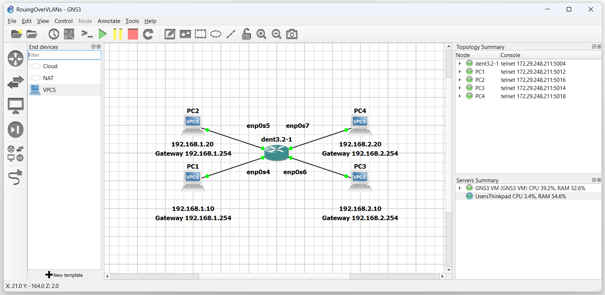
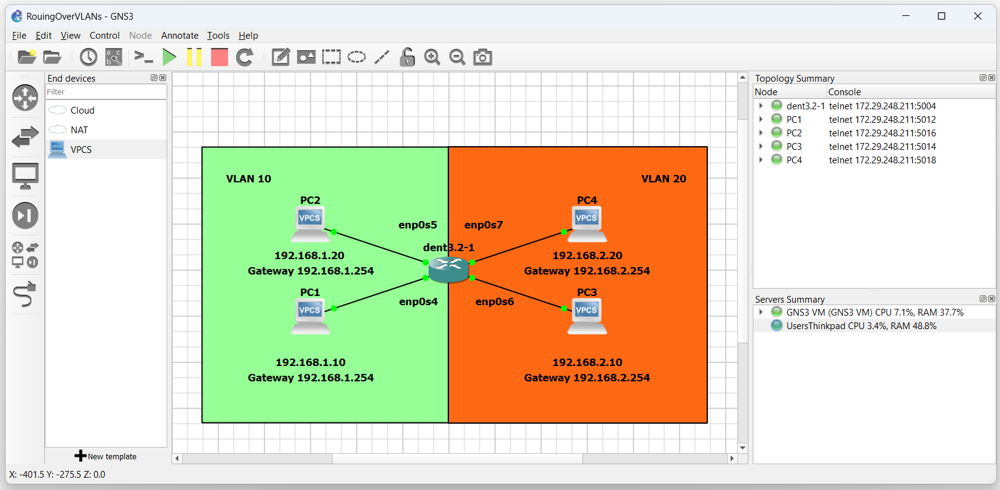

# Routing Over VLANs

## Introduction

To facilitate communication between different VLANs,
you will need a device with routing capabilities.

This guide will cover routing with a multilayer switch.

## Create A Bridge Routing Interface

To enable Layer 3 routing over VLANs, virtual bridge-routing interfaces
can be made on the Layer 2 bridge managing the VLANs you wish to route over.

Each VLAN should have its own bridge-routing interface, and the bridge itself
should be added as a member of the desired VLANs to route over.

To create a bridge-routing interface on a bridge of your choice, use
the following command:

```
$ ip link add link {$Bridge Name} name ${Router Interface Name} type vlan id  ${Desired VLAN #}
```

To make a bridge a member of its own VLANs, use the following command:

```
$ bridge vlan add dev ${Bridge Name} vid  ${Desired VLAN #} self
```

Finally, assign an IP address to the virtual bridge-routing interfaces
that match the gateway defined for each device:

```
$ ip addr add ${IP Address} dev ${Router Interface Name}
```

---

## Example Configuration

Consider the topology:



In this example, imagine we want PC1 and PC2 to be in VLAN 10
while PC3 and PC4 will be in VLAN 20. After establishing the VLANs,
we will configure the switch for inter-VLAN routing.

To configure the VLANs, create a bridge and enslave the interfaces to it:

```
$ ip link add name br0 type bridge vlan_filtering 1

$ ip link set dev enp0s4 master br0

$ ip link set dev enp0s5 master br0

$ ip link set dev enp0s6 master br0

$ ip link set dev enp0s7 master br0
```

Now, bring each interface up:

```
$ ip link set br0 up

$ ip link set enp0s4 up

$ ip link set enp0s5 up

$ ip link set enp0s6 up

$ ip link set enp0s7 up
```

Next, establish the new vid and pvid for all interfaces:

```
$ bridge vlan add dev enp0s4 vid 10 pvid untagged master

$ bridge vlan add dev enp0s5 vid 10 pvid untagged master

$ bridge vlan add dev enp0s6 vid 20 pvid untagged master

$ bridge vlan add dev enp0s7 vid 20 pvid untagged master
```

The topology is now:



Only devices in the same VLAN may communicate with each other.

To have the devices communicate between VLAN 10 and VLAN 20, create the bridge-routing interfaces.

VLAN 10 can be defined by:

```
$ ip link add link br0 name br0.10 type vlan id 10
```

VLAN 20 can be defined by:

```
$ ip link add link br0 name br0.20 type vlan id 20
```

Both `br0.10` and `br0.20` are virtual bridge-routing interfaces.

Next, add the VLANs we wish to route to the bridge interface.

```
$ bridge vlan add dev br0 vid 10 self

$ bridge vlan add dev br0 vid 20 self
```

Finally, assign IP addresses to the virtual bridge-routing interfaces
that match the gateway assigned to each PC

```
$ ip addr add 192.168.1.254/24 dev br0.10

$ ip addr add 192.168.2.254/24 dev br0.20
```

Take for example PC1 and PC2 on subnet 192.168.1
Both devices are using gateway 192.168.1.254

Similarly, PC3 and PC4 on subnet 192.168.2
will use gateway 192.168.2.254

Next, bring both the virtual routing interfaces up with:

```
$ ip link set br0.10 up

$ ip link set br0.20 up
```

Lastly, ensure packet forwarding is enabled.
To enable packet forwarding
the value in the file `ip_forward` must be "1".

To view the contents of the file, execute the
following command:

```
$ cat /proc/sys/net/ipv4/ip_forward
```

If the file content is "0", packet forwarding is disabled.

The file's content must be "1" for packet forwarding to be enabled
Use the following command to overwrite the contents of the file to
the value of '1' if it is not already:

```
$ sudo sh -c 'echo 1 > /proc/sys/net/ipv4/ip_forward'
```

PC1 and PC2 should now be able to communicate with PC3 and PC4
over the multilayer switch.

**NOTE: The outputs below were tested on a Virtual Machine**

```
PC1 : 192.168.1.10 192.168.1.254/24

PC1> ping 192.168.1.20

84 bytes from 192.168.1.20 icmp_seq=1 ttl=64 time=0.906 ms
84 bytes from 192.168.1.20 icmp_seq=2 ttl=64 time=0.892 ms
84 bytes from 192.168.1.20 icmp_seq=3 ttl=64 time=0.875 ms
^C

PC1> ping 192.168.2.20

84 bytes from 192.168.2.20 icmp_seq=1 ttl=63 time=1.416 ms
84 bytes from 192.168.2.20 icmp_seq=2 ttl=63 time=1.016 ms
84 bytes from 192.168.2.20 icmp_seq=3 ttl=63 time=1.017 ms
^C

PC1>
```
