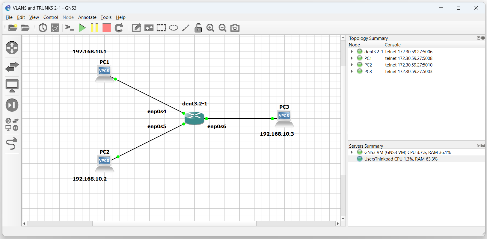
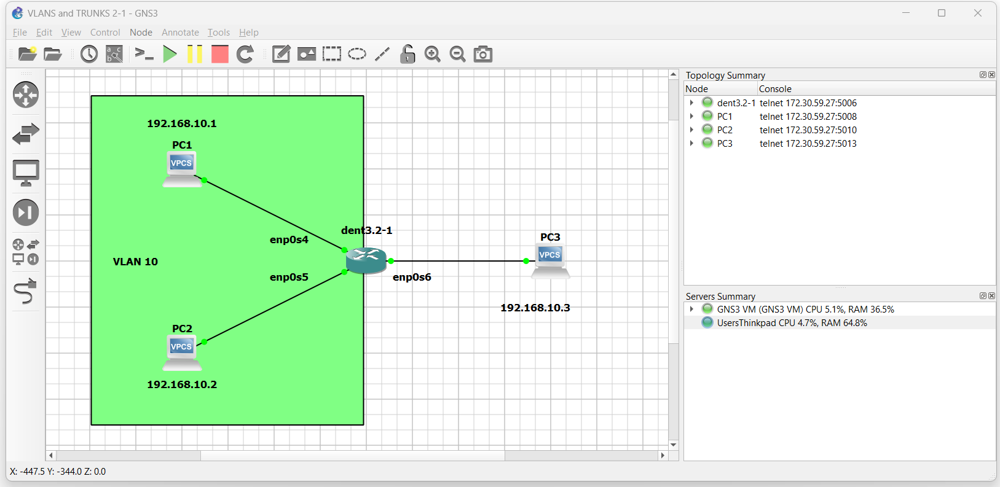

# VLANs Set Up

## Introduction

This guide will explain how to set up a VLAN using bridges.

Traditional bridging in Linux accepts only one VLAN per bridge
and attached ports must have VLAN subinterfaces configured.
For a large number of VLANs, this poses an issue with scalability,
which is the motivation for the usage of VLAN Aware bridges.

DENT supports VLAN Aware bridging. This feature allows for
the filtering and processing of multiple VLAN tags in a
network packet on a bridge port.

## Bridges and VLANs

A nice feature of bridges in VLAN Aware mode
is that they can handle tagged and untagged frames.

In VLAN Aware mode, a network switch is configured to recognize
and process VLAN tags on incoming frames. This mode allows the
switch to forward traffic based on the VLAN information,
ensuring that devices within the same VLAN
can communicate with each other while isolating traffic between
different VLANs.

The PVID is associated with a specific switch port and determines
the default VLAN for incoming untagged frames.

VLAN Aware mode and the default PVID can be toggled on bridge creation
with the command:

```
$ ip link add name ${Bridge Name} type bridge ${Enable VLAN Aware} ${Set PVID}
```

Or after bridge creation with:

```
$ ip link set dev ${Bridge Name} type bridge ${Enable VLAN Aware} ${Set PVID}
```

To enable VLAN Aware bridge mode, use the `vlan_filtering 1` flag.
To set the PORT VLAN ID, use `vlan_default_pvid ${Input default ID}`.

For example:

```
$ ip link add name ${Bridge Name} type bridge vlan_filtering 1 vlan_default_pvid 1
```

If no vlan_default_pvid is chosen, the default will be `1`.

Setting the PVID to 0 with `vlan_default_pvid 0` will not set any default PVID and
will not configure VLANs on ports by default. Additionally, setting the PVID to
untagged master with `pvid untagged master` will specify that untagged frames arriving at the
specified network device will be treated as part of the chosen VLAN filter; the bridge interface
will manage this VLAN configuration.

## Setting up VLANs

To create a VLAN, each port connected to the switch
must be associated with a VLAN id `vid`.

Any interface connected to the switch can specify their
associated VLAN with the following command:

```
$ bridge vlan add dev ${Interface Name} vid ${Desired VLAN #}
```

To remove an interface from a VLAN, run the following:

```
$ bridge vlan del dev ${Interface Name} vid ${Desired VLAN #}
```

The bridge interface itself is also treated like a port and needs its own VLAN configuration
for any VLANs you want to receive on it. VLAN configuration on ports is not required for simple forwarding between ports.
Like other ports, bridge interfaces get the default PVID assigned when configured.

Note: Configuring further VLANs on the bridge interface requires the `self` flag.

```
$ bridge vlan add vid ${Desited VLAN Number} dev ${Bridge Name} self
```

---

## Example Configuration

Imagine the following topology:



To communicate between each PC, create a bridge on the switch
and add each PC to it.

```
$ ip link add name br0 type bridge

$ ip link set dev enp0s4 master br0

$ ip link set dev enp0s5 master br0

$ ip link set dev enp0s6 master br0
```

Next, bring each of these interfaces up:

```
$ ip link set br0 up

$ ip link set enp0s4 up

$ ip link set enp0s5 up

$ ip link set enp0s6 up
```

These devices are now connected to bridge `br0`. Communication over
the switch is open to all connected devices on the same subnet.

Pinging between either of the three PCs is now possible.

**NOTE: The output below was tested on a Virtual Machine**

```
PC3 : 192.168.10.3 255.255.255.0

PC3> ping 192.168.10.1

84 bytes from 192.168.10.1 icmp_seq=1 ttl=64 time=0.506 ms
84 bytes from 192.168.10.1 icmp_seq=2 ttl=64 time=0.713 ms
84 bytes from 192.168.10.1 icmp_seq=3 ttl=64 time=0.728 ms
84 bytes from 192.168.10.1 icmp_seq=4 ttl=64 time=0.878 ms
^C
PC3> ping 192.168.10.2

84 bytes from 192.168.10.2 icmp_seq=1 ttl=64 time=0.506 ms
84 bytes from 192.168.10.2 icmp_seq=2 ttl=64 time=0.713 ms
84 bytes from 192.168.10.2 icmp_seq=3 ttl=64 time=0.728 ms
84 bytes from 192.168.10.2 icmp_seq=4 ttl=64 time=0.878 ms
^C
PC3>
```

Now imagine we want to create a VLAN encompassing PC1 and PC2 so that PC3
can no longer interact with them.



First, toggle VLAN Aware mode on

```
$ ip link set dev br0 type bridge vlan_filtering 1
```

Next, establish the new vid and pvid for both interfaces from PC1 and PC2:

```
$ bridge vlan add dev enp0s4 vid 10 pvid untagged master

$ bridge vlan add dev enp0s5 vid 10 pvid untagged master
```

All frames from PC1 and PC2 are now tagged with vid 10.
Pinging PC1 to and from PC2 is still possible; however,
attempting to reach PC1 or PC2 from PC3 is no longer possible.

**NOTE: The output below was tested on a Virtual Machine**

```
PC3 : 192.168.10.3 255.255.255.0

PC3> ping 192.168.10.1

host (192.168.10.1) not reachable

PC3> ping 192.168.10.2

host (192.168.10.2) not reachable

PC3>
```

Communication with PC1 and PC2 is only possible for those in VLAN 10.

## Debugging Tool

If you ever need to see the VLAN configuration on a bridge
you can use the following command:

```
$ bridge vlan show
```
