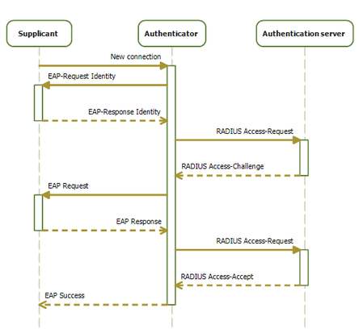
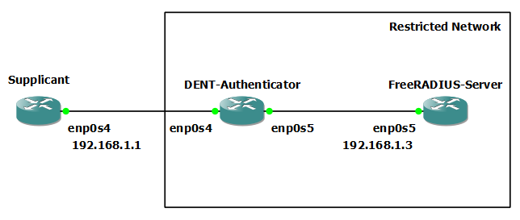

# IEEE 802.1x (Port Based Authentication)

## Introduction

In this guide, we will quickly explain what IEEE 802.1x (Port Based Authentication) is
and give an example implementing it.

Key to network security, IEEE 802.1x is a standard for port-based network
access control that provides an authentication mechanism to devices interested in joining
a LAN or WLAN. Over ethernet frameworks, IEEE 802.1x uses the
Extensible Authentication Protocol (EAP) to transmit authentication information.
Required components include the Supplicant, Authenticator, and Authentication Server.
Essentially, this standard ensures secure network access by authenticating devices before they connect.
LAN and WLAN connections benefit significantly from this robust authentication method.

The following is a brief description of the three components:

- **Supplicant**: The Supplicant is the device attempting to access the network. It is often the one that
  participates in the EAP transaction with the Authenticator.

- **Authenticator**: The Authenticator is the network device that connects the Supplicant to the network. It acts as the
  access point for the Supplicant and controls the type of traffic flow between the Supplicant and
  the network before and after authentication.
  In IEEE 802.1x, this is also more broadly referred to as a Network Access Server.

- **Authentication Server**: The Authentication Server receives requests for network access
  and verifies devices attempting to connect to the network. This information is then passed back to the Authenticator
  where traffic flow is changed based on the results. This is also commonly referred to as a RADIUS Server.
  It is also often known as an AAA (Authentication, Authorization, and Accounting) Server.

### Explanation of the protocol

The image below is a good visualization of the 802.1x Progression.



1. New Connection: When a Supplicant connects for the first time to the Authenticator, the only protocol that the Supplicant can use is the Extensible Authentication Protocol (EAP). All other types of communication are blocked until the device is authenticated.
   In order to begin the authentication process, the Supplicant must send an EAP-Start message to the Authenticator.
2. EAP-Request Identity: The Authenticator will respond with an EAP-Request Identity message, asking the Supplicant to provide its identity (usually a username or other identifiable information).
3. EAP-Response Identity: The Supplicant will then send an EAP-Response Identity message, which includes this identifiable information.
4. RADIUS Access-Request: The Authenticator encapsulates the EAP-Response Identity message into a RADIUS Access-Request message and sends it to the Authentication Server (RADIUS server).
5. EAP Authentication Methods: The Authentication Server processes the EAP-Response Identity message and determines which method to use for authentication (e.g., EAP-TLS, EAP-PEAP, EAP-TTLS, MAC).
6. RADIUS Access-Challenge: The server then sends a RADIUS-Access Challenge message back to the Authenticator requesting more information to authenticate the client such as credentials, certificates, or other authentication data. This process may repeat several times as needed.
7. EAP-Request: The Authenticator will forward the RADIUS-Access Challenge message to the Supplicant as an EAP-Request.
8. EAP-Response: The Supplicant responds with an EAP-Response message, which includes credentials, certificates, or other authentication data, depending on the EAP method being used.
9. RADIUS Access-Request: The Authenticator will take the EAP-Response message and send the data to the Authentication Server as a RADIUS Access-Request message.
10. RADIUS Access-Accept/Reject: Once the RADIUS server has enough information to authenticate the client, it sends a RADIUS Access-Accept or Access-Reject message to the Authenticator. An Access-Accept message indicates successful authentication, while an Access-Reject message indicates failure.
11. Network Access: If the Supplicant is successfully authenticated, the Authenticator grants network access to the client. If authentication fails, the Supplicant is denied access.

In this document, we will be using the following free publicly available software
FreeRADIUS, hostapd, and wpa_supplicant to configure an example of IEEE 802.1x.

_In this guide, we will utilize the `freeradius` utility as the Authentication Server,
while the `hostapd` utility serves as the Authenticator, and the
`wpasupplicant` utility acts as the Supplicant.
Together, these will facilitate the implementation of IEEE 802.1X._

## Example Configuration

Consider the following topology:



This demo will detail how to configure a Supplicant, Authenticator
and Authentication Server for 802.1x Authentication using EAP-TTLS.
It will also briefly cover configuring the Authentication Server
for other 802.1x authentication methods.

## Installations

**For this demo, you will need to install three separate utilities on three devices:**

1. On one device, install the `freeradius` utility. This device will act as the Authentication Server (FreeRADIUS-Server).
2. On another device, install the `hostapd` utility. This device will act as the Authenticator.
3. On the last device, install the `wpa_supplicant` utility. This device will act as the Supplicant.

For information on how to install each utility, read below:

_NOTE: Before any installation, do not forget to use `$ apt-get update` to fetch the latest version of your package lists. Follow this with the command `$ apt-get upgrade` to first review the changes in the latest versions and then replace the old packages by installing the new ones._

### FreeRADIUS Installation

freeRADIUS is a free, open-source RADIUS server. It is commonly used by Internet Service Providers
and Telecommunications companies.

If freeRADIUS is not already installed on the device that will act as the FreeRADIUS-Server
install the `freeradius` utility with `$ apt-get install freeradius`

For our example configuration, we will install `freeradius` by running
the `$ apt-get install freeradius` command on the device titled **FreeRADIUS-Server**.

On the FreeRADIUS-Server:

```
root@localhost:~# apt-get install freeradius
```

### hostapd Installation

hostapd (host access point daemon) is a user space daemon software enabling a network interface card
to act as an access point.

If hostapd is not already installed on the device that will act as the DENT-Authenticator
, install the `hostapd` utility with `$ apt-get install hostapd`

For our example configuration, we will install `hostapd` by running
the `$ apt-get install hostapd` command on the device titled **DENT-Authenticator**.

On the DENT-Authenticator:

```
root@localhost:~# apt-get install hostapd
```

### wpa_supplicant Installation

WPA Supplicant is a Wi-Fi Protected Access (WPA) client
and IEEE 802.1X supplicant. It implements WPA key negotiation
with a WPA Authenticator and Extensible Authentication Protocol
(EAP) authentication with an Authentication Server.

If wpa_supplicant is not already installed on the device that will act as the Supplicant,
install the `wpasupplicant` utility with `$ apt-get install wpa_supplicant`

For our example configuration, we will install `wpasupplicant` by running
the command `$ apt-get install wpasupplicant` on the device titled **Supplicant**.

On the Supplicant:

```
root@localhost:~#  apt-get install wpasupplicant
```

### Iproute2 Package Version

Iproute2 Version 5.18 and beyond includes the bridge port lock feature discussed later in this guide.
This is a key feature used in implementing IEEE 802.1x. In this guide, we used iproute2-6.9.0.
To install iproute2-6.9.0, please visit the appendix at the bottom.

## Setting up the Network

Recall the network topology is:


For this demo, we will establish the network by building the topology using
the commands below.

First, on the DENT-Authenticator, run the following:

```
ip link add name br0 type bridge
ip link set enp0s4 master br0 up
ip link set enp0s5 master br0 up
ip link set br0 up
ip address add 192.168.1.2/24 dev br0
```

To implement the restriction on the network, we will also add a set of Bridge
Port Configurations to the **DENT-Authenticator**.

On the DENT-Authenticator:

```
bridge link set dev enp0s4 flood off
bridge link set dev enp0s4 learning off
bridge link set dev enp0s4 locked on
```

Together, these commands will drop incoming packets from sources not found in
the DENT-Authenticator's Forwarding Data Base table (FDB). This excludes EAPOL frames, which
will be used for authentication purposes. After authentication
is complete, we will install a matching static FDB entry to allow traffic from authorized
Supplicants to enter the network.

For more information on Bridge Port Configurations, read below:

- `bridge link set dev enp0s4 flood off`: This command controls whether unicast traffic for which there is no FDB entry will
  be flooded. By default, this flag is on.

- `bridge link set dev enp0s4 learning off`: This command controls whether a given port will learn MAC addresses from received traffic.
  If learning is off, the bridge will flood any traffic for which it has
  no FDB entry. By default, this flag is on.

- `bridge link set dev enp0s4 locked on`: This command controls whether packets from a source are filtered.
  When locked is on, non-link-local frames received through the port are
  dropped unless an FDB entry with the MAC source address
  points to the port. A common use case for this is IEEE 802.1X
  where hosts can authenticate themselves by exchanging
  EAPOL frames with the authenticator. By default, this flag is off.

For the remaining devices, we will include the following:

On the Supplicant:

```
ip address add 192.168.1.1 dev enp0s4
ip link set dev enp0s4 up
ip route add 192.168.1.0/24 dev enp0s4
```

On the FreeRADIUS-Server:

```
ip address add 192.168.1.3 dev enp0s5
ip link set dev enp0s5 up
ip route add 192.168.1.0/24 dev enp0s5
```

With the configuration above, traffic from the Supplicant will not
able to reach the FreeRADIUS-Server because the Authenticator is configured to filter out all
packets except for EAP packets.

On the Supplicant:

```
root@localhost:/etc/wpa_supplicant# ping 192.168.1.3
PING 192.168.1.3 (192.168.1.3) 56(84) bytes of data.
From 192.168.1.1 icmp_seq=1 Destination Host Unreachable
From 192.168.1.1 icmp_seq=2 Destination Host Unreachable
From 192.168.1.1 icmp_seq=3 Destination Host Unreachable
```

---

## Establishing Authentication

### Configuring the FreeRADIUS-Server

#### **Creating Certificates**

The freeradius package installs scripts and
configuration files in the `/etc/freeradius/3.0/certs/` directory to create your own
certificate authority (CA) and issue certificates.

This section will cover the following certificates:

- `/etc/freeradius/3.0/certs/ca.pem`: CA certificate
- `/etc/freeradius/3.0/certs/server.key`: Private key of the server certificate
- `/etc/freeradius/3.0/certs/server.pem`: Server certificate
- `/etc/freeradius/3.0/certs/client.key`: Private key of the client certificate
- `/etc/freeradius/3.0/certs/client.pem`: Client certificate

Upon the installation of `freeradius` a default configuration of each certificate is created.
For this demo, we will use the default configuration. However,
Network Administrators are recommended to customize each certificate as the certificates generated by these scripts
expire after 60 days and use the insecure password "whatever".

To customize a certificate simply:

1. Change into the `/etc/freeradius/3.0/certs/` directory.

2. Customize the CA configuration in the `/etc/freeradius/3.0/certs/ca.cnf`:

```
...
[ req ]
default_bits            = 2048
input_password          = ca_password
output_password         = ca_password
...
[certificate_authority]
countryName             = US
stateOrProvinceName     = North Carolina
localityName            = Raleigh
organizationName        = Example Inc.
emailAddress            = admin@example.org
commonName              = "Example Certificate Authority"
...
```

3. Customize the server configuration in the `/etc/freeradius/3.0/certs/server.cnf`:

```
...
[ CA_default ]
default_days            = 730
...
[ req ]
distinguished_name      = server
default_bits            = 2048
input_password          = key_password
output_password         = key_password
...
[server]
countryName             = US
stateOrProvinceName     = North Carolina
localityName            = Raleigh
organizationName        = Example Inc.
emailAddress            = admin@example.org
commonName              = "Example Server Certificate"
...
```

4. Customize the client configuration in the `/etc/freeradius/3.0/certs/client.cnf`:

```
...
[ CA_default ]
default_days            = 365
...
[ req ]
distinguished_name      = client
default_bits            = 2048
input_password          = password_on_private_key
output_password         = password_on_private_key
...
[client]
countryName             = US
stateOrProvinceName     = North Carolina
localityName            = Raleigh
organizationName        = Example Inc.
emailAddress            = user@example.org
commonName              = user@example.org
...
```

5. Once customized, create the certificates by running `make all`.

On the FreeRADIUS-Server:

```
root@localhost:/etc/freeradius/3.0/certs# make all
```

**Exchanging these certificates securely allows for many of the different authentication protocols available.**

#### **Configuring EAP**

Freeradius supports many different methods of Extensible Authentication Protocol. A few TLS-based EAP types
include:

- **EAP-TLS** (transport layer security) uses a secure TLS connection to authenticate
  clients by using certificates. To use EAP-TLS, you need TLS client certificates for each
  network client and a server certificate for the server. Note that the same certificate
  authority (CA) must have issued the certificates. Always use your own CA to create certificates
  because all client certificates issued by the CA you use can authenticate to your FreeRADIUS server.

- **EAP-TTLS** (tunneled transport layer security) uses a secure TLS connection as the outer
  authentication protocol to set up the tunnel. The inner authentication then uses, for
  example, the password authentication protocol (PAP) or challenge handshake authentication
  protocol (CHAP). To use EAP-TTLS, you need a TLS server certificate.

- **EAP-PEAP** (protected extensible authentication protocol) uses a secure TLS connection
  as the outer authentication protocol to set up the tunnel. The authenticator authenticates
  the certificate of the RADIUS server. Afterward, the Supplicant authenticates through the
  encrypted tunnel by using Microsoft challenge handshake authentication protocol version 2
  (MS-CHAPv2) or other methods.

To configure from the above the type of EAP to use, edit the `/etc/freeradius/3.0/mods-available/eap` file:

Depending on your environment,
set the `default_eap_type` parameter in the eap directive to the primary `EAP_type` you want to use:

```
eap {
...
  default_eap_type = EAP_type
...
}
```

For this configuration demo, we will use `ttls`:

On the FreeRADIUS-Server:

```
eap {
...
  default_eap_type = ttls
...
}
```

To specify the `private_key_password` parameter needed to decrypt TLS operations change
`private_key_password` to reflect the `input_password` and `output_password`
defined in the user's configuration of `/etc/freeradius/3.0/certs/server.cnf`.
For our configuration demo, we will leave the `private_key_password`
unchanged in the `/etc/freeradius/3.0/mods-available/eap` file.
By default, the `private_key_password is "whatever"

**NOTE: "whatever" is also the default `input_password` and `output_password`
defined in the user's configuration of `/etc/freeradius/3.0/certs/server.cnf`.
This default string should only be used for testing purposes.**

On the FreeRADIUS-Server:

```
eap {
...
  tls-config tls-common {
...
    private_key_password = whatever
...
  }
}
```

Next, to leave only EAP enabled for the outer authentication and disable plain-text authentication methods
edit `/etc/freeradius/3.0/sites-available/default`, and comment out all authentication methods other than eap.

On the FreeRADIUS-Server:

```
authenticate {
...
    # Auth-Type PAP {
    #     pap
    # }

    # Auth-Type CHAP {
    #     chap
    # }

    # Auth-Type MS-CHAP {
    #     mschap
    # }

    # mschap

    # digest
    ...
}
```

Finally, to specify if other hosts should be able to access the free RADIUS service, such as an Authenticator
edit the `/etc/freeradius/3.0/clients.conf` file and use the following template:

```
client <hostname_or_description> {
    ipaddr = <IP_address_or_range>
    secret = <client_password>
}
```

In our configuration, we will add the address of the bridge.

On the FreeRADIUS-Server:

```
client DENT-Authenticator {
        ipaddr          = 192.168.1.2
        secret          = testing123
}
```

For EAP-TTLS and EAP-PEAP, be sure to also add the users to the `/etc/freeradius/3.0/users file`:

```
example_user        Cleartext-Password := "user_password"
```

For our configuration demo, since we will use ttls, add the Supplicant's `identity` and `password`.

On the FreeRADIUS-Server:

```
Supplicant       Cleartext-Password := "password"
```

Users who intend to use certificate-based authentication (EAP-TLS), do not add an entry.

To verify the configuration files run `freeradius -XC`.

On the FreeRADIUS-Server:

```
root@localhost:~# freeradius -XC
FreeRADIUS Version 3.2.2
Copyright (C) 1999-2022 The FreeRADIUS server project and contributors
[...]
Configuration appears to be OK
```

_NOTE: If port 1812 is said to already be in use, try restarting the freeradius service with
`systemctl stop freeradius` then `freeradius -X`_

### Configuring the Authenticator

#### **Creating hostapd.conf**

The hostapd utility will be used as the authenticator for this example demo.
Upon configuration, `hostapd_cli`
can be used to track when different events occur (such as successful authentication)
and run commands to give access to the Supplicant.
While the hostapd service provides an integrated RADIUS server,
due to its limited functionality, we will use the FreeRADIUS server to authenticate individuals instead.

After installing `hostapd` you must configure a hostapd.conf file in `/etc/hostapd/hostapd.conf` to set up
hostapd. If it does not exist, add one.

A template can be seen here:

```
# General settings of hostapd
# ===========================

# Control interface settings
ctrl_interface=/var/run/hostapd
ctrl_interface_group=wheel

# Enable logging for all modules
logger_syslog=-1
logger_stdout=-1

# Log level
logger_syslog_level=2
logger_stdout_level=2


# Wired 802.1X authentication
# ===========================

# Driver interface type
driver=wired

# Enable IEEE 802.1X authorization
ieee8021x=1

# Use port access entry (PAE) group address
# (01:80:c2:00:00:03) when sending EAPOL frames
use_pae_group_addr=1

# Network interface for authentication requests
interface=br0


# RADIUS client configuration
# ===========================

# Local IP address used as NAS-IP-Address
own_ip_addr=192.0.2.2

# Unique NAS-Identifier within scope of RADIUS server
nas_identifier=hostapd.example.org

# RADIUS authentication server
auth_server_addr=192.0.2.1
auth_server_port=1812
auth_server_shared_secret=hostapd_client_password

# RADIUS accounting server
acct_server_addr=192.0.2.1
acct_server_port=1813
acct_server_shared_secret=hostapd_client_password
```

For our example configuration, we will adjust the parameters to match and simplify the above.

On the DENT-Authenticator:

```
##### hostapd configuration file #####
## Empty lines and lines starting with # are ignored
## Example configuration file for wired authenticator. See hostapd.conf for
## more details.

interface=enp0s4
bridge=br0
driver=wired
logger_syslog=-1
logger_syslog_level=2
logger_stdout=-1
logger_stdout_level=2
ieee8021x=1
eap_reauth_period=20
use_pae_group_addr=1
ctrl_interface=/var/run/hostapd/
ctrl_interface_group=0

# RADIUS client configuration
# ===========================

auth_server_addr=192.168.1.3
auth_server_port=1812
auth_server_shared_secret=testing123
```

To enable and start the `hostapd` service, use the following:

```
$ systemctl enable --now hostapd
```

To start the service in debug mode

```
$ hostapd /etc/hostapd/hostapd.conf  -g /var/run/hostapd.pid -d -B
```

Here is an example of the output on the DENT-Authenticator:

```
root@localhost:~#  hostapd /etc/hostapd/hostapd.conf  -g /var/run/hostapd.pid -d -B
random: Trying to read entropy from /dev/random
Configuration file: /etc/hostapd/hostapd.conf
Opening raw packet socket for ifindex 3
BSS count 1, BSSID mask 00:00:00:00:00:00 (0 bits)
enp0s4: IEEE 802.11 Fetching hardware channel/rate support not supported.
Completing interface initialization
hostapd_setup_bss(hapd=0x558cce09b680 (enp0s4), first=1)
enp0s4: Flushing old station entries
enp0s4: Deauthenticate all stations
Using interface enp0s4 with hwaddr 0c:4d:69:10:00:01 and ssid ""
enp0s4: RADIUS Authentication server 192.168.1.3:1812
RADIUS local address: 192.168.1.2:42862
enp0s4: interface state UNINITIALIZED->ENABLED
enp0s4: AP-ENABLED
enp0s4: Setup of interface done.
Using existing control interface directory.
```

#### **Blocking and Allowing Traffic based on hostapd_cli**

The bridge port configurations we added earlier blocks all traffic on the listening port
of the hostapd except extensible authentication protocol over LAN (EAPOL) packets.
The hostapd_cli utility can be used to connect to the hostapd control interface and evaluate events
regarding the Authentication.

The `/usr/local/bin/802-1x-tr-mgmt` script below is an example that can
be used in conjunction with the hostapd_cli to evaluate EAP
events and add or delete the FDB entry for a MAC address
depending on the results received by the Authentication Server.

Some of these include:

- AP-STA-CONNECTED
- AP-STA-DISCONNECTED
- ...

On the DENT-Authenticator:

```
root@localhost:/etc/hostapd# cat /usr/local/bin/802-1x-tr-mgmt
#!/bin/sh

if [ "x$1" = "xblock_all" ]; then
EOF
    echo "802-1x-tr-mgmt Blocking all traffic through enp0s4. Traffic for given
host will be allowed after 802.1x authentication"

elif [ "x$1" = "xallow_all" ]; then
    echo "802-1x-tr-mgmt Allowed all forwarding again"
fi

case ${2:-NOTANEVENT} in
    AP-STA-CONNECTED)
        #/sbin/bridge fdb add 0c:2d:83:56:00:01 dev enp0s4 static master
        /sbin/bridge fdb add $3 dev enp0s4 static master
        echo "$1: Allowed traffic from $3"
        ;;
    AP-STA-DISCONNECTED | CTRL-EVENT-EAP-FAILURE | CTRL-EVENT-DISCONNECTED)
        #/sbin/bridge fdb del 0c:2d:83:56:00:01 dev enp0s4 static master
        /sbin/bridge fdb del $3 dev enp0s4 static master
        echo "802-1x-tr-mgmt $1: Dening all traffic from $3"
        ;;
esac
```

To run the `hostapd_cli` with this event script use:

```
$ hostapd_cli -i enp0s4 -a /usr/local/bin/802-1x-tr-mgmt
```

**NOTE: Ensure that the file `/usr/local/bin/802-1x-tr-mgmt` has the executable permission set.
You can check the permissions with the ls -l command.
If the file is not executable, you can add the executable permission with the chmod command:
`$ sudo chmod +x /usr/local/bin/802-1x-tr-mgmt`**

#### **Creating a System Service**

A system service can also be created to support the implementation like the example below.

NOTE: The `<MAC ADDRESS Of Supplicant>` should be configured to reflect the MAC ADDRESS of the Supplicant
that you wish to add to the FDB and that will be permitted to access the network.

On the DENT-Authenticator:

```
root@localhost:/etc/hostapd# cat /etc/systemd/system/802-1x-tr-mgmt.service
[Unit]
Description= Service for Bridges Example 802.1x traffic
#After=hostapd.service
#After=systemd-daemon-reload.service

[Service]
Type=simple
ExecStartPre=/bin/echo "Running Pre Start"
ExecStartPre=/bin/echo "Restricting Acces"
ExecStartPre=-/sbin/bridge fdb del <MAC ADDRESS Of Supplicant> dev enp0s4 static master
ExecStartPre=/sbin/bridge link set dev enp0s4 flood off
ExecStartPre=/sbin/bridge link set dev enp0s4 learning off
ExecStart=/sbin/bridge link set dev enp0s4 locked on
ExecStart=- hostapd_cli -i enp0s4 -a /usr/local/bin/802-1x-tr-mgmt


ExecStopPost=/bin/echo "Running Stop Post"
ExecStopPost=/bin/echo "Letting Traffic Through"
ExecStopPost=-/sbin/bridge fdb add <MAC ADDRESS Of Supplicant> dev enp0s4 static master
ExecStopPost=/sbin/bridge link set dev enp0s4 flooding on
ExecStopPost=/sbin/bridge link set dev enp0s4 leanring on
ExecStopPost=/sbin/bridge link set dev enp0s4 locked off

RemainAfterExit=yes

[Install]
WantedBy=multi-user.target
```

To start the service, simply reload the daemon and restart the service:

```
sudo systemctl daemon-reload
systemctl enable 802-1x-tr-mgmt.service
systemctl restart 802-1x-tr-mgmt.service
systemctl status 802-1x-tr-mgmt.service
```

With the hostapd configuration completed, connecting a wpa_supplicant to the hostapd Access Point will now
authenticate the user based on the FreeRADIUS-Server configurations.

### Configuring the Supplicant

#### **Creating wpa_supplicant.conf**

To test authentication using EAP over tunneled transport layer security (TTLS) works as expected we will configure
a Supplicant using `wpa_supplicant` and add a `.conf` file at `/etc/wpa_supplicant/wpa_supplicant-TTLS.conf`

On the Supplicant:

```
root@localhost:/etc/wpa_supplicant# cat wpa_supplicant-TTLS.conf
ap_scan=0

network={
    eap=TTLS
    eapol_flags=0
    key_mgmt=IEEE8021X

    # Anonymous identity (sent in unencrypted phase 1)
    # Can be any string
    anonymous_identity="anonymous"

    # Inner authentication (sent in TLS-encrypted phase 2)
    phase2="auth=PAP"
    identity="Supplicant"
    password="password"

    # CA certificate to validate the RADIUS server's identity
    ca_cert="/etc/pki/tls/certs/ca.pem"
}
```

Analysis:

- The `identity` should match the name given as our Cleartext example in the users file of the FreeRADIUS-Server.
- The `password` should match the password given as our Cleartext example in the users file of the FreeRADIUS-Server.

**NOTE: In accordance with EAP-TTLS for authentication with a
FreeRADIUS-Server, the Supplicant needs to verify the authority of
the FreeRADIUS Server. In order to do this, the Supplicant needs to have a copy
of the Certificate Authority (CA) certificate (ca_cert) that signed
the FreeRADIUS Server’s certificate. Use any form of secure file transfer to ensure
the Supplicant has a copy of the Certificate Authority (CA) certificate (ca_cert) that signed
the FreeRADIUS Server’s certificate. If you do not currently have certificates signed by a trusted CA
you may use the `ssl-cert-snakeoil.pem` certificate included with the server
in `etc/freeradius/3.0/mods-available/eap`. These test certificates SHOULD NOT be used in a normal
deployment. They are created only to make it easier to install
the server, and to perform simple tests**

In our example we placed a copy
of the Certificate Authority (CA) certificate (ca_cert) that signed
the FreeRADIUS Server’s certificate at `/etc/pki/tls/certs/ca.pem`

To authenticate the Supplicant, simply use the following command:

```
$ sudo wpa_supplicant -c /etc/wpa_supplicant/wpa_supplicant-TTLS.conf -D wired -i enp0s4
```

For more information on WPA_supplicant visit the man page: [WPA_supplicant MAN Page](https://www.linux.org/docs/man5/wpa_supplicant.html)
For more example configurations visit: [WPA_supplicant Example Configs Page](https://www.systutorials.com/docs/linux/man/5-wpa_supplicant.conf/)

### Testing 802.1x Authentication

Now that the devices are configured, we can test
the authentication of the Supplicant on the network.

On the FreeRADIUS-Server start the freeRADIUS with the `freeradius -X` command:

```
root@localhost:~# freeradius -X
[...]

Listening on auth address 127.0.0.1 port 18120 bound to server inner-tunnel
Listening on proxy address * port 43583
Listening on proxy address :: port 51599
Ready to process requests
```

On the DENT-Authenticator, open an access point by running the `hostapd.conf` file:

```
root@localhost:~# hostapd /etc/hostapd/hostapd.conf -B -d
[...]

enp0s4: interface state UNINITIALIZED->ENABLED
enp0s4: AP-ENABLED
enp0s4: Setup of interface done.
```

Follow this by restarting the management service:

```
sudo systemctl daemon-reload
systemctl enable 802-1x-tr-mgmt.service
systemctl restart 802-1x-tr-mgmt.service
systemctl status 802-1x-tr-mgmt.service
```

Do not forget to start the `hostapd_cli` with:

```
hostapd_cli -i enp0s4 -a /usr/local/bin/802-1x-tr-mgmt
```

The output should resemble:

```
[...]
Jul 01 23:02:55 localhost echo[3396]: Restricting Acces
Jul 01 23:02:55 localhost systemd[1]: Started Service for Bridges Example 802.1x
root@localhost:~#  hostapd_cli -i enp0s4 -a /usr/local/bin/802-1x-tr-mgmt

```

On the Supplicant test the authentication with `wpa_supplicant`:

```
root@localhost:~# sudo wpa_supplicant -c /etc/wpa_supplicant/wpa_supplicant-TTLS.conf -D wired -i enp0s4
Successfully initialized wpa_supplicant
enp0s4: Associated with 01:80:c2:00:00:03
WMM AC: Missing IEs
enp0s4: CTRL-EVENT-EAP-STARTED EAP authentication started
enp0s4: CTRL-EVENT-EAP-PROPOSED-METHOD vendor=0 method=21
enp0s4: CTRL-EVENT-EAP-METHOD EAP vendor 0 method 21 (TTLS) selected
enp0s4: CTRL-EVENT-EAP-PEER-CERT depth=1 subject='/C=FR/ST=Radius/L=Somewhere/O=Example Inc./emailAddress=admin@example.org/CN=Example Certificate Authority' hash=409d765e4f51bce2f8ae2093481a4ed225f2b792a228a6f34068724b86cc0673
enp0s4: CTRL-EVENT-EAP-PEER-CERT depth=0 subject='/C=FR/ST=Radius/O=Example Inc./CN=Example Server Certificate/emailAddress=admin@example.org' hash=3f9465b29e04a7968cd8767a6a2810afe1580ffa98dd0686f4df60a74ad5f881
enp0s4: CTRL-EVENT-EAP-SUCCESS EAP authentication completed successfully
```

The output from the `hostapd_cli` will show that the authentication was successfull and will add the MAC address of the device to the FDB
then print the following

```
[...]
Jul 01 23:02:55 localhost echo[3396]: Restricting Acces
Jul 01 23:02:55 localhost systemd[1]: Started Service for Bridges Example 802.1x
root@localhost:~#  hostapd_cli -i enp0s4 -a /usr/local/bin/802-1x-tr-mgmt
enp0s4: Allowed traffic from 0c:2d:83:56:00:01
```

The Supplicant should now be able to access the Network:

```
root@localhost:/etc/wpa_supplicant/wpa_supplicant# ping 192.168.1.3
PING 192.168.1.3 (192.168.1.3) 56(84) bytes of data.
64 bytes from 192.168.1.3: icmp_seq=1 ttl=64 time=6.85 ms
64 bytes from 192.168.1.3: icmp_seq=2 ttl=64 time=3.74 ms
64 bytes from 192.168.1.3: icmp_seq=3 ttl=64 time=3.07 ms
64 bytes from 192.168.1.3: icmp_seq=4 ttl=64 time=3.52 ms
[...]
```

**NOTE: The outputs above were tested on a virtual machine**

### Appendix

#### **Iproute2 Version**

For our example configuration, we used iproute2-6.9.0.

To download a specific iproute2 version you may `wget` packages
from the [mirrors.kernel.org](https://mirrors.kernel.org) website
provided by the Linux Kernel Archives.

On the DENT-Authenticator use the following to get iproute2-6.9.0:

```
root@localhost:~#  wget https://mirrors.kernel.org/pub/linux/utils/net/iproute2/iproute2-6.9.0.tar.gz
```

Next extract the contents of the compressed tarball file with:

```
root@localhost:~#  tar -xvf iproute2-6.9.0.tar.gz
```

To make the package install the supporting utilities `bison` and
`flex` with `apt install bison` and `apt install flex`:

```
root@localhost:~# apt install bison
Reading package lists... Done
Building dependency tree
Reading state information... Done
The following additional packages will be installed:
  libbison-dev libsigsegv2 m4
[...]
root@localhost:~# apt install flex
Reading package lists... Done
Building dependency tree
Reading state information... Done
The following additional packages will be installed:
  cpp cpp-6 gcc gcc-6 libasan3 libatomic1 libc-dev-bin libc6-dev libcc1-0
  libcilkrts5 libfl-dev libgcc-6-dev libgomp1 libisl15 libitm1 liblsan0
  libmpc3 libmpfr4 libmpx2 libquadmath0 libtsan0 libubsan0 linux-libc-dev
  manpages manpages-dev
[...]
root@localhost:
```

Finally, `cd` into the new `iproute2-main` directory and
make this iproute2 version with:

```
root@localhost:~/iproute2-main# make install
```
