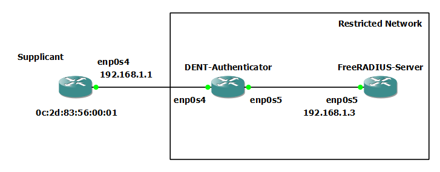

 
# MAC Address Authentication

## Introduction

In this guide, we will quickly explain what MAC Address Authentication is
and give an example implementing it.

**NOTE: Topics covered in this guide are introduced in
[IEEE 802.1x (Port Based Authentication)](<./IEEE802.1x(PortBasedAuthentication).html>)**

MAC Address Authentication allows administrators to limit who can and cannot
connect to a network by allowing or denying devices by their MAC address.
In this guide, we will be using a RADIUS Server and an Authenticator to validate
a device attempting to access a network based on their MAC Address.

## Enabling MAC Address Authentication

Most NASes send the MAC address in the Calling-Station-ID attribute.

To support MAC Address Authentication, a few additions are needed:

1). Since there are several standard formats depending on the NAS, the following policy is
available in FreeRADIUS version 3 and onwards at `freeradius/3.0/policy.d/canonicalization` to reformat
MAC Addresses under the same style. If this is not included, add the following to the defined location.

```
#
# Rewrite called station id attribute into a standard format.
#
rewrite_calling_station_id {
        if (Calling-Station-Id =~ /([0-9a-f]{2})[-:]?([0-9a-f]{2})[-:.]?([0-9a-f]{2})[-:]?([0-9a-f]{2})[-:.]?([0-9a-f]{2})[-:]?([0-9a-f]{2})/i) {
                update request {
                        Calling-Station-Id := "%{tolower:%{1}-%{2}-%{3}-%{4}-%{5}-%{6}}"
                }
        }
        else {
                noop
        }
}
```

2). Next in the `freeradius/3.0/mods-available/files`
create a new instance of the files module to read a new
file of permitted MAC addresses as shown below:

```
files {
    [...]
}
files authorized_macs {
        # The default key attribute to use for matches. The content
        # of this attribute is used to match the "name" of the
        # entry.
        key = "%{Calling-Station-ID}"

        usersfile = ${confdir}/authorized_macs

        #  If you want to use the old Cistron 'users' file
        #  with FreeRADIUS, you should change the next line
        #  to 'compat = cistron'.  You can copy your 'users'
        #  file from Cistron.
        # compat = no
}
```

3). Finally, create a list of permitted MAC addresses titled `freeradius/3.0/authorized_macs`,
to be read by the new files instance. An example is shown below:

```
0c:2d:83:56:00:01
        Reply-Message = "Device with MAC Address %{Calling-Station-Id} authorized for network access"
0d:4f:83:21:00:01
        Reply-Message = "Device with MAC Address %{Calling-Station-Id} authorized for network access"
[...]
```

## Example Configuration

Consider the following topology:



## MAC Address Authentication

To check only if a device exists in the authorized MAC Address list,
edit the authorize section in `freeradius/3.0/sites-available/default`
to call only the canonicalization policy and new files module:

```
authorize {
        preprocess

        # If cleaning up the Calling-Station-Id...
        rewrite_calling_station_id

        # Now check against the authorized_macs file
        authorized_macs

        if (!ok) {
                # No match was found, so reject
                reject
        }
        else {
                # The MAC address was found, so update Auth-Type
                # to accept this auth.
                update control {
                        Auth-Type := Accept
                }
        }
}
```

Example:

After adding the MAC Address 0C:2D:83:56:00:1 to the authorized_macs list.

```
root@localhost:/etc/freeradius/3.0/sites-available# freeradius -X
[...]
(0) authorized_macs: EXPAND %{Calling-Station-ID}
(0) authorized_macs:    --> 0C-2D-83-56-00-01
(0) authorized_macs: users: Matched entry 0C-2D-83-56-00-01 at line 1
(0) authorized_macs: EXPAND Device with MAC Address %{Calling-Station-Id} authorized for network access
(0) authorized_macs:    --> Device with MAC Address 0C-2D-83-56-00-01 authorized for network access
(0)     [authorized_macs] = ok
[...]
(0) Sent Access-Accept Id 26 from 192.168.1.3:1812 to 192.168.1.2:60013 length 95
(0)   Reply-Message = "Device with MAC Address 0C-2D-83-56-00-01 authorized for network access"
(0) Finished request
[...]
```

**NOTE: The above was tested on a virtual machine**

## MAC Address or 802.1x Authentication

The following configuration in `freeradius/3.0/sites-available/default` will approve requests
with either 802.1x Authentication or MAC Address Authentication.

- If 802.1x is not configured, the MAC Address of the Supplicant must be known.
- If 802.1x is configured, as long as valid credentials are presented, the
  Supplicants may access the network.

```
authorize {
        preprocess

        # If cleaning up the Calling-Station-Id...
        rewrite_calling_station_id

        # If this is NOT 802.1x, assume mac-auth. We check this by testing
        # for the presence of the EAP message attribute in the request.
        if (!EAP-Message) {
                # Now check against the authorized_macs file
                authorized_macs

                if (!ok) {
                        reject
                }
                else {
                        # accept
                        update control {
                                Auth-Type := Accept
                        }
                }
        }

        else {
                # Normal FreeRADIUS virtual server config goes here e.g.
                eap
        }
}
```

Example:

After adding the MAC Address 0C:2D:83:56:00:1 to the authorized_macs list.

```
root@localhost:/etc/freeradius/3.0/sites-available# freeradius -X
[...]
 authorized_macs: EXPAND %{Calling-Station-ID}
(2) authorized_macs:    --> 0C-2D-83-56-00-01
(2) authorized_macs: users: Matched entry 0C-2D-83-56-00-01 at line 1
(2) authorized_macs: EXPAND Device with MAC Address %{Calling-Station-Id} authorized for network access
(2) authorized_macs:    --> Device with MAC Address 0C-2D-83-56-00-01 authorized for network access
[...]
(11) Sent Access-Accept Id 44 from 192.168.1.3:1812 to 192.168.1.2:51656 length 177
(11)   MS-MPPE-Recv-Key = 0x817d9c1889907d69989d5913864df31d3a3307813a6fd0276408523954e41b77
(11)   MS-MPPE-Send-Key = 0x4ea7540a5847b49090a934053c8480587f1c07f2b24147da4d40b921f8c40269
(11)   EAP-Message = 0x032d0004
(11)   Message-Authenticator = 0x00000000000000000000000000000000
(11)   User-Name = "anonymous"
(11)   Framed-MTU += 994
(11) Finished request
[...]
```

**NOTE: The above was tested on a virtual machine**

Example:

After omitting the MAC Address 0C:2D:83:56:00:1 to the authorized_macs list and running 802.1X Authentication with EAP.

```
root@localhost:/etc/freeradius/3.0/sites-available# freeradius -X
[...]
(5) files: users: Matched entry Supplicant at line 3
(5)       [files] = ok
(5)       [expiration] = noop
(5)       [logintime] = noop
(5)       [pap] = updated
(5)     } # authorize = updated
(5)   Found Auth-Type = PAP
(5)   # Executing group from file /etc/freeradius/sites-enabled/inner-tunnel
(5)     Auth-Type PAP {
(5) pap: Login attempt with password
(5) pap: Comparing with "known good" Cleartext-Password
(5) pap: User authenticated successfully
(5)       [pap] = ok
(5)     } # Auth-Type PAP = ok
[...]
(5) Sent Access-Accept Id 39 from 192.168.1.3:1812 to 192.168.1.2:60013 length 177
(5)   MS-MPPE-Recv-Key = 0x2ba733ea28be8611d63f4e05ccd677eaf5a1d693657165a54d6b4c8e462912a9
(5)   MS-MPPE-Send-Key = 0xd66afec3f863ffe6c9d8ad0154f88e8130248461afa6d3a27d7d1f1c04713990
(5)   EAP-Message = 0x038a0004
(5)   Message-Authenticator = 0x00000000000000000000000000000000
(5)   User-Name = "anonymous"
(5)   Framed-MTU += 994
(5) Finished request
[...]
```

**NOTE: The above was tested on a virtual machine**

## MAC Address and 802.1x Authentication

The following configuration in `freeradius/3.0/sites-available/default` will combine both
802.1x Authentication and MAC Address Authentication.

- If 802.1x is not configured, the MAC Address of the Supplicant must be known.
- If 802.1x is configured, valid credentials and an accepted MAC Address
  must be present to access the network.

```
authorize {
        preprocess

        # If cleaning up the Calling-Station-Id...
        rewrite_calling_station_id

        # always check against the authorized_macs file first
        authorized_macs

        if (!ok) {
        # Reject if the MAC address was not permitted.
                reject
        }

        # If this is NOT 802.1x, mac-auth
        if (!EAP-Message) {
                # MAC address has already been checked, so accept
                update control {
                        Auth-Type := Accept
                }
        }
        else {
                # Normal FreeRADIUS virtual server config goes here e.g.
                eap
        }
}
```

Example:

After adding the MAC address 0C:2D:83:56:00:1 to the authorized_macs list
and running 802.1X Authentication with EAP.

```
root@localhost:/etc/freeradius/3.0/sites-available# freeradius -X
[...]
 authorized_macs: EXPAND %{Calling-Station-ID}
(2) authorized_macs:    --> 0C-2D-83-56-00-01
(2) authorized_macs: users: Matched entry 0C-2D-83-56-00-01 at line 1
(2) authorized_macs: EXPAND Device with MAC Address %{Calling-Station-Id} authorized for network access
(2) authorized_macs:    --> Device with MAC Address 0C-2D-83-56-00-01 authorized for network access
[...]
 files: users: Matched entry Supplicant at line 3
(5)       [files] = ok
(5)       [expiration] = noop
(5)       [logintime] = noop
(5)       [pap] = updated
(5)     } # authorize = updated
(5)   Found Auth-Type = PAP
(5)   # Executing group from file /etc/freeradius/3.0/sites-enabled/inner-tunnel
(5)     Auth-Type PAP {
(5) pap: Login attempt with password
(5) pap: Comparing with "known good" Cleartext-Password
(5) pap: User authenticated successfully
(5)       [pap] = ok
(5)     } # Auth-Type PAP = ok
[...]
(11) Sent Access-Accept Id 44 from 192.168.1.3:1812 to 192.168.1.2:51656 length 177
(11)   MS-MPPE-Recv-Key = 0x817d9c1889907d69989d5913864df31d3a3307813a6fd0276408523954e41b77
(11)   MS-MPPE-Send-Key = 0x4ea7540a5847b49090a934053c8480587f1c07f2b24147da4d40b921f8c40269
(11)   EAP-Message = 0x032d0004
(11)   Message-Authenticator = 0x00000000000000000000000000000000
(11)   User-Name = "anonymous"
(11)   Framed-MTU += 994
(11) Finished request
[...]
```

**NOTE: The above was tested on a virtual machine**

Example:

After omitting the authorized MAC address and running
802.1X Authentication with EAP.

```
root@localhost:/etc/freeradius/3.0/sites-available# freeradius -X
[...]
(0) authorized_macs: EXPAND %{Calling-Station-ID}
(0) authorized_macs:    --> 0C-2D-83-56-00-01
(0)     [authorized_macs] = noop
(0)     if (!ok) {
(0)     if (!ok)  -> TRUE
(0)     if (!ok)  {
(0)       [reject] = reject
(0)     } # if (!ok)  = reject
(0)   } # authorize = reject
(0) Using Post-Auth-Type Reject
[...]
(0) Sent Access-Reject Id 24 from 192.168.1.3:1812 to 192.168.1.2:60013 length 44
(0)   EAP-Message = 0x04990004
(0)   Message-Authenticator = 0x00000000000000000000000000000000
[...]
```

**NOTE: The above was tested on a virtual machine**

For other MAC Address Authentication configurations, visit the freeRADIUS wiki: [FreeRADIUS Wiki]https://wiki.freeradius.org/guide/mac-auth
