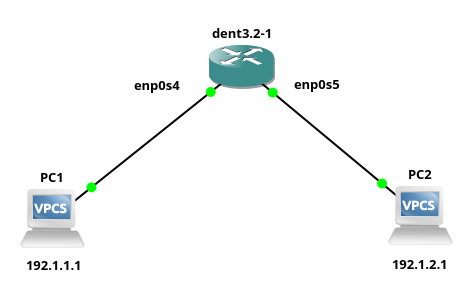
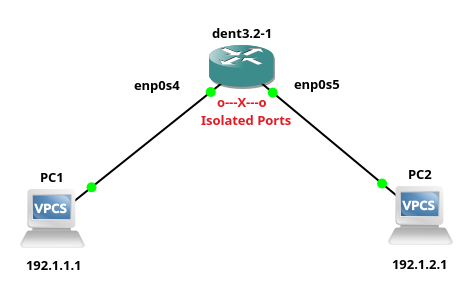

# Port Isolation

DENT supports port isolation, regulating traffic between ports in the same bridge domain.

- It improves security by limiting communication but keeping access to necessary resources intact.
- It was introduced in the [BeebleBox release (v2)](https://github.com/dentproject/dentOS/releases/tag/v2.0) as part of DENT's support for user applications.

DENT enables port isolation through the configuration of bridge links. This functionality allows administrators to control traffic between ports within the same bridge domain.

To isolate a bridge port, you can set the isolation property using the command:

```
bridge link set dev DEV [isolated {on|off}]
```

**Note**: It is off by default.

### Example:

```
bridge link set dev enp0s4 isolated on
```

Isolating one port requires another to be isolated for the effect:

```
bridge link set dev enp0s5 isolated on
```

Now the bridge ports `enp0s4` and `enp0s5` are unable to send or receive any packet to or from each other. However, these interfaces can still communicate normally with any other unisolated port on the bridge.

### Example Configuration-

Ensure that the devices are connected to enp0s4 and enp0s5 and are interconnected. They will now be able to communicate with each other using this bridge, as they are on the same subnet. Then isolate them using bridge commands, similar to the examples provided above.

**Before isolation:**



PC1 pings PC2:

```
PC1> ping 192.1.2.1
84 bytes from 192.1.2.1 icmp_seq=1 ttl=64 time=0.506 ms
84 bytes from 192.1.2.1 icmp_seq=2 ttl=64 time=0.713 ms
84 bytes from 192.1.2.1 icmp_seq=3 ttl=64 time=0.728 ms
84 bytes from 192.1.2.1 icmp_seq=4 ttl=64 time=0.878 ms
```

**After isolation:**



PC1 pings PC2:

```
PC1> ping 192.1.2.1
Request timed out.
Request timed out.
Request timed out.
Request timed out.
```

**Note**: The same can be checked for PC2 pinging PC1.

### Some important notes regarding port isolation:

- Port isolation affects traffic between isolated ports regardless of VLAN membership.
- The bridge's self-interface is not subject to port isolation.
- This setting is available through (rt) netlink and does not have an equivalent in ioctl/brctl.

<div style="border-top: 1px solid gray;"></div>
